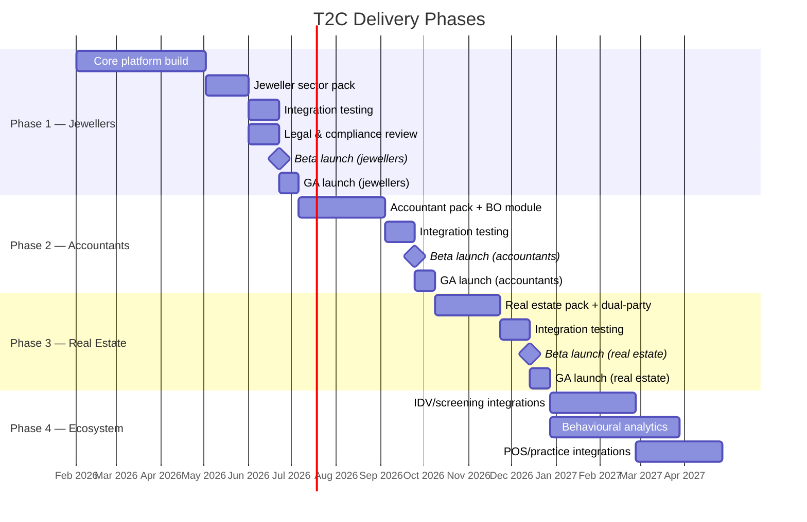

# T2C (AMLIQ) — Delivery Plan & Open Questions

> **Source:** Extracted verbatim from Sections 10 and 11 of the master [Module Design Document](./module-design-document.md).

---

## 10. Phased Delivery Plan

### 10A. Phase Overview

### 10B. Phase 1 — Jewellers (Foundation + First Sector)

Phase 1 builds 100% of the core platform and delivers the jeweller sector pack. Every subsequent phase reuses the core and adds only pack assets and incremental module features.

**Why jewellers first:**
1. Simplest CDD scope: 2 primary entity types (individual, body corporate), 1 threshold trigger ($10k cash)
2. Exercises the hardest reporting pipeline: daily TTR with strict 10-business-day deadline
3. Forces the flexible Case abstraction early (transaction-based workflow)
4. Non-individual → electronic payment referral routing validates the pack routing engine
5. Smallest SMB audience → manageable beta cohort

#### Phase 1 module delivery

| Module | Phase 1 scope | What is deferred |
|:-------|:-------------|:-----------------|
| **A — Multi-Tenancy** | Full | — |
| **B — Sector Pack** | Full core + jeweller pack | Accountant, real estate packs |
| **C — Case Management** | Transaction subtype only | Engagement, property transaction subtypes |
| **D — Form Renderer** | Full | — |
| **E — CDD Orchestration** | Full CDD + simplified CDD + delayed CDD | Beneficial ownership workflow (entity types limited to individual + body corporate for jewellers) |
| **F — Risk Engine** | Full | — |
| **G — Screening** | Sanctions (DFAT manual list) + PEP + adverse media stubs | Full provider integration (IDV/screening providers may be manual-only in Phase 1) |
| **H — Escalation** | Full | — |
| **I — Reporting** | SMR + TTR | IFTI, CBM, ACR (ACR deadline is 31 Mar 2027 — post-launch) |
| **J — Deadline Engine** | Full | — |
| **K — Audit Trail** | Full | — |
| **L — Evidence Store** | Full store + basic export (customer scope) | Full-tenant export, PDF generation |
| **M — Customer Management** | Individual + body corporate entity types | Trust, partnership, association, government body, beneficial ownership mapping |
| **N — Ongoing Monitoring** | Periodic reviews + trigger events + UAR→SMR | Transaction monitoring (TTR auto-trigger from transaction data) |
| **O — Program Management** | Program document CRUD + approval workflow | Compliance calendar, ACR preparation, independent review tracking |
| **P — Governance & Training** | CO appointment + personnel records + basic training tracking | Full training catalogue, due diligence enforcement |
| **Q — Dashboard** | Core widgets (deadline ticker, open cases, escalation queue, reporting status, risk distribution) | Sector-specific widgets, training compliance widget, integrity widget |
| **R — Billing** | Stripe integration, 1 plan (early adopter), trial | Multi-tier plans, usage metering |
| **S — Auth & RBAC** | Full (all 4 roles, MFA, session management) | — |

#### Phase 1 acceptance criteria

| # | Criterion | Verification |
|:--|:---------|:-------------|
| AC1 | Jeweller can sign up, select sector, see jeweller-themed dashboard | E2E test |
| AC2 | Staff can create a cash transaction case, route through CDD, and complete all steps | E2E test |
| AC3 | Non-individual + electronic payment correctly identified as non-designated (no CDD) | RBAC + routing test |
| AC4 | Sanctions screening runs on every customer (cannot be skipped or delayed) | Integration test |
| AC5 | Risk engine produces correct rating using jeweller factor catalogue | Unit test (parameterised) |
| AC6 | SMR pipeline: flag → UAR → SMR → deadline → manual submission → evidence | E2E test |
| AC7 | TTR deadline created for cash ≥$10k; 10-business-day calculation correct | Unit + integration test |
| AC8 | Tipping-off: `client_facing` cannot see SMR records via any path | Tipping-off test suite |
| AC9 | Tenant isolation: Tenant A cannot query Tenant B data | Isolation test suite |
| AC10 | Audit trail hash chain valid after full E2E scenario | Integrity test |
| AC11 | Evidence pack export produces valid ZIP with correct manifest hashes | Integration test |
| AC12 | All deadlines fire warnings and escalate on overdue | Deadline engine test |

### 10C. Phase 2 — Accountants

**Incremental scope (reuses 100% of Phase 1 core):**

| Increment | Description | Modules affected |
|:----------|:-----------|:----------------|
| Accountant sector pack | Risk factor catalogue, form templates, Table 6 service definitions, entity type catalogue (7 types), language pack, dashboard layout | B (new pack assets) |
| Engagement case subtype | Table 6 service selector, ongoing vs one-off flag, service description | C (add subtype) |
| Beneficial ownership | BO identification workflow, BO → Customer linkage, CDD per BO, "unable to determine" escalation | M (BeneficialOwnership entity), E (BO orchestration) |
| 5 additional entity types | Trust, partnership, unincorporated association, registered foreign company, government body — with entity-specific forms and verification steps | M (entity types), D (form templates), E (CDD routing) |
| Delayed CDD (20-day) | Delay justification, sanctions-cannot-delay enforcement, deadline | E (delayed CDD path), J (deadline type) |
| Qualified disclosure | Pack config flag, separate workflow, evidence record | N (disclosure workflow), B (pack config) |
| ACR preparation | Compliance calendar, 31 Mar deadline, data compilation from system, GB approval | O (ACR workflow), J (deadline) |
| Independent review tracking | Reviewer details, findings, remediation | O (IndependentReview entity) |
| IFTI reporting | International transfer identification, deadline, form, manual submission | I (report type), J (deadline type) |

**Phase 2 acceptance criteria (incremental):**

| # | Criterion |
|:--|:---------|
| AC13 | Accountant can sign up and see accountant-themed dashboard with correct terminology |
| AC14 | Table 6 service selector correctly identifies designated vs non-designated services |
| AC15 | Body corporate client triggers beneficial ownership workflow; each BO gets independent CDD |
| AC16 | "Unable to determine beneficial owner" triggers escalation with justification |
| AC17 | Delayed CDD: justification recorded, 20-day deadline created, sanctions screening proceeds immediately |
| AC18 | Qualified disclosure workflow available only when pack config enables it |
| AC19 | ACR preparation compiles system data; GB approval gate works |
| AC20 | All Phase 1 acceptance criteria still pass (regression) |

### 10D. Phase 3 — Real Estate

**Incremental scope:**

| Increment | Description | Modules affected |
|:----------|:-----------|:----------------|
| Real estate sector pack | Risk factor catalogue, form templates, property transaction types, dual-party terminology, dashboard layout | B (new pack assets) |
| Property transaction case subtype | Property address, transaction type (sale/lease/manage), dual-party structure | C (add subtype) |
| Dual-party CDD | Both buyer + seller (or landlord + tenant) require independent CDD; parallel orchestration; case blocked until both complete | C (CaseParty dual structure), E (parallel CDD) |
| Counterparty offboarding | Remove counterparty from case without closing case for direct client; tipping-off safe | M (counterparty offboard path), C (partial party removal) |
| Beneficial ownership (reuse) | Already built in Phase 2 — no new development | — |

**Phase 3 acceptance criteria (incremental):**

| # | Criterion |
|:--|:---------|
| AC21 | Real estate agent can sign up and see real estate-themed dashboard |
| AC22 | Property sale case creates dual-party structure (seller + buyer) |
| AC23 | Both parties require independent CDD; case cannot proceed until both complete |
| AC24 | Counterparty can be offboarded without closing case for direct client |
| AC25 | Counterparty offboarding uses compliant reasons only (tipping-off safe) |
| AC26 | Beneficial ownership works for entity buyers/sellers (reused from Phase 2) |
| AC27 | All Phase 1 + Phase 2 acceptance criteria still pass (regression) |

### 10E. Phase 4 — Ecosystem (Outline)

Phase 4 is exploratory and depends on market feedback from Phases 1–3. Indicative scope:

| Increment | Description |
|:----------|:-----------|
| Full IDV provider integration | Automated identity verification via GreenID / OCR Labs API (replaces manual upload) |
| Full screening provider integration | Real-time Refinitiv / Dow Jones API integration (replaces manual DFAT check) |
| POS integration (jewellers) | Transaction data feed from point-of-sale systems → auto-create cases |
| Practice management integration (accountants) | Client and engagement data sync from Xero Practice Manager, MYOB, etc. |
| Property platform integration (real estate) | Transaction data from REA Group, Domain, etc. |
| Behavioural analytics | Pattern detection across transactions, screening results, and customer behaviour (ML-based, opt-in) |
| AUSTRAC Online API | Direct submission if AUSTRAC provides an API (currently manual-only) |
| Additional sectors | Lawyers (if included in Tranche 2 scope); other DNFBPs |
| IP-based anomaly detection | Session security enhancement: flag logins from unusual locations |
| Advanced reporting | BI-style dashboards, trend analysis, board reporting packs |

---

## 11. Open Questions

### 11A. Regulatory & Legal

| # | Question | Impact | Status | Owner |
|:--|:---------|:-------|:-------|:------|
| OQ1 | **Final Tranche 2 regulations** — Will the final rules differ from the draft exposure bill? Specific risk: designated service definitions, threshold amounts, or reporting deadlines may change. | May require pack asset updates before launch. Risk factor catalogues and form templates may need revision. | Open — monitoring Parliamentary process | Product |
| OQ2 | **Accountant qualified disclosure scope** — Is s.123(4) exception automatic, or must the accountant actively invoke it? Does it apply to all Table 6 services or only some? | Affects qualified disclosure workflow design and pack configuration. | Open — awaiting legal review | Legal |
| OQ3 | **Jeweller "electronic payment" definition** — Does "electronic payment" include BNPL, cryptocurrency, or only traditional EFT/card? Non-individual + electronic payment = not designated. | Affects entity type routing logic in jeweller pack. | Open — AUSTRAC guidance pending | Product |
| OQ4 | **Pre-commencement CDD obligations** — For existing customers as of 1 Jul 2026, what is the acceptable "lighter" CDD process? Is a deadline imposed? | Affects pre-commencement CDD workflow and deadline configuration. | Open — awaiting AUSTRAC guidance | Product |
| OQ5 | **CBM reporting applicability** — Do any Tranche 2 sectors have correspondent banking relationships that trigger CBM? Likely no for jewellers/accountants/real estate, but needs confirmation. | If no → CBM module can be deferred entirely. | Open — likely out of scope | Product |
| OQ6 | **Product liability positioning** — What disclaimers, terms of service, and liability caps are required given the product assists with regulatory compliance? | Legal review required before launch. Does not affect technical design. | Open — legal review scheduled | Legal |
| OQ7 | **IFTI applicability per sector** — Which Tranche 2 sectors handle international funds transfers? Likely accountants only (client money accounts). | Affects which packs include IFTI reporting. | Open — awaiting legal review | Product |

### 11B. Technical & Architecture

| # | Question | Impact | Status | Owner |
|:--|:---------|:-------|:-------|:------|
| TQ1 | **Single-table vs multi-table DynamoDB** — Section 6 uses a hybrid approach (Main table + dedicated tables for AuditLog, Billing, Notifications). Should we consolidate further or split more? | Affects GSI design, IAM granularity, and cost. Need to validate access patterns under load. | Open — decide during Phase 1 build | Engineering |
| TQ2 | **Step Functions vs Lambda orchestration for CDD** — Module E notes CDD orchestration as sequential steps with checkpoints. AWS Step Functions provides native state management, retries, and timeouts. Lambda-only is simpler but requires manual state management. | Step Functions: better observability, built-in retries, visual debugging. Lambda-only: simpler deployment, lower cost at low volume, no state machine schema to maintain. | Open — prototype both in Phase 1 | Engineering |
| TQ3 | **Screening provider selection** — Refinitiv World-Check vs Dow Jones Risk & Compliance vs other. Phase 1 may use manual DFAT check only. When to integrate, and which provider? | Affects cost, API design, match resolution workflow, and data retention obligations with provider. | Open — evaluate in Phase 1; integrate in Phase 2 or 4 | Product + Engineering |
| TQ4 | **IDV provider selection** — GreenID vs OCR Labs vs other. Phase 1 may use manual document upload only. | Affects identity verification UX, success rates, cost, and fallback behaviour. | Open — evaluate in Phase 1; integrate in Phase 2 or 4 | Product + Engineering |
| TQ5 | **Cognito group-per-tenant-role scalability** — Design uses `{tenant_id}_{role}` Cognito groups. At 10k tenants × 4 roles = 40k groups. Cognito limit is 10k groups per user pool (soft limit, increasable). | May need alternative RBAC approach at scale: custom authorizer Lambda instead of Cognito groups, or multiple user pools. | Open — validate limits; design alternative for Phase 4 | Engineering |
| TQ6 | **Audit log sequence number generation** — Module K requires monotonically increasing sequence numbers per tenant for hash chain ordering. DynamoDB does not natively support auto-increment. | Options: (a) atomic counter in separate DDB item, (b) ULID (lexicographic sort = timestamp order but not strictly sequential), (c) SQS FIFO ordering + Lambda assigns sequence. | Open — prototype in Phase 1 | Engineering |
| TQ7 | **Evidence pack PDF generation** — Module L generates PDF summaries from structured data. Lambda has 15-min timeout and /tmp storage limits. | Options: (a) Lambda with Puppeteer/Chromium layer, (b) dedicated PDF service (Fargate), (c) third-party API (e.g., Gotenberg). | Open — evaluate complexity vs volume in Phase 1 | Engineering |
| TQ8 | **Offline / poor-connectivity support** — Jewellers at markets or trade shows may have intermittent connectivity. Should the app support offline CDD data entry with sync? | Would require service worker + IndexedDB cache + conflict resolution. Significant complexity. May be out of scope for Phase 1. | Open — evaluate user research | Product |
| TQ9 | **Multi-region deployment** — Current design is single-region (ap-southeast-2, Sydney). Is multi-region needed for DR or latency? | Single-region acceptable for AU-only product. Multi-region adds cost and complexity (DynamoDB Global Tables, S3 replication). | Resolved — single-region for Phases 1–3; re-evaluate Phase 4 | Engineering |
| TQ10 | **Pack asset hot-reload vs deploy-and-restart** — When a sector pack is updated, should running tenants see changes immediately (hot-reload) or only after explicit upgrade? | Hot-reload risks breaking running workflows. Explicit upgrade is safer but requires tenant action. | Resolved — explicit upgrade per tenant; admin-triggered; tenant pinned to version | Engineering |

### 11C. Product & UX

| # | Question | Impact | Status | Owner |
|:--|:---------|:-------|:-------|:------|
| PQ1 | **Onboarding wizard vs guided setup** — How much hand-holding does the first-time setup require? (AML/CTF program creation, risk appetite configuration, governance role assignment, first case) | Affects Phase 1 frontend scope. SMB users may need a step-by-step wizard. | Open — design in Phase 1 sprint 1 | Design |
| PQ2 | **Mobile-first or desktop-first** — Jewellers at point of sale may prefer mobile/tablet. Accountants prefer desktop. Real estate agents are mobile-heavy. | Phase 1 (jewellers): responsive with tablet-optimised CDD forms. Desktop-first for admin/compliance tasks. | Tentatively resolved — responsive, tablet-optimised for CDD | Design |
| PQ3 | **Notification channel preferences** — Should tenants be able to choose email-only, SMS-only, or both? What about push notifications? | Affects Deadline Engine notification dispatcher and tenant config. | Open — default to email + in-app; SMS opt-in; push deferred | Product |
| PQ4 | **White-label / branding** — Should tenants be able to customise logo, colours, and email templates? | Adds frontend complexity. May be a premium (Business tier) feature. | Open — deferred to Phase 2+ unless customer demand | Product |
| PQ5 | **Bulk import** — Accountants with existing client books need to import customers at onboarding. What format? CSV? API? | Affects Customer Management module. Bulk import needs duplicate detection, validation, and CDD triggering. | Open — design in Phase 2 (accountants) | Engineering |

---

> **Module Design Document complete.** All 11 sections delivered:
> 1. Executive Summary — 2. Goals & Non-Goals — 3. Architectural Principles — 4. High-Level Architecture — 5. Module Inventory (A–S) — 6. Data Model — 7. Key Flows (1–8) — 8. Security, Privacy & Compliance Controls — 9. Non-Functional Requirements — 10. Phased Delivery Plan — 11. Open Questions.
