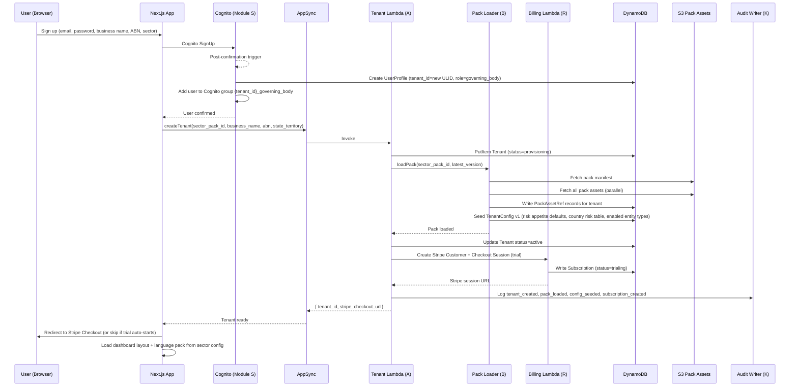
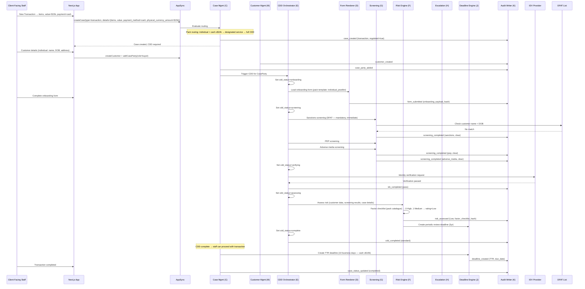
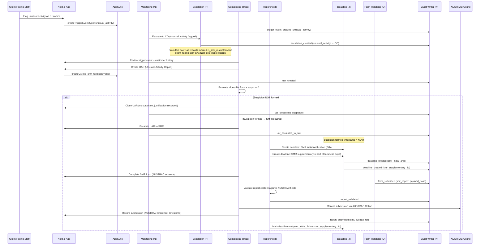
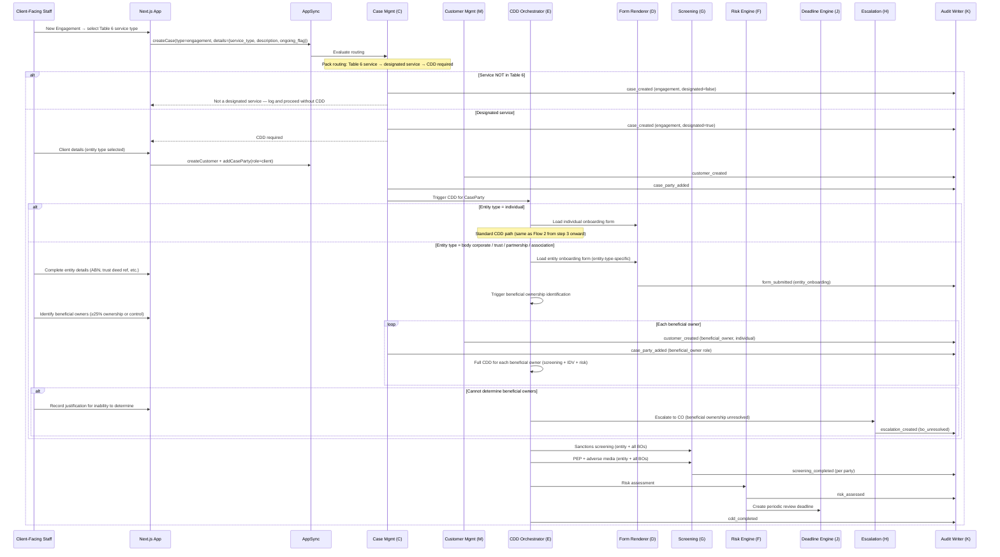
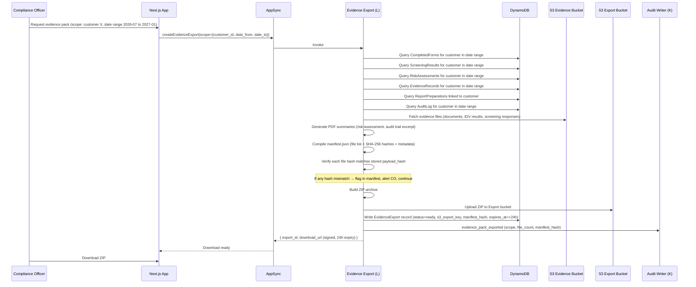

# T2C (AMLIQ) — Key Flows

> **Source:** Extracted verbatim from Section 7 of the master design document
> (`docs/architecture/module-design-document.md`, lines 1598–2313).

---

## 7. Key Flows

Each flow is a step-by-step walkthrough showing the modules involved, the data written, the audit events emitted, and the decision points. Mermaid sequence diagrams accompany each flow.

### Flow 1 — Tenant Signup & Sector Pack Provisioning

**Trigger:** New user signs up and selects a sector.
**Happy path duration:** < 10 seconds (automated).
**Modules involved:** S (Auth), A (Multi-Tenancy), B (Sector Pack), J (Deadline), R (Billing), K (Audit).



**Step-by-step:**

| # | Step | Module | Data written | Audit event |
|:--|:-----|:-------|:------------|:------------|
| 1 | User submits signup form | S | Cognito user, UserProfile | `user_signup` |
| 2 | Post-confirmation trigger sets tenant_id + role | S | Cognito custom attrs, Cognito group membership | `user_role_assigned` |
| 3 | createTenant mutation invoked | A | Tenant (status=provisioning) | `tenant_create_started` |
| 4 | Pack Loader fetches sector pack assets from S3 | B | PackAssetRef records | `pack_loaded` |
| 5 | Seed TenantConfig v1 (risk appetite, country risk, entity types) | A | TenantConfig v1 | `config_seeded` |
| 6 | Tenant status → active | A | Tenant update | `tenant_activated` |
| 7 | Create Stripe customer + trial subscription | R | Subscription (trialing) | `subscription_created` |
| 8 | Return to frontend; load sector-specific UI | B, Q | — (client-side reads) | — |

**Failure / rollback:**
- If pack loading fails at step 4 → Tenant status stays `provisioning`; retry with backoff; if 3 retries fail → mark `provision_failed`, alert admin, notify user.
- If Stripe call fails at step 7 → Tenant is active but no billing; background job reconciles; user prompted to complete billing on next login.

---

### Flow 2 — Jeweller Transaction Onboarding (Full CDD)

**Trigger:** Client-facing staff creates a new transaction case for a walk-in customer purchasing jewellery ≥ $10,000 in physical currency.
**Happy path duration:** 10–30 minutes (staff-driven, IDV may be async).
**Modules involved:** C (Case), M (Customer), E (CDD), D (Form), G (Screening), F (Risk), H (Escalation), J (Deadline), L (Evidence), K (Audit).



**Jewellers routing nuance (decision tree at step 1):**

| Entity type | Payment method | Physical currency ≥ $10k? | Result |
|:------------|:--------------|:--------------------------|:-------|
| Individual | Cash | Yes | Designated service → full CDD + TTR |
| Individual | Cash | No | Designated service → full CDD (no TTR) |
| Individual | Electronic | — | Designated service → full CDD |
| Non-individual (body corp, trust, etc.) | Electronic | — | **Electronic payment referral — not a designated service for jewellers.** Log and close. |
| Non-individual | Cash | Yes | Designated service → full CDD + TTR |
| Non-individual | Cash | No | Designated service → full CDD |

**Step-by-step:**

| # | Step | Module | Data written | Audit event |
|:--|:-----|:-------|:------------|:------------|
| 1 | Staff enters transaction details; pack routing evaluates | C | Case (type=transaction, regulated=true) | `case_created` |
| 2 | Staff enters customer details | M, C | Customer, CaseParty | `customer_created`, `case_party_added` |
| 3 | CDD triggered; onboarding form loaded from pack | E, D | CompletedForm (onboarding) | `cdd_initiated`, `form_submitted` |
| 4 | Sanctions screening (DFAT) — cannot delay | G | ScreeningResult (sanctions, clear) | `screening_completed` |
| 5 | PEP + adverse media screening | G | ScreeningResult ×2 | `screening_completed` ×2 |
| 6 | Identity verification (IDV provider or manual) | E | EvidenceRecord (IDV result) | `idv_completed` |
| 7 | Risk assessment (factor checklist → rating) | F | RiskAssessment | `risk_assessed` |
| 8 | Periodic review deadline created (frequency per risk tier) | J | Deadline (periodic_review) | `deadline_created` |
| 9 | CDD complete; TTR deadline created (cash ≥$10k) | E, J | CaseParty update, Deadline (TTR) | `cdd_completed`, `deadline_created` |
| 10 | Transaction completed | C | Case status=completed | `case_completed` |

**High-risk variant (branch at step 7):**
If risk rating = High → CDD status changes to `escalated` → Escalation created (to CO) → CO reviews, triggers Enhanced CDD → source-of-funds/wealth form → Senior Manager approval required → if approved, CDD completes with enhanced monitoring (12-month review cycle).

---

### Flow 3 — Suspicious Matter Report (SMR) Pipeline

**Trigger:** Staff flags unusual activity, or CO identifies a suspicious matter during review.
**Happy path duration:** Hours to days (investigation + CO judgement + manual AUSTRAC submission).
**Modules involved:** N (Monitoring), H (Escalation), I (Reporting), J (Deadline), D (Form), L (Evidence), K (Audit).
**Tipping-off controls active throughout.**



**Tipping-off controls enforced at every step:**

| Control | Enforcement point | Mechanism |
|:--------|:-----------------|:----------|
| UAR/SMR records invisible to `client_facing` | AppSync resolver | `is_smr_restricted: true` → resolver checks role ∈ {CO, SM, GB}; rejects otherwise |
| Escalation reason does not mention suspicion to `client_facing` | Escalation Engine | Escalation visible to `client_facing` shows only "compliance review required" — no suspicion language |
| Offboarding (if needed) uses safe reasons only | Customer Mgmt | Reason picker: "risk appetite" / "CDD non-compliance" only; no free-text |
| Safe communication templates | Frontend | Offboarding comms templates pre-approved; no customisation of reason text |
| Accountant qualified disclosure | Sector Pack config | `accountant_qualified_disclosure: true` flag enables configurable exception per pack |

**Step-by-step:**

| # | Step | Module | Data written | Audit event |
|:--|:-----|:-------|:------------|:------------|
| 1 | Staff flags unusual activity | N | TriggerEvent (unusual_activity) | `trigger_event_created` |
| 2 | Auto-escalate to CO | H | Escalation (unusual_activity → CO) | `escalation_created` |
| 3 | CO creates UAR (restricted) | N | UAR (is_smr_restricted=true) | `uar_created` |
| 4a | No suspicion → close UAR | N | UAR status=closed | `uar_closed` |
| 4b | Suspicion formed → SMR pipeline | N, I | UAR escalated; ReportPreparation (SMR) | `uar_escalated_to_smr` |
| 5 | Deadlines created (24h initial, 3d supplementary) | J | Deadline ×2 | `deadline_created` ×2 |
| 6 | CO completes SMR form | D | CompletedForm (SMR, payload_hash) | `form_submitted` |
| 7 | Report validated | I | ReportPreparation status=ready | `report_validated` |
| 8 | CO submits manually to AUSTRAC Online | I | ReportSubmission (austrac_ref, timestamp) | `report_submitted` |
| 9 | Deadline marked met | J | Deadline status=met | `deadline_met` |

---

### Flow 4 — Periodic Review & Risk Reassessment

**Trigger:** Deadline Engine fires a periodic review deadline (12mo for High, 2yr for Medium, 3yr for Low).
**Happy path duration:** 1–5 days (staff collects updated info, CO reviews).
**Modules involved:** J (Deadline), N (Monitoring), D (Form), G (Screening), F (Risk), H (Escalation), K (Audit).

```mermaid
sequenceDiagram
    participant Sched as EventBridge (15-min tick)
    participant DLFn as Deadline Engine (J)
    participant NotifFn as Notification (J)
    participant CO as Compliance Officer
    participant Staff as Client-Facing Staff
    participant App as Next.js App
    participant MonFn as Monitoring (N)
    participant FormFn as Form Renderer (D)
    participant ScreenFn as Screening (G)
    participant RiskFn as Risk Engine (F)
    participant EscFn as Escalation (H)
    participant Audit as Audit Writer (K)

    Sched->>DLFn: Tick — scan deadlines
    DLFn->>DLFn: Find: periodic_review deadline due within warning window
    DLFn->>NotifFn: Send warning (email + in-app) to CO
    DLFn->>Audit: deadline_warned (periodic_review)

    CO->>App: Open periodic review for customer
    CO->>Staff: Assign data collection (if needed)

    Staff->>App: Complete periodic review form (pre-populated with current data)
    FormFn->>Audit: form_submitted (periodic_review, payload_hash)

    MonFn->>ScreenFn: Trigger rescreening (sanctions + PEP + adverse media)
    ScreenFn->>ScreenFn: Compare results to previous screening
    ScreenFn->>Audit: screening_completed (rescreening, delta=none)

    MonFn->>RiskFn: Reassess risk (updated data + new screening results)
    RiskFn->>RiskFn: Factor checklist → new rating

    alt Rating unchanged
        RiskFn->>Audit: risk_assessed (unchanged, Medium)
        RiskFn->>DLFn: Create next periodic review deadline (same frequency)
        MonFn->>Audit: periodic_review_completed
    else Rating increased (e.g., Medium → High)
        RiskFn->>Audit: risk_assessed (changed, Medium→High)
        RiskFn->>EscFn: Escalate — risk increase requires CO/SM review
        EscFn->>Audit: escalation_created (risk_increase)
        RiskFn->>DLFn: Create next periodic review deadline (12mo — High frequency)
        MonFn->>MonFn: Update MonitoringPlan (new version, High tier)
        Note over CO: CO reviews; may trigger Enhanced CDD
    else Rating decreased (e.g., High → Medium)
        RiskFn->>Audit: risk_assessed (changed, High→Medium)
        RiskFn->>DLFn: Create next periodic review deadline (2yr — Medium frequency)
        MonFn->>MonFn: Update MonitoringPlan (new version, Medium tier)
        MonFn->>Audit: periodic_review_completed (risk_decreased)
    end

    DLFn->>DLFn: Mark current periodic_review deadline as met
    DLFn->>Audit: deadline_met (periodic_review)
```

**Step-by-step:**

| # | Step | Module | Data written | Audit event |
|:--|:-----|:-------|:------------|:------------|
| 1 | Deadline Engine detects upcoming periodic review | J | Notification (warning to CO) | `deadline_warned` |
| 2 | Staff completes periodic review form (pre-populated) | D | CompletedForm (periodic_review) | `form_submitted` |
| 3 | Rescreening triggered (sanctions, PEP, adverse media) | G | ScreeningResult ×3 (rescreening) | `screening_completed` ×3 |
| 4 | Risk reassessment with updated data | F | RiskAssessment (new) | `risk_assessed` |
| 5a | Rating unchanged → next review at same frequency | J | Deadline (next periodic_review) | `deadline_created` |
| 5b | Rating increased → escalation + shorter review cycle | H, J, N | Escalation, Deadline, MonitoringPlan (new version) | `escalation_created`, `deadline_created`, `monitoring_plan_updated` |
| 5c | Rating decreased → longer review cycle | J, N | Deadline, MonitoringPlan (new version) | `deadline_created`, `monitoring_plan_updated` |
| 6 | Current deadline marked met | J | Deadline status=met | `deadline_met` |

**Overdue variant:** If deadline passes without review completion → status changes to `overdue` → escalate to SM → if still unresolved → escalate to GB → compliance incident created.

> **Section 7 — Flows 1–4 complete.**

---

### Flow 5 — Accountant Engagement Onboarding

**Trigger:** Compliance officer or client-facing staff initiates a new engagement with a client requiring a Table 6 designated service.
**Happy path duration:** 1–5 days (CDD may involve beneficial ownership mapping for entity clients).
**Modules involved:** C (Case), M (Customer), E (CDD), D (Form), G (Screening), F (Risk), J (Deadline), H (Escalation), L (Evidence), K (Audit).



**Accountant-specific nuances:**

| Nuance | Implementation |
|:-------|:--------------|
| **Table 6 service selector** | Pack-configured dropdown; only services in Table 6 trigger CDD. Non-designated services logged but no CDD. |
| **Beneficial ownership** | Required for all non-individual entity types. Each BO is a separate Customer with own CDD/screening/risk. |
| **Delayed CDD** | Accountants may delay CDD up to 20 days if: (a) necessary to avoid disruption, (b) ML/TF risk low. Sanctions screening **cannot** be delayed. Justification recorded. Deadline created. |
| **Ongoing engagements** | If `ongoing_flag=true`, monitoring plan is active for engagement duration (not one-off). |
| **Qualified disclosure exception** | Pack config `accountant_qualified_disclosure: true` — allows CO to disclose to client under s.123(4) exception. Configurable per tenant. |

**Delayed CDD variant (branch after case creation):**

| # | Step | Module | Data written | Audit event |
|:--|:-----|:-------|:------------|:------------|
| 1 | Staff selects "Delay CDD" with justification | E | CaseParty cdd_status=delayed | `cdd_delayed` |
| 2 | Sanctions screening proceeds immediately (cannot delay) | G | ScreeningResult (sanctions) | `screening_completed` |
| 3 | Deadline created: 20-day CDD completion | J | Deadline (delayed_cdd, 20 days) | `deadline_created` |
| 4 | Engagement proceeds; CDD must complete within 20 days | E, J | — | — |
| 5 | If deadline expires without completion → escalate | H | Escalation (delayed_cdd_overdue) | `escalation_created` |

---

### Flow 6 — Real Estate Dual-Party CDD

**Trigger:** Agent creates a property transaction case. Both buyer and seller (or landlord and tenant) require CDD.
**Happy path duration:** 1–10 days (dual-party, may be asynchronous as parties provide documents at different times).
**Modules involved:** C (Case), M (Customer), E (CDD), D (Form), G (Screening), F (Risk), J (Deadline), H (Escalation), K (Audit).

```mermaid
sequenceDiagram
    participant Agent as Client-Facing Staff (Agent)
    participant App as Next.js App
    participant API as AppSync
    participant CaseFn as Case Mgmt (C)
    participant CustFn as Customer Mgmt (M)
    participant CDDFn as CDD Orchestrator (E)
    participant ScreenFn as Screening (G)
    participant RiskFn as Risk Engine (F)
    participant DLFn as Deadline Engine (J)
    participant Audit as Audit Writer (K)

    Agent->>App: New Property Transaction → type=sale, address
    App->>API: createCase(type=property_transaction, details={property_address, transaction_type=sale})
    CaseFn->>Audit: case_created (property_transaction, designated=true)
    Note over CaseFn: Real estate: ALL property transactions are designated services

    Agent->>App: Add seller (direct client)
    App->>API: createCustomer(seller) + addCaseParty(role=seller, is_direct_client=true)
    CustFn->>Audit: customer_created (seller)
    CaseFn->>Audit: case_party_added (seller)

    Agent->>App: Add buyer (counterparty)
    App->>API: createCustomer(buyer) + addCaseParty(role=buyer, is_direct_client=false)
    CustFn->>Audit: customer_created (buyer)
    CaseFn->>Audit: case_party_added (buyer)

    par CDD for Seller
        CaseFn->>CDDFn: Trigger CDD (seller)
        CDDFn->>ScreenFn: Sanctions + PEP + adverse media
        CDDFn->>CDDFn: IDV → Risk assessment
        CDDFn->>Audit: cdd_completed (seller)
    and CDD for Buyer
        CaseFn->>CDDFn: Trigger CDD (buyer)
        CDDFn->>ScreenFn: Sanctions + PEP + adverse media
        CDDFn->>CDDFn: IDV → Risk assessment
        CDDFn->>Audit: cdd_completed (buyer)
    end

    Note over CaseFn: Both parties CDD complete → transaction can proceed

    alt Buyer withdraws mid-transaction
        Agent->>App: Offboard counterparty (buyer)
        CaseFn->>CaseFn: Remove buyer CaseParty; case remains open for seller
        CustFn->>Audit: counterparty_offboarded (buyer, reason=transaction_withdrawn)
        Note over Agent: New buyer added later → new CaseParty + new CDD
    end

    Agent->>App: Transaction settles
    CaseFn->>Audit: case_status_updated (completed)
    RiskFn->>DLFn: Periodic review deadlines for both parties
```

**Real estate–specific nuances:**

| Nuance | Implementation |
|:-------|:--------------|
| **Always designated** | Pack routing: all property transactions are designated services. No "not regulated" exit. |
| **Dual-party CDD** | Both buyer and seller (or landlord and tenant) require independent CDD. Each is a CaseParty with own cdd_status. |
| **Direct client vs counterparty** | `is_direct_client` flag on CaseParty. Agent owes full ongoing duty to direct client. Counterparty CDD is for the transaction only. |
| **Counterparty offboarding** | Counterparty can be removed from case without closing the case. Direct client relationship continues. No tipping-off concern for counterparty withdrawal (transaction reason, not suspicion). |
| **Beneficial ownership** | Required for entity-type buyers/sellers (body corporate, trust). Same as accountant flow — each BO requires own CDD. Built in Phase 2, reused here. |
| **Parallel CDD** | Both parties' CDD can proceed concurrently. Case cannot proceed to settlement until both are complete. |

**Step-by-step:**

| # | Step | Module | Data written | Audit event |
|:--|:-----|:-------|:------------|:------------|
| 1 | Agent creates property transaction case | C | Case (type=property_transaction) | `case_created` |
| 2 | Add seller (direct client) + buyer (counterparty) | M, C | Customer ×2, CaseParty ×2 | `customer_created` ×2, `case_party_added` ×2 |
| 3 | CDD triggered for both parties (parallel) | E, G, F | Per party: CompletedForm, ScreeningResult ×3, RiskAssessment | `cdd_initiated` ×2, `cdd_completed` ×2 |
| 4 | Both CDD complete → case can proceed | C | Case status eligible for settlement | — |
| 5 | (Optional) Counterparty offboarded | M, C | CaseParty removed; Customer status=offboarded | `counterparty_offboarded` |
| 6 | Transaction settles; periodic reviews scheduled | C, J | Case completed; Deadline ×2 | `case_completed`, `deadline_created` ×2 |

---

### Flow 7 — Evidence Pack Export

**Trigger:** CO, SM, or GB requests an evidence bundle for AUSTRAC review, independent evaluation, or board reporting.
**Happy path duration:** 10–60 seconds (automated generation).
**Modules involved:** L (Evidence), K (Audit), D (Form), G (Screening), F (Risk), I (Reporting).



**Evidence pack contents (ZIP structure):**

```
evidence-pack-{customer_id}-{date}.zip
├── manifest.json              # File inventory + SHA-256 hashes + generation metadata
├── summary/
│   ├── risk-assessment.pdf    # Generated from RiskAssessment records
│   ├── audit-trail.pdf        # Generated from AuditLog query
│   └── screening-summary.pdf  # Generated from ScreeningResult records
├── forms/
│   ├── onboarding-{form_id}.json
│   ├── periodic-review-{form_id}.json
│   └── ...
├── screening/
│   ├── sanctions-{result_id}.json
│   ├── pep-{result_id}.json
│   └── ...
├── evidence/
│   ├── id-document-{evidence_id}.pdf
│   ├── trust-deed-{evidence_id}.pdf
│   └── ...
└── reports/
    ├── ttr-{report_id}.json   (if applicable)
    └── ...
```

**Step-by-step:**

| # | Step | Module | Data written | Audit event |
|:--|:-----|:-------|:------------|:------------|
| 1 | CO selects scope (customer, case, or date range) | — | — | — |
| 2 | Export Lambda queries all relevant entities | L | — (reads only) | — |
| 3 | Fetch evidence files from S3; verify hashes | L | — | Hash mismatch → `integrity_warning` |
| 4 | Generate PDF summaries from structured data | L | — (in-memory) | — |
| 5 | Compile manifest with file list + hashes | L | — (in-memory) | — |
| 6 | Build ZIP, upload to Export bucket | L | EvidenceExport record (status=ready) | `evidence_pack_exported` |
| 7 | Return signed download URL (24h expiry) | L | — | — |

**Scope options:**

| Scope type | Query targets | Typical use |
|:-----------|:-------------|:-----------|
| **Customer** | All records linked to customer_id within optional date range | AUSTRAC review of specific customer |
| **Case** | All records linked to case_id | Transaction-specific audit |
| **Report** | All records linked to a specific report (SMR/TTR) | Report supporting evidence |
| **Full tenant** | All records within date range | Independent evaluation / annual review |

**Tipping-off:** If scope includes SMR-linked records, the export is restricted to CO/SM/GB. `client_facing` cannot generate packs that contain SMR content. Resolver checks `is_smr_restricted` on included records before allowing export.

---

### Flow 8 — Customer Offboarding with Tipping-Off Controls

**Trigger:** CO decides to end the customer relationship (risk appetite exceeded, CDD non-compliance, or post-SMR offboarding).
**Happy path duration:** 1–3 days (approval workflow + communication).
**Modules involved:** M (Customer), C (Case), H (Escalation), J (Deadline), N (Monitoring), L (Evidence), K (Audit).

```mermaid
sequenceDiagram
    participant CO as Compliance Officer
    participant App as Next.js App
    participant API as AppSync
    participant CustFn as Customer Mgmt (M)
    participant EscFn as Escalation (H)
    participant SM as Senior Manager
    participant CaseFn as Case Mgmt (C)
    participant MonFn as Monitoring (N)
    participant DLFn as Deadline Engine (J)
    participant Audit as Audit Writer (K)

    CO->>App: Initiate offboarding for customer
    App->>App: Display compliant reason picker (no free text)

    Note over App: Permitted reasons ONLY:<br/>1. "Risk outside our risk appetite"<br/>2. "Unable to complete customer due diligence"<br/>3. "Customer requested closure"<br/>4. "Regulatory direction"<br/>Never: "suspicious activity", "money laundering concern", etc.

    CO->>App: Select reason + add internal notes
    App->>API: requestOffboarding(customer_id, reason_code, internal_notes)

    CustFn->>EscFn: Create escalation → Senior Manager approval required
    EscFn->>Audit: escalation_created (offboarding_approval)
    EscFn->>SM: Notification — offboarding approval requested

    SM->>App: Review offboarding request
    SM->>App: Approve with optional conditions

    alt SM approves
        EscFn->>Audit: escalation_approved (offboarding)

        CustFn->>CustFn: Customer status → offboarded
        CustFn->>CustFn: Set offboarded_at = now, offboard_reason = reason_code
        CustFn->>Audit: customer_offboarded (reason_code)

        CaseFn->>CaseFn: Close all open cases for customer
        CaseFn->>Audit: case_closed (offboarding) — per case

        MonFn->>MonFn: Cancel active monitoring plan
        MonFn->>Audit: monitoring_cancelled (offboarding)

        DLFn->>DLFn: Cancel pending periodic review deadlines
        DLFn->>Audit: deadline_cancelled (offboarding)

        Note over CustFn: Set retention_start_date = now on customer + all linked evidence
        CustFn->>Audit: retention_started (7yr from now)

        CO->>App: Generate offboarding communication
        App->>App: Load safe communication template
        Note over App: Template uses ONLY the selected compliant reason.<br/>No reference to suspicion, SMR, or investigation.<br/>Template is read-only — CO cannot edit reason text.
        CO->>App: Send / record communication
        CustFn->>Audit: offboarding_communicated (channel, template_id)

    else SM rejects
        EscFn->>Audit: escalation_rejected (offboarding, justification)
        Note over CO: Customer remains active; CO may re-request with different justification
    end
```

**Tipping-off controls specific to offboarding:**

| Control | Risk mitigated | Enforcement |
|:--------|:--------------|:-----------|
| **Compliant reason picker** | Offboarding reason reveals suspicion | System-enforced enum: 4 permitted reasons. No free-text reason field exposed to customer. Internal notes are internal-only. |
| **Safe communication templates** | Written communication reveals suspicion | Pre-approved templates loaded from sector pack. Reason text is injected from reason_code — CO cannot edit the reason paragraph. |
| **SM approval gate** | Rash offboarding post-SMR raises suspicion | SM must approve; approval logged; SM sees internal notes but communication uses safe template |
| **Timing controls** | Immediate offboarding after SMR filing looks suspicious | System does not auto-offboard on SMR. CO makes independent decision. If offboarding coincides with SMR, audit trail shows separate justification. |
| **Accountant qualified disclosure** | Accountant needs to inform client of reporting obligation | If `accountant_qualified_disclosure=true` in pack config, CO can enable qualified disclosure per s.123(4). Separate workflow, separate evidence record. |

**Step-by-step:**

| # | Step | Module | Data written | Audit event |
|:--|:-----|:-------|:------------|:------------|
| 1 | CO selects compliant offboarding reason | M | — (UI only, pending approval) | — |
| 2 | Escalation to SM for approval | H | Escalation (offboarding_approval) | `escalation_created` |
| 3 | SM approves/rejects | H | EscalationDecision | `escalation_approved` or `escalation_rejected` |
| 4 | Customer status → offboarded | M | Customer (status=offboarded, offboarded_at, reason_code) | `customer_offboarded` |
| 5 | Close all open cases | C | Case status=closed per case | `case_closed` ×N |
| 6 | Cancel monitoring plan + pending deadlines | N, J | MonitoringPlan cancelled; Deadlines cancelled | `monitoring_cancelled`, `deadline_cancelled` |
| 7 | Set retention start date | M, L | retention_start_date on Customer + EvidenceRecords | `retention_started` |
| 8 | Generate + send safe communication | M | Communication record (template_id, channel) | `offboarding_communicated` |

**Post-SMR offboarding nuance:** The system deliberately does **not** link offboarding to SMR filing. If a CO decides to offboard a customer who also has an SMR, the offboarding proceeds on its own merits (risk appetite / CDD non-compliance). The audit trail records both events independently. An AUSTRAC reviewer can see both, but the customer never sees an SMR-linked reason.

> **Section 7 complete.** All 8 key flows documented with sequence diagrams, step-by-step tables, sector-specific nuances, and variant branches.
