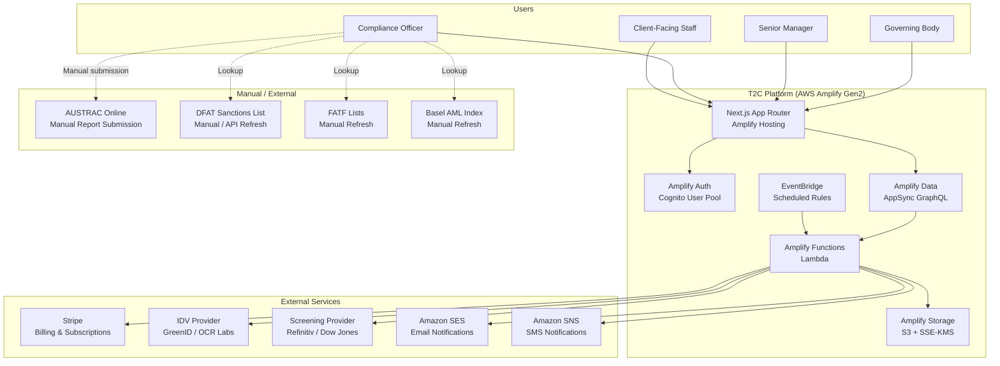
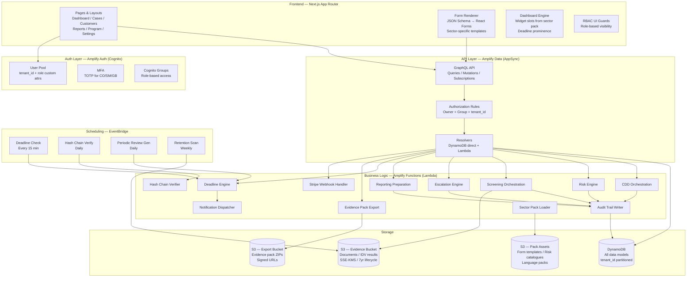
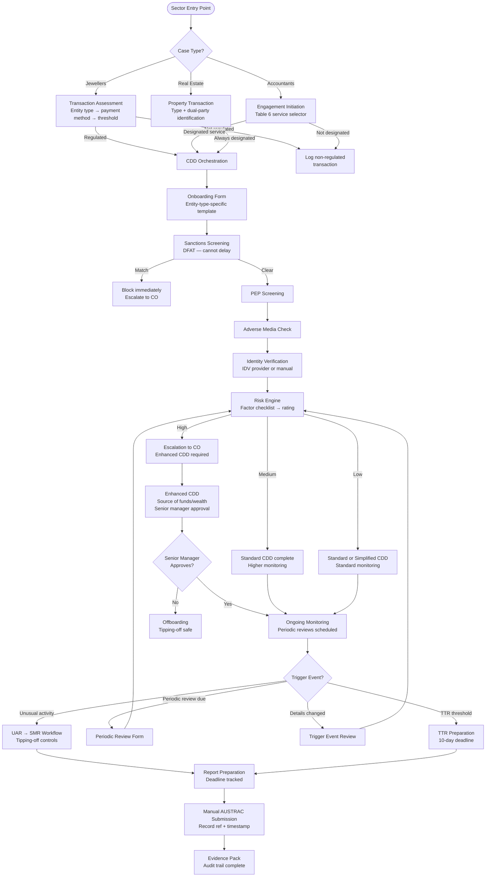
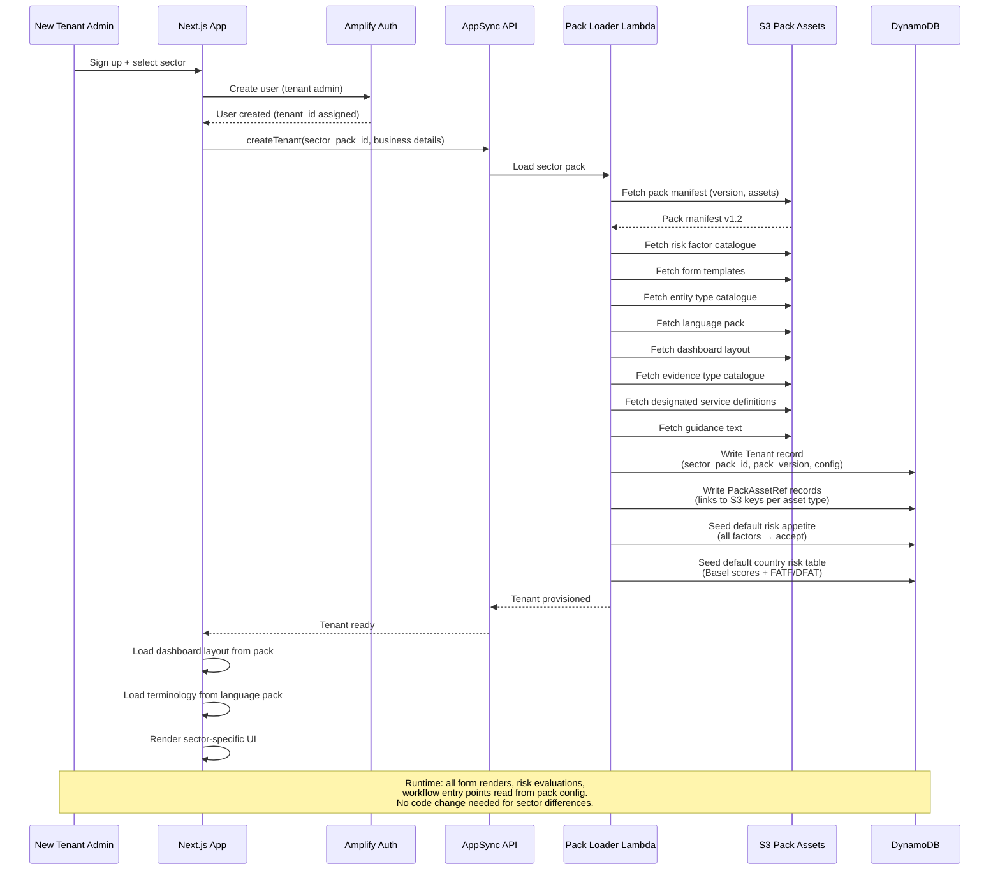
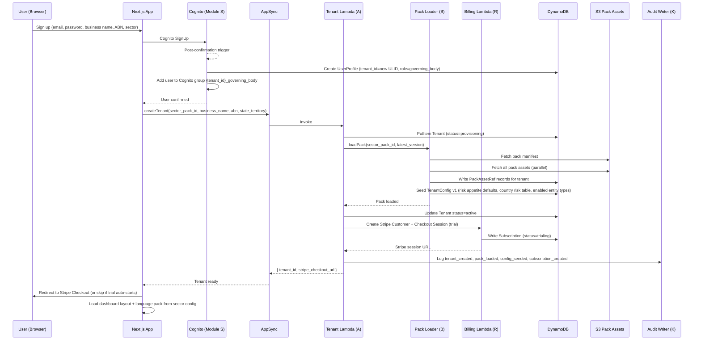
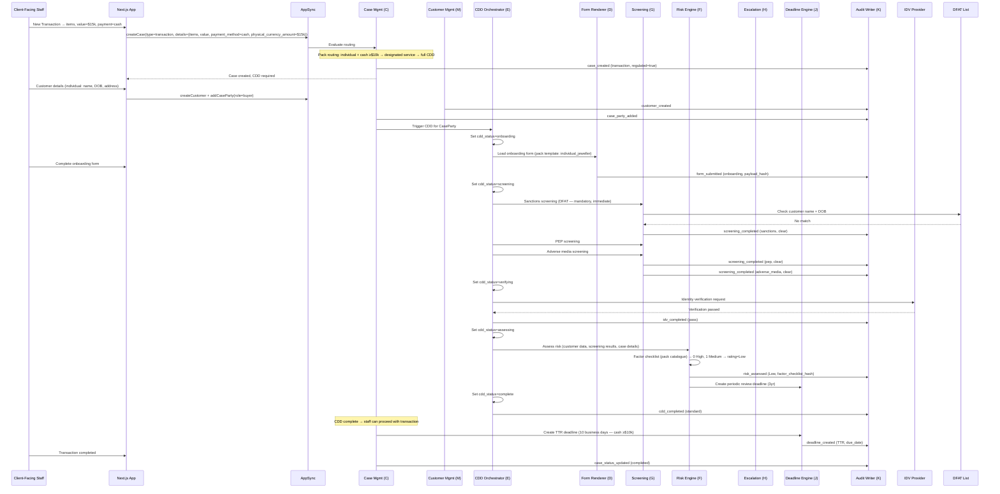
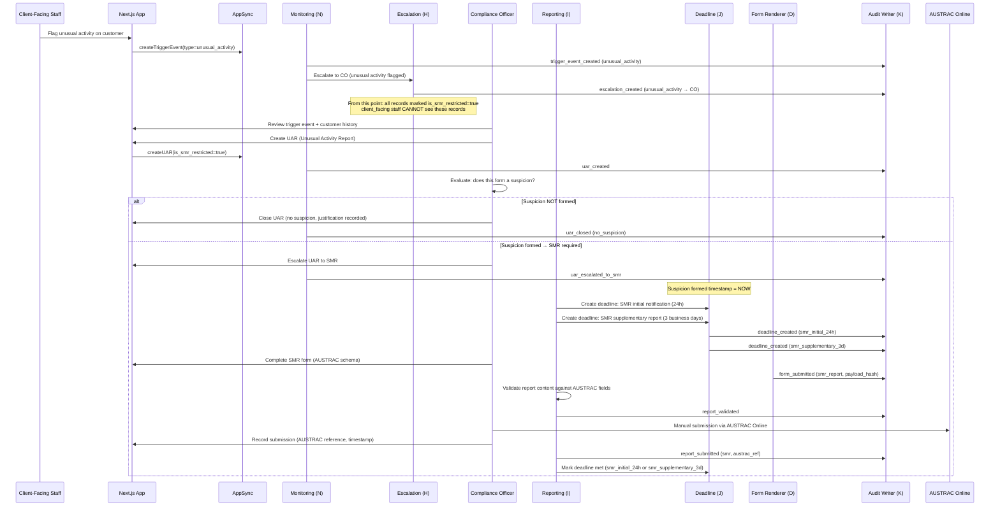
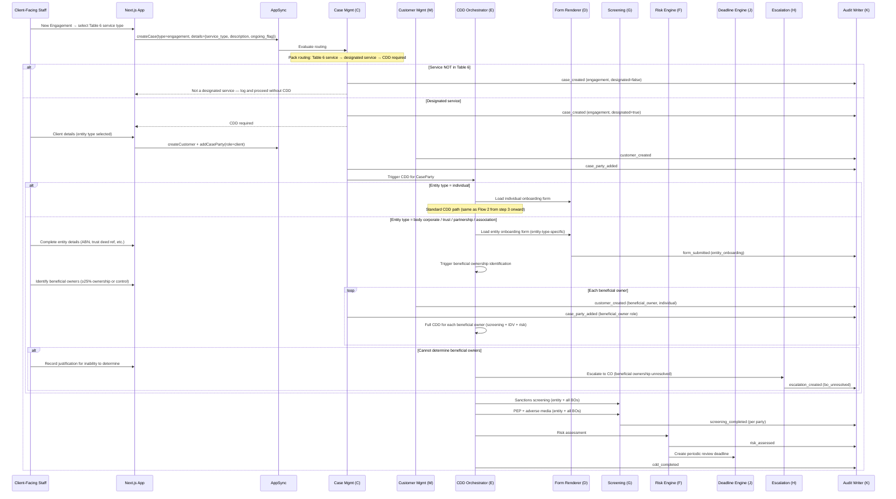
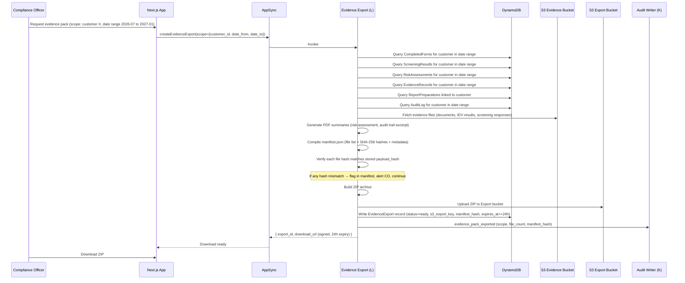
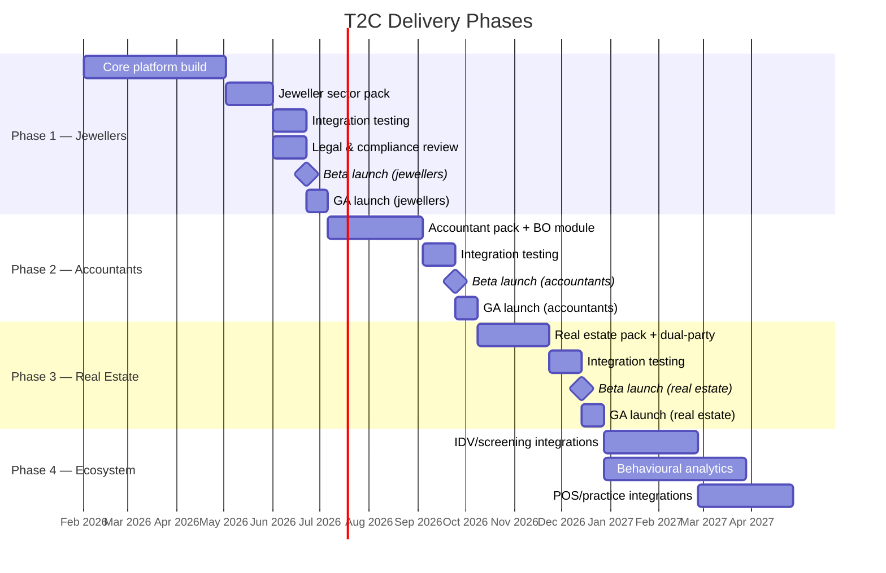

# T2C (AMLIQ) — Module Design Document

> **Version:** 1.0
> **Date:** 2026-02-26
> **Status:** Draft
> **Platform:** AWS Amplify Gen2 (Next.js App Router)
> **Source of truth:** `docs/concept/concept-final.md`

---

## Navigation — Spoke Documents

This master document is the canonical reference. The following focused working documents are extracted for implementation use:

### Module Files (`modules/`)

| ID | Module | File |
|:---|:-------|:-----|
| A | Multi-Tenancy & Tenant Configuration | [`modules/module-a-multi-tenancy.md`](modules/module-a-multi-tenancy.md) |
| B | Sector Pack Manager | [`modules/module-b-sector-pack.md`](modules/module-b-sector-pack.md) |
| C | Case Management | [`modules/module-c-case-management.md`](modules/module-c-case-management.md) |
| D | Form Renderer | [`modules/module-d-form-renderer.md`](modules/module-d-form-renderer.md) |
| E | CDD Orchestration | [`modules/module-e-cdd-orchestration.md`](modules/module-e-cdd-orchestration.md) |
| F | Risk Engine | [`modules/module-f-risk-engine.md`](modules/module-f-risk-engine.md) |
| G | Screening Orchestration | [`modules/module-g-screening.md`](modules/module-g-screening.md) |
| H | Escalation Engine | [`modules/module-h-escalation.md`](modules/module-h-escalation.md) |
| I | Reporting Preparation | [`modules/module-i-reporting.md`](modules/module-i-reporting.md) |
| J | Deadline & Notification Engine | [`modules/module-j-deadline-notification.md`](modules/module-j-deadline-notification.md) |
| K | Audit Trail & Evidence Integrity | [`modules/module-k-audit-trail.md`](modules/module-k-audit-trail.md) |
| L | Evidence Store & Export | [`modules/module-l-evidence-store.md`](modules/module-l-evidence-store.md) |
| M | Customer Management | [`modules/module-m-customer-management.md`](modules/module-m-customer-management.md) |
| N | Ongoing Monitoring | [`modules/module-n-ongoing-monitoring.md`](modules/module-n-ongoing-monitoring.md) |
| O | Program Management | [`modules/module-o-program-management.md`](modules/module-o-program-management.md) |
| P | Governance, Personnel & Training | [`modules/module-p-governance-personnel.md`](modules/module-p-governance-personnel.md) |
| Q | Dashboard & Analytics | [`modules/module-q-dashboard.md`](modules/module-q-dashboard.md) |
| R | Billing & Subscription | [`modules/module-r-billing.md`](modules/module-r-billing.md) |
| S | Auth & RBAC | [`modules/module-s-auth-rbac.md`](modules/module-s-auth-rbac.md) |

### Cross-Cutting Documents

| Document | Sections | File |
|:---------|:---------|:-----|
| Data Model | § 6 (Design rules, entity catalogue, GSIs, retention, integrity) | [`data-model.md`](data-model.md) |
| Key Flows | § 7 (All 8 sequence-diagrammed flows) | [`flows.md`](flows.md) |
| Security Controls | § 8 (RBAC matrix, tipping-off, encryption, OWASP, compliance) | [`security-controls.md`](security-controls.md) |
| Delivery Plan | § 10–11 (Phased plan, acceptance criteria, open questions) | [`delivery-plan.md`](delivery-plan.md) |
| Module Index | Cross-cutting concerns and invariants | [`modules/README.md`](modules/README.md) |

---

## 1. Executive Summary

T2C is a multi-tenant AML/CTF compliance orchestration and evidence platform for Australian businesses newly regulated under the AML/CTF Act Tranche 2 reforms (effective 1 July 2026). Rather than building three separate products for jewellers, accountants, and real estate agents, T2C is a **single unified platform with vertical sector packs**. Approximately 70% of the system — risk engine, CDD workflow orchestration, screening integration, escalation engine, reporting preparation, audit trail, evidence storage, program management, governance, personnel due diligence, training, retention, RBAC, multi-tenancy — is structurally identical across all sectors. The remaining 30% — designated service definitions, customer entity types, risk factor catalogues, form templates, workflow entry points, terminology, dashboard layouts — is cleanly handled through configuration loaded from a sector pack at tenant provisioning time.

### Launch order

| Phase | Sector | Justification |
|:------|:-------|:-------------|
| **Phase 1** | Jewellers | Simplest scope (2 primary CDD types, 1 threshold trigger), but exercises hardest reporting pipeline (daily TTR). Forces flexible Case abstraction. |
| **Phase 2** | Accountants | Adds 5 entity types, beneficial ownership, engagement-based workflow. Reuses 100% of core platform. |
| **Phase 3** | Real Estate | Adds dual-party CDD, counterparty offboarding. Beneficial ownership already built in Phase 2. |
| **Phase 4** | Ecosystem | Full IDV/screening integration, sector-specific POS/practice-management integrations, behavioural analytics. |

### Top 7 product risks and mitigations

| # | Risk | Impact | Mitigation |
|:--|:-----|:-------|:-----------|
| 1 | **Compliance gap** — product misinterprets AUSTRAC obligations | Tenant receives enforcement action; product liability | All obligation mappings cite AUSTRAC source documents; product positioned as "compliance workflow support" not legal advice; legal review gate before launch |
| 2 | **Data integrity failure** — evidence tampered or lost | 7-year audit trail invalidated; tenant cannot demonstrate compliance | Append-only audit log with SHA-256 hash chain; periodic integrity verification job; SSE-KMS encryption; immutable evidence store |
| 3 | **Multi-tenancy breach** — cross-tenant data leak | Privacy breach; regulatory breach; reputational damage | tenant_id on every entity; resolver-level auth rules; no cross-tenant queries; penetration testing |
| 4 | **Missed deadline** — system fails to track or alert on SMR/TTR/CBM | Tenant commits reporting offence | Deterministic deadline engine with multiple notification channels; escalation on missed acknowledgement; dashboard prominence; HA deployment |
| 5 | **Reporting preparation error** — SMR/TTR content incomplete or malformed | Tenant submits defective report to AUSTRAC | Structured form templates with validation; CO review gate; checklist before manual submission |
| 6 | **Tipping-off violation** — system exposes SMR existence to wrong role | Criminal offence for tenant personnel | RBAC restricts SMR-related records to CO/senior manager/governing body; offboarding templates use compliant reasons only; accountant qualified disclosure configurable per pack |
| 7 | **Security breach** — unauthorised access to PII or compliance data | Privacy Act breach; AUSTRAC notification; reputational damage | MFA for privileged roles; encryption at rest/transit; session timeouts; OWASP Top 10 mitigations; annual pen test; CloudWatch alerting |

---

## 2. Product Goals and Non-Goals

### Goals

| # | Goal | Description |
|:--|:-----|:-----------|
| G1 | **Evidence-first compliance orchestration** | Every compliance action produces a timestamped, hashed, attributed evidence artefact. The platform's primary output is a defensible audit trail. |
| G2 | **Deterministic deadline control** | Every time-sensitive obligation (SMR 24h/3d, TTR 10d, CBM, ACR 31 Mar, periodic reviews, delayed CDD, CO notification 14d) is tracked with status lifecycle, warnings, and escalation. No deadline is missed due to system ambiguity. |
| G3 | **Audit-ready evidence packs** | One-click export of scoped evidence bundles (PDF/CSV/JSON) with integrity manifests. Ready for AUSTRAC review, independent evaluation, or governing body reporting. |
| G4 | **Sector packs as configuration** | Sector differences (forms, risk factors, terminology, workflow entry points, dashboard layout, evidence types, designated service definitions) are loaded from versioned sector pack assets — not hard-coded. Adding a new sector requires no core platform code changes. |
| G5 | **Multi-tenant isolation** | Strict row-level tenant isolation. Every data entity scoped to tenant_id. No cross-tenant data access at any layer. |
| G6 | **SMB-friendly UX** | Target users are sole practitioners and small teams (1-20 people). Workflows must be guided, terminology contextual, and compliance jargon minimised via sector language packs. |
| G7 | **7-year record integrity** | All compliance records retained for 7 years after relevance ends, with versioning, hashing, and tamper-evident storage. |

### Non-Goals

| # | Non-Goal | Rationale |
|:--|:---------|:----------|
| NG1 | **Direct AUSTRAC Online submission** | Product prepares report content; submission is manual via AUSTRAC Online. Deferred to Phase 4 if AUSTRAC provides an API. |
| NG2 | **Non-Australian operations** | AU-only regulatory context. No support for other jurisdictions. |
| NG3 | **Other Tranche 2 sectors (lawyers)** | Sector pack architecture supports future sectors, but lawyers are out of scope for Phases 1-4. |
| NG4 | **Guarantee of compliance** | Product is a compliance workflow tool, not legal advice. All guidance text references AUSTRAC source material. Legal review recommended before launch. |
| NG5 | **AI/ML-based detection** | Risk scoring is deterministic and rules-based per AUSTRAC factor catalogues. No machine learning models. Behavioural analytics deferred to Phase 4. |
| NG6 | **Real-time transaction monitoring** | T2C is a compliance workflow tool, not a transaction monitoring system. It processes transactions after they occur. |

---

## 3. Architectural Principles

### P1. Evidence integrity first

Every state change produces an immutable evidence record. Documents and provider responses are SHA-256 hashed on ingestion. The audit log is append-only with a hash chain (each entry = SHA-256 of previous chain hash + current entry data). Program documents are versioned — edits create new versions; previous versions are immutable. A background verification job periodically validates the hash chain and alerts on breaks.

### P2. Deterministic deadline engine

Every time-sensitive compliance obligation is represented as a Deadline entity with an explicit lifecycle (pending → warned → overdue → met/missed). The engine does not rely on user memory or ad-hoc reminders. Deadlines are created automatically when triggering events occur (SMR suspicion formed, TTR threshold crossed, periodic review due). Warning and escalation rules are configuration-driven per deadline type. The deadline engine runs on a schedule (EventBridge) independent of user sessions.

### P3. Strict tenant isolation

Every data entity includes tenant_id as part of its primary key or partition key. All data access resolves tenant_id from the authenticated user's session. AppSync resolvers enforce owner-based and group-based authorization rules that include tenant scoping. No API endpoint, resolver, or Lambda function permits cross-tenant data access. Storage (S3) uses tenant-prefixed key paths. Amplify Auth custom attributes carry tenant_id.

### P4. RBAC mapped to AUSTRAC governance roles

The platform's role model directly mirrors AUSTRAC's governance structure:

| Platform role | AUSTRAC governance role | Key permissions |
|:-------------|:-----------------------|:---------------|
| `governing_body` | Governing body / Board | Full visibility; approve program documents; receive annual report; final escalation |
| `senior_manager` | Senior manager | Approve high-risk customers; approve enhanced CDD; approve offboarding; receive escalations |
| `compliance_officer` | AML/CTF compliance officer | Manage all CDD/screening/escalation/reporting workflows; SMR access; program maintenance |
| `client_facing` | Client-facing staff | Initiate cases; complete onboarding forms; flag unusual activity; no SMR access |

Single-employee mode collapses all roles to one user. Self-approval loops are removed (actions are logged but not blocked for self-sign-off). RBAC is enforced at the AppSync resolver and Lambda function level.

### P5. Tipping-off safe-by-design

SMR-related records (UAR forms, SMR preparation, investigation notes, submission records) are access-restricted to `compliance_officer`, `senior_manager`, and `governing_body` roles. `client_facing` staff cannot see SMR content. Offboarding communication templates use only compliant reasons (risk appetite / CDD non-compliance) — never suspicion. The accountant qualified disclosure exception is a configurable flag in the sector pack.

### P6. Sector pack configuration — no code changes

Sector differences are expressed as versioned pack assets (JSON/YAML files in S3 or DynamoDB records). The core platform reads pack configuration at runtime. Pack assets include: risk factor catalogues, form template schemas, entity type catalogues with routing rules, workflow entry point definitions, language packs (i18n-style string maps), dashboard layout configurations, evidence type catalogues, designated service definitions, and guidance text. Adding or updating a sector requires deploying new pack assets — not changing application code.

### P7. Append-only audit — no deletes, no updates

The AuditLog table has no UPDATE or DELETE operations at any layer — AppSync, Lambda, or direct DynamoDB access. IAM policies for the AuditLog table grant only `PutItem` and `Query/GetItem`. The table's partition key design prevents overwriting existing records. This is enforced at the IAM policy level, not just application logic.

---

## 4. High-Level Architecture

### 4A. System Context Diagram



### 4B. Component Diagram



### 4C. Core Workflow Diagram



### 4D. Sector Pack Loading Diagram



---

## 5. Module Inventory

### Module A — Multi-Tenancy & Tenant Configuration

**Purpose:** Provision, configure, and isolate tenants. Every data entity in the system is scoped to a tenant. This module owns the Tenant entity and enforces the "no cross-tenant queries" invariant.

**Inputs / Outputs:**

| Direction | Interface | Description |
|:----------|:----------|:-----------|
| IN | `createTenant` mutation | Signup: business details, sector_pack_id, admin user |
| IN | `updateTenantConfig` mutation | Update risk appetite, country risk, notification config, governance roles |
| OUT | Tenant context | Every API call resolves tenant_id from authenticated user's Cognito custom attribute |
| OUT | Config read | Other modules read tenant config (risk appetite, enabled entity types, notification prefs) |

**Key responsibilities:**
1. Create Tenant record with sector_pack_id on signup
2. Trigger Sector Pack Loader to hydrate pack assets
3. Seed default configuration (risk appetite, country risk table, governance roles)
4. Enforce tenant_id on all DynamoDB partition keys
5. Support single-employee mode toggle (collapses governance roles)
6. Manage tenant-level feature flags (from entitlements)

**Data entities owned:** Tenant, TenantConfig (embedded or separate)

**Security / RBAC:**
- `createTenant`: unauthenticated (signup flow) → immediately assigns `governing_body` role to first user
- `updateTenantConfig`: `governing_body` or `compliance_officer` only
- All other modules read tenant config via internal context — never cross-tenant

**Audit requirements:** All config changes logged (risk appetite changes, governance role assignments, notification config changes). Previous config versions retained.

**Retention:** Tenant record: lifetime. Config change history: 7 years.

**Failure modes & compensating controls:**
| Failure | Impact | Control |
|:--------|:-------|:--------|
| Pack loading fails during signup | Tenant created but unusable | Transaction: roll back tenant creation if pack load fails; retry with exponential backoff |
| tenant_id missing from request | Cross-tenant data leak | AppSync resolver middleware validates tenant_id on every request; reject if missing |
| Config corruption | Workflows break | Config versioning; rollback to previous version |

**Sector pack touches:** `sector_pack_id` determines which pack is loaded. `enabled_entity_types` and `entity_type_routing` come from pack defaults but are tenant-editable. `is_single_employee` is tenant-set, not pack-determined.

**Amplify Gen2 implementation notes:**
- Tenant record in DynamoDB with `tenant_id` as partition key
- Cognito custom attribute `custom:tenant_id` set on user creation (post-confirmation Lambda trigger)
- Cognito custom attribute `custom:role` set on user creation and updated via admin API
- AppSync auth rules use `custom:tenant_id` for owner-based authorization on all models
- Lambda functions extract tenant_id from Cognito claims in the AppSync event

---

### Module B — Sector Pack Manager

**Purpose:** Store, version, and deliver sector pack assets to all other modules at runtime. Packs are the mechanism by which sector-specific behaviour is injected into the universal core platform.

**Inputs / Outputs:**

| Direction | Interface | Description |
|:----------|:----------|:-----------|
| IN | Pack deployment | Admin uploads new pack version (S3 + manifest) |
| IN | `loadPack(sector_pack_id, version?)` | Lambda reads pack assets for a tenant |
| OUT | Risk factor catalogue | → Risk Engine |
| OUT | Form templates | → Form Renderer |
| OUT | Entity type catalogue | → CDD Orchestration, Case Management |
| OUT | Workflow entry points | → Case Management |
| OUT | Language pack | → Frontend (i18n) |
| OUT | Dashboard layout | → Frontend (widget config) |
| OUT | Evidence type catalogue | → Evidence Store |
| OUT | Designated service definitions | → Case Management |
| OUT | Guidance text | → Form Renderer, Frontend |

**Key responsibilities:**
1. Store pack assets in S3 with versioned keys (`packs/{sector}/{version}/{asset_type}.json`)
2. Maintain PackVersion records in DynamoDB (version, release date, changelog, status)
3. Support pack rollout: draft → published → deprecated lifecycle
4. Tenant records reference a specific pack version; upgrades are explicit
5. Validate pack schema on upload (all required assets present, JSON valid)
6. Cache frequently accessed pack assets (in-memory Lambda cache or DynamoDB)

**Data entities owned:** SectorPack, PackVersion, PackAssetRef

**Security / RBAC:**
- Pack deployment: platform admin only (not tenant users)
- Pack read: any authenticated user within a tenant referencing that pack
- Pack assets are read-only for tenants

**Audit requirements:** Pack version changes logged. Tenant pack upgrades logged. Pack deployment history retained.

**Retention:** All pack versions retained indefinitely (tenants may reference old versions). Asset files in S3 with no lifecycle expiry.

**Failure modes & compensating controls:**
| Failure | Impact | Control |
|:--------|:-------|:--------|
| Pack asset missing from S3 | Module cannot load config | Schema validation on deploy; health check on load; fall back to previous version |
| Pack version mismatch | Tenant uses stale config | Explicit version pinning per tenant; upgrade is a deliberate action |
| Corrupt pack JSON | Runtime errors in form renderer, risk engine | JSON schema validation on upload; reject invalid packs |

**Sector pack touches:** This module IS the sector pack system. It provides assets to all other modules.

**Amplify Gen2 implementation notes:**
- Pack assets stored in S3 bucket (`t2c-pack-assets`) with versioned key paths
- PackVersion and PackAssetRef stored in DynamoDB via Amplify Data models
- Pack Loader Lambda reads S3 assets and caches in Lambda execution context (reused across warm invocations)
- Frontend fetches language pack and dashboard layout via AppSync query (cached client-side)

---

### Module C — Case Management

**Purpose:** Manage the central Case entity — the activity unit that triggers and organises all compliance workflows. Cases are subtyped per sector (Transaction, Engagement, Property Transaction) and linked to customers via CaseParty (many-to-many).

**Inputs / Outputs:**

| Direction | Interface | Description |
|:----------|:----------|:-----------|
| IN | `createCase` mutation | Staff creates a new case (type determined by sector entry point) |
| IN | `addCaseParty` mutation | Link a customer to a case with a role |
| IN | `updateCaseStatus` mutation | Progress case through lifecycle |
| OUT | Case created event | → CDD Orchestration (triggers onboarding) |
| OUT | Case party linked event | → CDD Orchestration (triggers CDD per party) |
| OUT | Case data | → Reporting, Evidence Export |

**Key responsibilities:**
1. Create cases with sector-specific subtypes (using `case_type` discriminator from pack workflow entry point)
2. Jewellers: Transaction subtype — capture items, value, payment method, physical currency amount, threshold assessment, regulated flag
3. Accountants: Engagement subtype — capture Table 6 service type, engagement description, ongoing vs one-off
4. Real Estate: Property Transaction subtype — capture property address, transaction type (sale/lease/manage), dual-party structure
5. Manage CaseParty links — customer + case + role (buyer/seller/landlord/tenant/client/counterparty) + CDD status per party
6. Enforce: no party can proceed to service delivery until CDD status is complete (or delayed CDD is approved)
7. Support counterparty offboarding (Real Estate) — remove counterparty without closing case for direct client

**Data entities owned:** Case, CaseParty

**Security / RBAC:**
- `createCase`: `client_facing`, `compliance_officer`
- `addCaseParty`: `client_facing`, `compliance_officer`
- `updateCaseStatus`: `compliance_officer` (for status changes that affect compliance state)
- All roles can view cases within their tenant

**Audit requirements:** Case creation, status changes, party additions/removals all logged with timestamps and user attribution.

**Retention:** 7 years after case end date.

**Failure modes & compensating controls:**
| Failure | Impact | Control |
|:--------|:-------|:--------|
| Case created without party | Orphan case | Validation: at least one party required on creation (except real estate where parties may be added as identified) |
| Duplicate case for same transaction | Duplicate compliance records | Idempotency key on case creation (tenant_id + case_type + reference fields) |
| CDD status out of sync with actual CDD | Service delivered without CDD | CDD Orchestration module is source of truth; Case reads CDD status, doesn't write it |

**Sector pack touches:**
- `case_type` discriminator mapped from sector pack workflow entry point
- Sector-specific fields on case subtypes (transaction value, service type, property address) defined in pack form templates
- "Is this regulated?" logic for jewellers is a pack-configured decision tree

**Amplify Gen2 implementation notes:**
- Case model in DynamoDB with `tenant_id` as partition key, `case_id` as sort key
- CaseParty model with `case_id` as partition key, `customer_id#role` as sort key
- GSI on CaseParty: `tenant_id#customer_id` → query all cases for a customer
- `case_type` stored as enum discriminator; subtype fields stored as a typed JSON `details` attribute
- AppSync subscription on case status change for real-time dashboard updates

---

### Module D — Form Renderer

**Purpose:** Render, validate, and store compliance forms from sector pack JSON/YAML templates. Every completed form is an evidence artefact with a frozen schema version reference and payload hash.

**Inputs / Outputs:**

| Direction | Interface | Description |
|:----------|:----------|:-----------|
| IN | Form template (from Sector Pack) | JSON schema defining fields, sections, conditional logic, validation rules, guidance text |
| IN | User input (form submission) | Field values entered by staff |
| OUT | CompletedForm record | Stored with schema_version, payload, payload_hash, submitted_by, timestamp |
| OUT | Form data | → CDD Orchestration, Risk Engine, Reporting, Evidence Export |

**Key responsibilities:**
1. Parse JSON form templates from sector pack into renderable React form components
2. Support field types: text, number, date, select, multi-select, checkbox, file upload, signature, conditional section (show/hide based on other field values)
3. Apply validation rules from template (required, regex, min/max, cross-field)
4. Replace terminology tokens with sector language pack strings (e.g., `{{customer_label}}` → "customer" or "client")
5. On submission: freeze the schema version used, compute SHA-256 hash of payload, store as CompletedForm
6. Completed forms are immutable — corrections create a new form version linked to the original
7. Support pre-population from existing customer data for periodic review and trigger event forms
8. Render guidance text (from pack) as contextual help per field/section

**Data entities owned:** CompletedForm

**Security / RBAC:**
- Form submission: role depends on form type (onboarding → `client_facing`+; enhanced CDD → `compliance_officer`+; SMR → `compliance_officer`+ only)
- Form read: scoped by SMR tipping-off rules (UAR/SMR forms restricted to CO/SM/GB)

**Audit requirements:** Form submission logged with user, timestamp, schema version, payload hash. Form corrections logged with reference to original.

**Retention:** 7 years after parent entity (customer/case/program) relevance ends.

**Failure modes & compensating controls:**
| Failure | Impact | Control |
|:--------|:-------|:--------|
| Template schema invalid | Form won't render | Schema validation on pack deployment; fallback to previous version |
| Payload hash mismatch on read | Evidence integrity question | Alert; compare stored hash with recomputed hash; log discrepancy |
| Large file upload timeout | Form submission fails | Multipart upload to S3; form payload references S3 key; retry |

**Sector pack touches:** Form templates are 100% pack-driven. The renderer is generic — all sector specificity comes from the template JSON. Terminology is injected from the language pack at render time.

**Amplify Gen2 implementation notes:**
- CompletedForm model in DynamoDB: `tenant_id` PK, `form_id` SK
- GSI: `tenant_id#entity_type#entity_id` → query forms for a customer/case
- Schema version references PackAssetRef (which form template + version was used)
- File uploads via Amplify Storage (S3) with tenant-prefixed keys
- Frontend: dynamic form renderer component reads template JSON and renders React Hook Form fields

---

### Module E — CDD Orchestration

**Purpose:** Orchestrate the full customer due diligence lifecycle: onboarding → identity verification → entity verification → beneficial ownership mapping → screening → risk assessment → escalation/approval. This module coordinates other modules but doesn't own the screening or risk rating logic.

**Inputs / Outputs:**

| Direction | Interface | Description |
|:----------|:----------|:-----------|
| IN | CDD triggered (from Case Management) | New case party requires CDD |
| IN | Entity type selected | Determines CDD path (full CDD vs electronic payment referral for jewellers) |
| IN | Pre-commencement flag | Lighter CDD for existing customers (1 Jul 2026) |
| OUT | CDD status updates | → Case Management (per CaseParty) |
| OUT | Screening requests | → Screening Orchestration |
| OUT | Risk assessment request | → Risk Engine |
| OUT | Escalation trigger | → Escalation Engine |
| OUT | Deadline creation | → Deadline Engine (for delayed CDD) |

**Key responsibilities:**
1. Route CDD based on entity type + sector rules:
   - Jewellers non-individual entities → electronic payment referral (not regulated, no CDD)
   - All other cases → full CDD workflow
2. Orchestrate onboarding form completion (entity-type-specific template from pack)
3. Trigger sanctions screening immediately — cannot be delayed regardless of risk level
4. Trigger PEP and adverse media screening
5. Trigger identity verification (IDV provider integration or manual document upload)
6. For body corporate/trust/partnership/association/government body: trigger beneficial ownership mapping (Accountants, Real Estate)
7. For entity customers: trigger entity verification (ASIC/ABR lookup, trust deed)
8. Coordinate risk assessment (pass collected data to Risk Engine)
9. If High risk → trigger escalation to CO
10. Support delayed CDD workflow: track delay justification, create deadline (20-day for accountants), enforce sanctions-cannot-delay
11. Support simplified CDD for Low-risk customers (reduced verification depth, but sanctions still required)
12. Support alternative ID justification workflow for vulnerable customers
13. Track CDD completion status per CaseParty

**Data entities owned:** None directly (orchestrates across Customer, CaseParty, CompletedForm, ScreeningResult, RiskAssessment)

**Security / RBAC:**
- Initiate CDD: `client_facing`, `compliance_officer`
- Complete enhanced CDD: `compliance_officer` + `senior_manager` approval
- View CDD status: all roles within tenant

**Audit requirements:** Every CDD state transition logged (initiated → screening → verified → assessed → approved/escalated). Delayed CDD justification and deadline creation logged.

**Retention:** CDD records follow customer retention (7 years after relationship ends).

**Failure modes & compensating controls:**
| Failure | Impact | Control |
|:--------|:-------|:--------|
| IDV provider unavailable | CDD blocked | Fallback to manual document upload; flag for follow-up verification |
| Screening provider unavailable | Sanctions check blocked (compliance risk) | Fallback to manual DFAT list check; log manual verification; high-priority alert to CO |
| CDD state machine stuck | Customer blocked from service | CDD status dashboard with "stuck" indicator; CO can manually advance with justification |

**Sector pack touches:**
- Entity type routing rules (which types get full CDD, which get alternative routing)
- Onboarding form templates (entity-type-specific)
- CDD form templates
- Delayed CDD rules (duration, conditions)
- Evidence type prompts for enhanced CDD (source of funds/wealth)

**Amplify Gen2 implementation notes:**
- CDD Orchestration implemented as a Lambda function (`cdd-orchestrator`) invoked by AppSync mutations
- State tracked on CaseParty record (`cdd_status` field: `not_started` → `onboarding` → `screening` → `verifying` → `assessing` → `complete` / `escalated` / `delayed`)
- Uses Step Functions-style logic within Lambda (sequential steps with checkpoint writes to DynamoDB)
- Alternative: AWS Step Functions for complex long-running CDD workflows (evaluate complexity at implementation)

---

### Module F — Risk Engine

**Purpose:** Evaluate customer ML/TF risk using deterministic, AUSTRAC-aligned scoring rules. The engine reads risk factor catalogues from the sector pack, applies universal scoring logic, and produces a risk rating (High/Medium/Low) with full factor-by-factor justification.

**Inputs / Outputs:**

| Direction | Interface | Description |
|:----------|:----------|:-----------|
| IN | Risk assessment request (from CDD Orchestration) | Customer data, entity type, screening results, case details |
| IN | Risk factor catalogue (from Sector Pack) | Factors with descriptions and default ratings per category |
| IN | Country risk table (from Tenant Config) | Country → Basel score → rating, with FATF/DFAT overrides |
| IN | Risk appetite (from Tenant Config) | Factor → accept/reject + controls |
| OUT | Risk assessment record | Rating (High/Medium/Low), factor checklist, assessed_by, timestamp |
| OUT | Escalation trigger | If High → Escalation Engine |
| OUT | Monitoring schedule | Risk tier → periodic review frequency |

**Key responsibilities:**
1. Present risk factor checklist from sector pack catalogue (4 categories: designated services, customers, delivery channels, countries)
2. Staff evaluates each factor (High/Medium/Low/N/A) with guidance text from pack
3. Apply universal scoring rules: 1+ High = High; 2+ Medium (no High) = Medium; else Low
4. Apply country risk: Basel AML Index (0-5 Low, 5.01-6 Medium, 6.01-10 High) with FATF/DFAT override to High
5. Check risk appetite: if customer risk exceeds tenant's appetite for any factor, flag for offboarding consideration
6. Support human override with mandatory justification (stored in audit trail)
7. Determine CDD level: Low → standard/simplified; Medium → full CDD; High → full + enhanced CDD
8. Determine monitoring level: Low → 3yr review; Medium → 2yr; High → 12mo
9. Create periodic review deadline based on risk tier

**Data entities owned:** RiskAssessment, RiskFactorChecklist (embedded in RiskAssessment)

**Security / RBAC:**
- Complete risk assessment: `client_facing` (initial), `compliance_officer` (review/override)
- Override risk rating: `compliance_officer` only (with justification)
- View risk assessments: all roles within tenant

**Audit requirements:** Full factor checklist stored per assessment. Override justification stored separately with approver. Rating changes logged.

**Retention:** 7 years after customer relationship ends.

**Failure modes & compensating controls:**
| Failure | Impact | Control |
|:--------|:-------|:--------|
| Factor catalogue missing | Cannot assess risk | Fallback: use previous pack version catalogue; alert admin |
| Country not in risk table | Cannot assess geographic risk | Trigger country risk escalation workflow (CO lookup + update) |
| Override without justification | Audit gap | Validation: justification field required if override flag is set |

**Sector pack touches:**
- Risk factor catalogue (all factors, descriptions, default ratings) is 100% pack-driven
- Scoring rules are universal (not pack-configured)
- Country risk table is seeded from pack defaults but tenant-editable
- Risk appetite is tenant-configured, not pack-configured
- Actions per tier (CDD level, monitoring frequency) are universal

**Amplify Gen2 implementation notes:**
- Risk Engine implemented as a Lambda function (`risk-engine`) invoked from CDD Orchestration
- RiskAssessment stored in DynamoDB: `tenant_id` PK, `assessment_id` SK
- GSI: `tenant_id#customer_id` → query all assessments for a customer
- Factor checklist stored as JSON array within RiskAssessment record
- Country risk lookup from Tenant config (DynamoDB read)

---

### Module G — Screening Orchestration

**Purpose:** Coordinate sanctions (DFAT), PEP, and adverse media screening against external providers (Refinitiv / Dow Jones) and local DFAT list. Sanctions screening is mandatory and **cannot be delayed** regardless of risk level or delayed-CDD status.

**Inputs / Outputs:**

| Direction | Interface | Description |
|:----------|:----------|:-----------|
| IN | Screening request (from CDD Orchestration) | Customer name, DOB, nationality, entity details |
| IN | Rescreening trigger (from Ongoing Monitoring) | Periodic or trigger-event-driven rescreening |
| OUT | ScreeningResult record | Match status, match details, provider response hash, timestamp |
| OUT | Sanctions match alert | → Escalation Engine (immediate block) |
| OUT | PEP/adverse media flags | → Risk Engine (factor input) |

**Key responsibilities:**
1. DFAT sanctions screening on every customer — first step, cannot be deferred
2. PEP screening via external provider
3. Adverse media screening via external provider
4. Store raw provider response as hashed evidence artefact in Evidence Store
5. Parse provider response into structured ScreeningResult
6. Support manual DFAT list check fallback if provider unavailable
7. Support rescreening (periodic + trigger-event) with delta comparison to previous results
8. Manage screening provider API keys per tenant (or platform-wide)

**Data entities owned:** ScreeningResult, ScreeningRequest

**Security / RBAC:**
- Initiate screening: `compliance_officer`, `client_facing` (via CDD workflow only)
- View screening results: `compliance_officer`, `senior_manager`, `governing_body`
- Sanctions match details: restricted if linked to SMR (tipping-off controls apply)

**Audit requirements:** Every screening request/response logged with provider, timestamp, match status, response hash. Manual DFAT checks logged with verifier and source.

**Retention:** 7 years after customer relationship ends. Raw provider responses retained alongside structured results.

**Failure modes & compensating controls:**
| Failure | Impact | Control |
|:--------|:-------|:--------|
| Provider API unavailable | Sanctions check blocked | Fallback to manual DFAT list check; high-priority CO alert; CDD cannot proceed until sanctions cleared |
| Provider returns false positive | Unnecessary escalation | CO review step for all matches; resolution recorded with justification |
| Provider response hash mismatch | Evidence integrity question | Re-fetch and compare; log discrepancy; alert admin |

**Sector pack touches:** Screening is core (not pack-configured). Entity name formatting rules may vary by pack (e.g., trust name conventions).

**Amplify Gen2 implementation notes:**
- Screening Lambda (`screening-orchestrator`) invoked from CDD Orchestration
- ScreeningResult in DynamoDB: `tenant_id` PK, `screening_id` SK
- GSI: `tenant_id#customer_id` → all screenings for a customer
- Raw provider response stored in S3 Evidence bucket with SHA-256 hash recorded in ScreeningResult
- Provider API keys stored in AWS Secrets Manager, referenced by Lambda environment

---

### Module H — Escalation Engine

**Purpose:** Route compliance decisions that require higher authority to the correct role based on RBAC and AUSTRAC governance requirements. Manages escalation queues, approval/rejection workflows, and tracks SLA deadlines for escalation responses.

**Inputs / Outputs:**

| Direction | Interface | Description |
|:----------|:----------|:-----------|
| IN | Escalation trigger (from CDD, Risk, Screening, Reporting, Monitoring) | Reason, source entity, required approver role, urgency |
| IN | Approval/rejection (from approver) | Decision, justification, conditions |
| OUT | Escalation record | → Audit Trail |
| OUT | Notification | → Notification Dispatcher (to approver) |
| OUT | Approval result | → originating module (CDD proceeds, report filed, customer offboarded) |
| OUT | Deadline creation | → Deadline Engine (escalation response SLA) |

**Key responsibilities:**
1. Create escalation records with reason, source entity reference, required approver role, and urgency level
2. Route to correct role: sanctions match → CO; high-risk CDD → CO then SM approval; SMR → CO; program approval → governing body
3. Notify approver via Notification Dispatcher (email + in-app)
4. Track escalation status: `pending` → `acknowledged` → `approved`/`rejected`/`deferred`
5. Create deadline for escalation response (configurable SLA per escalation type)
6. If escalation unacknowledged past SLA → re-escalate to next level (CO → SM → GB)
7. Record approval/rejection with mandatory justification
8. Support conditional approval (approve with additional controls required)

**Data entities owned:** Escalation, EscalationDecision

**Security / RBAC:**
- Create escalation: system-initiated (from other modules) or `compliance_officer`
- Approve/reject: role specified in escalation record (`compliance_officer`, `senior_manager`, `governing_body`)
- Self-approval: permitted only in single-employee mode (logged as self-approved)
- View escalation queue: approver role + `compliance_officer`

**Audit requirements:** Escalation creation, acknowledgement, decision (with justification), and re-escalation all logged with timestamps and user attribution.

**Retention:** 7 years after parent entity relevance ends.

**Failure modes & compensating controls:**
| Failure | Impact | Control |
|:--------|:-------|:--------|
| Approver not available | Escalation stuck | Auto-re-escalate after SLA; notify next level; dashboard prominence |
| Notification delivery failure | Approver unaware | Multi-channel notification (email + in-app); dashboard badge; deadline engine catches missed acknowledgement |
| Circular escalation | Infinite loop | Max escalation depth (3 levels); terminal escalation to GB with manual-only resolution |

**Sector pack touches:** Escalation routing rules are core. Escalation reason text may use sector terminology from language pack. Escalation types (which events trigger escalation) are universal.

**Amplify Gen2 implementation notes:**
- Escalation model in DynamoDB: `tenant_id` PK, `escalation_id` SK
- GSI: `tenant_id#approver_role#status` → query pending escalations for a role
- Escalation Lambda (`escalation-engine`) handles creation, routing, and SLA enforcement
- AppSync subscription on escalation status for real-time approver notification

---

### Module I — Reporting Preparation

**Purpose:** Prepare structured content for AUSTRAC reports — SMR (Suspicious Matter Report), TTR (Threshold Transaction Report), IFTI (International Funds Transfer Instruction), CBM (Correspondent Banking Monthly), and ACR (Annual Compliance Report). T2C prepares report content only; submission to AUSTRAC Online is **manual**.

**Inputs / Outputs:**

| Direction | Interface | Description |
|:----------|:----------|:-----------|
| IN | Report trigger (from Escalation, Monitoring, Deadline Engine) | Report type, source case/customer, triggering event |
| IN | Report form completion (from CO) | Structured report content per AUSTRAC schema |
| OUT | ReportPreparation record | Type, content, status, deadline, submission reference |
| OUT | Deadline creation | → Deadline Engine (SMR 24h initial / 3d supplementary; TTR 10 business days) |
| OUT | Evidence artefact | → Evidence Store (completed report content + submission confirmation) |

**Key responsibilities:**
1. SMR workflow: suspicion formed → 24h initial notification deadline → 3-day supplementary report deadline → CO review → manual submission → record AUSTRAC reference + timestamp
2. TTR workflow: threshold crossed (≥$10k cash) → 10 business day deadline → auto-populate from transaction data → CO review → manual submission
3. IFTI workflow: international transfer → deadline → form preparation → CO review → manual submission
4. CBM workflow (if applicable): monthly compilation → deadline → CO review → manual submission
5. ACR workflow: annual compliance report → 31 March deadline → CO compiles from system data → GB approval → manual submission
6. Validate report content against AUSTRAC field requirements before marking "ready for submission"
7. Record submission confirmation (AUSTRAC reference number, submission timestamp) after manual filing
8. Support report amendment workflow (supplementary/corrective reports linked to original)

**Data entities owned:** ReportPreparation, ReportSubmission

**Security / RBAC:**
- Create/edit report: `compliance_officer` only
- SMR-related reports: restricted to `compliance_officer`, `senior_manager`, `governing_body` (tipping-off)
- Approve ACR: `governing_body`
- View non-SMR reports: `compliance_officer`, `senior_manager`, `governing_body`

**Audit requirements:** Report creation, edits, review, submission, and amendment all logged. SMR access logged separately for tipping-off compliance.

**Retention:** 7 years after report submission date.

**Failure modes & compensating controls:**
| Failure | Impact | Control |
|:--------|:-------|:--------|
| Report deadline missed | Reporting offence | Deadline Engine escalation; dashboard red alert; daily digest to CO + SM |
| Report content validation fails | Cannot submit | Validation errors shown in-form; CO must resolve before "ready" status |
| Submission confirmation not recorded | No evidence of filing | Reminder notification until confirmation recorded; escalation if >24h |

**Sector pack touches:** Report types available are universal (SMR/TTR are sector-agnostic). TTR threshold trigger logic for jewellers (physical currency ≥$10k) is pack-configured. IFTI applicability is pack-configured. CBM applicability is pack-configured.

**Amplify Gen2 implementation notes:**
- ReportPreparation model in DynamoDB: `tenant_id` PK, `report_id` SK
- GSI: `tenant_id#report_type#status` → query reports by type and status
- Report content stored as structured JSON matching AUSTRAC field schema
- Reporting Lambda (`report-preparation`) handles form validation and deadline creation
- SMR records use additional DynamoDB attribute `is_smr_restricted: true` for resolver-level access control

---

### Module J — Deadline & Notification Engine

**Purpose:** Track every time-sensitive compliance obligation as a deterministic Deadline entity with lifecycle, warnings, escalation on miss, and multi-channel notification delivery. The engine runs independently of user sessions on EventBridge schedule.

**Inputs / Outputs:**

| Direction | Interface | Description |
|:----------|:----------|:-----------|
| IN | Deadline creation (from any module) | Type, due date/time, owner role, linked entity, warning schedule |
| IN | Deadline acknowledgement/completion (from user) | Status update |
| IN | EventBridge scheduled tick (every 15 min) | Trigger deadline scan |
| OUT | Notification (email, in-app, SMS) | → SES, SNS, AppSync subscription |
| OUT | Escalation trigger | → Escalation Engine (on overdue) |
| OUT | Dashboard data | → Dashboard (deadline widgets, red/amber/green) |

**Key responsibilities:**
1. Manage deadline lifecycle: `pending` → `warned` → `due` → `met`/`overdue`/`missed`
2. Deadline types with rules (all configurable):
   - SMR initial notification: 24 hours from suspicion formed
   - SMR supplementary report: 3 business days from suspicion formed
   - TTR filing: 10 business days from transaction
   - Delayed CDD completion: 20 days (accountants), sector-configurable
   - Periodic review: 12mo (High), 2yr (Medium), 3yr (Low) from last review
   - CO notification to AUSTRAC: 14 days from appointment
   - ACR submission: 31 March annually
   - Escalation response SLA: configurable per escalation type
3. Warning notifications at configurable intervals (e.g., 72h, 24h, 4h before due)
4. On overdue: escalate to next role level; mark dashboard red
5. On missed (past grace period): create compliance incident record; escalate to GB
6. Support business-day calculation (AU public holidays + state holidays, configurable)
7. Multi-channel notification: email (SES), in-app (AppSync subscription), SMS (SNS) based on tenant notification preferences
8. Daily digest email: summary of upcoming/overdue deadlines per role

**Data entities owned:** Deadline, Notification, NotificationPreference

**Security / RBAC:**
- Create deadline: system-initiated (from other modules)
- View deadlines: all roles within tenant (SMR-linked deadlines restricted per tipping-off rules)
- Acknowledge/complete: role specified in deadline record
- Configure notification preferences: `governing_body`, `compliance_officer`

**Audit requirements:** Deadline creation, warning sent, acknowledgement, completion, overdue, missed — all logged with timestamps. Notification delivery status logged.

**Retention:** 7 years after deadline resolution.

**Failure modes & compensating controls:**
| Failure | Impact | Control |
|:--------|:-------|:--------|
| EventBridge schedule fails | Deadlines not checked | CloudWatch alarm on missing invocations; manual trigger available; secondary schedule as backup |
| SES/SNS delivery failure | User not notified | Retry with exponential backoff; fall back to alternate channel; in-app notification always attempted |
| Business day calculation error | Deadline date wrong | Unit-tested holiday calendar; tenant-configurable state selection; manual override |

**Sector pack touches:** Deadline type catalogue (which deadlines exist) is mostly core. Delayed CDD duration is pack-configured. Periodic review frequencies are universal (risk-tier-based). Business day rules are tenant-configured (state selection).

**Amplify Gen2 implementation notes:**
- Deadline model in DynamoDB: `tenant_id` PK, `deadline_id` SK
- GSI: `tenant_id#status#due_date` → query upcoming/overdue deadlines
- GSI: `tenant_id#linked_entity` → deadlines for a specific case/customer/report
- Deadline Lambda (`deadline-engine`) triggered by EventBridge rule (every 15 min)
- Notification Dispatcher Lambda (`notification-dispatcher`) handles SES/SNS/AppSync delivery
- AppSync subscription `onDeadlineWarning(tenant_id)` for real-time in-app alerts

---

### Module K — Audit Trail & Evidence Integrity

**Purpose:** Maintain an append-only, hash-chained audit log for every compliance-relevant action in the system. Provide tamper-evident integrity verification and support evidence pack generation for AUSTRAC review.

**Inputs / Outputs:**

| Direction | Interface | Description |
|:----------|:----------|:-----------|
| IN | Audit event (from every module) | Action type, actor, tenant_id, entity references, payload snapshot, timestamp |
| OUT | AuditLog records | Immutable, append-only, hash-chained |
| OUT | Integrity verification result | → Dashboard (integrity status widget) |
| OUT | Audit data | → Evidence Export (scoped query for evidence packs) |

**Key responsibilities:**
1. Write every compliance-relevant action as an AuditLog entry (append-only — no UPDATE, no DELETE)
2. Hash chain: each entry's hash = SHA-256(previous_chain_hash + current_entry_data)
3. IAM policy on AuditLog table: `PutItem` and `Query/GetItem` only — no `UpdateItem`, no `DeleteItem`
4. Periodic integrity verification job (daily, EventBridge): walk chain, verify hashes, alert on break
5. Store: action_type, actor_id, actor_role, tenant_id, entity_type, entity_id, payload_snapshot (relevant field values at time of action), timestamp, entry_hash, chain_hash
6. Support scoped queries: by tenant, by entity, by actor, by date range, by action type
7. High-volume write path: batch writes with ordering guarantee (sequence number per tenant)

**Data entities owned:** AuditLog

**Security / RBAC:**
- Write audit entry: system-only (Lambda functions via internal calls — no user-facing mutation)
- Read audit log: `compliance_officer`, `senior_manager`, `governing_body`
- No role can delete or modify audit entries
- IAM enforcement: DynamoDB table policy restricts to PutItem + Query/GetItem

**Audit requirements:** The audit trail IS the audit system. Integrity verification results are themselves logged (in a separate verification log).

**Retention:** 7 years from entry creation. Entries are never deleted before retention expiry.

**Failure modes & compensating controls:**
| Failure | Impact | Control |
|:--------|:-------|:--------|
| Hash chain break detected | Evidence integrity compromised | Alert CO + admin; isolate affected range; forensic investigation; generate integrity report |
| Audit write failure | Action proceeds without evidence | Retry with DLQ (dead letter queue); action blocks if audit write fails after retries (fail-closed) |
| High write volume throttling | Audit entries delayed | DynamoDB on-demand capacity; batch writes; SQS buffer for burst |

**Sector pack touches:** None. Audit trail is 100% core. Action type catalogue is universal.

**Amplify Gen2 implementation notes:**
- AuditLog model in DynamoDB: `tenant_id` PK, `sequence_number` SK (monotonically increasing per tenant)
- GSI: `tenant_id#entity_type#entity_id` → audit trail for a specific entity
- GSI: `tenant_id#actor_id#timestamp` → audit trail for a specific user
- Audit Writer Lambda (`audit-writer`) accepts events from SQS queue (decoupled from source modules)
- SQS FIFO queue ensures ordering per tenant (message group ID = tenant_id)
- Hash Chain Verifier Lambda (`hash-verifier`) triggered daily by EventBridge
- DynamoDB table IAM policy explicitly denies `dynamodb:UpdateItem` and `dynamodb:DeleteItem`

---

### Module L — Evidence Store & Export

**Purpose:** Store, hash, and retrieve all compliance evidence artefacts (documents, IDV results, screening responses, completed forms, program documents). Generate scoped evidence packs (ZIP with integrity manifest) for AUSTRAC review, independent evaluation, or governing body reporting.

**Inputs / Outputs:**

| Direction | Interface | Description |
|:----------|:----------|:-----------|
| IN | Evidence upload (from any module) | File/blob + metadata (type, linked entity, uploader, description) |
| IN | Export request (from CO/SM/GB) | Scope (customer, case, date range, report), format (PDF/CSV/JSON) |
| OUT | EvidenceRecord | S3 key, SHA-256 hash, metadata, upload timestamp |
| OUT | Evidence pack ZIP | Signed URL for download; manifest with file list + hashes |

**Key responsibilities:**
1. Store evidence files in S3 Evidence bucket with tenant-prefixed keys (`evidence/{tenant_id}/{entity_type}/{entity_id}/{file_id}`)
2. Compute SHA-256 hash on ingestion; store hash in EvidenceRecord
3. SSE-KMS encryption at rest; HTTPS in transit
4. S3 lifecycle: 7-year retention from `retention_start_date` (set when parent entity relevance ends)
5. Evidence type catalogue from sector pack (document categories, required evidence per CDD level)
6. Generate evidence packs: query all evidence for a scope → compile ZIP → include JSON integrity manifest (file list with hashes) → store in Export bucket → generate signed URL (24h expiry)
7. Support PDF generation from structured data (risk assessments, audit trail excerpts, form submissions)
8. Periodic integrity check: sample random evidence files, recompute hash, compare to stored hash

**Data entities owned:** EvidenceRecord, EvidenceExport

**Security / RBAC:**
- Upload evidence: `client_facing` (onboarding docs), `compliance_officer` (all types)
- View/download evidence: scoped by tipping-off rules (SMR-linked evidence restricted to CO/SM/GB)
- Generate evidence pack: `compliance_officer`, `senior_manager`, `governing_body`
- Evidence files inherit access control from parent entity

**Audit requirements:** Upload, download, and export actions logged. Evidence pack generation logged with scope and requester.

**Retention:** 7 years after parent entity relevance ends. Export ZIPs: 30-day auto-delete (regenerate on demand).

**Failure modes & compensating controls:**
| Failure | Impact | Control |
|:--------|:-------|:--------|
| S3 upload failure | Evidence not stored | Retry with exponential backoff; multipart upload for large files; user notified of failure |
| Hash mismatch on retrieval | Evidence integrity question | Alert CO + admin; quarantine file; compare with backup; log incident |
| Export ZIP too large | Download timeout | Streaming ZIP generation; split into volumes if >500MB; signed URL with extended expiry |

**Sector pack touches:** Evidence type catalogue (which document types exist, which are required per CDD level) is pack-driven. Storage and hashing mechanics are core.

**Amplify Gen2 implementation notes:**
- EvidenceRecord model in DynamoDB: `tenant_id` PK, `evidence_id` SK
- GSI: `tenant_id#entity_type#entity_id` → all evidence for a customer/case/report
- S3 Evidence bucket with SSE-KMS, versioning enabled, lifecycle rules for retention
- S3 Export bucket with 30-day lifecycle expiry
- Evidence Pack Lambda (`evidence-export`) generates ZIP, writes to Export bucket, returns signed URL
- Amplify Storage access rules: tenant-prefixed paths with identity-pool scoped access

---

### Module M — Customer Management

**Purpose:** Manage the customer registry — individuals and entities (body corporate, trust, partnership, association, government body) — with full beneficial ownership mapping. Customers are linked to cases via CaseParty (Module C) and are the subjects of CDD, screening, risk assessment, and ongoing monitoring.

**Inputs / Outputs:**

| Direction | Interface | Description |
|:----------|:----------|:-----------|
| IN | `createCustomer` mutation | Entity type, identification details, contact info |
| IN | `updateCustomer` mutation | Detail changes (triggers trigger-event review) |
| IN | Beneficial owner identification | Linked individuals who own/control an entity customer |
| OUT | Customer data | → CDD Orchestration, Risk Engine, Screening, Reporting |
| OUT | Customer detail change event | → Ongoing Monitoring (trigger event) |
| OUT | Beneficial ownership graph | → CDD Orchestration (each beneficial owner requires own CDD) |

**Key responsibilities:**
1. Store customer records by entity type: individual, body corporate, trust, partnership, unincorporated association, registered foreign company, government body
2. Entity-type-specific fields defined by sector pack form templates (e.g., ABN for body corporate, trust deed reference for trust)
3. Beneficial ownership mapping: entity customer → linked individual beneficial owners (≥25% ownership or control)
4. Each beneficial owner is a Customer record with their own CDD/screening/risk assessment
5. Support "unable to determine beneficial owner" workflow with justification and escalation
6. Track customer status: `active`, `suspended` (pending CDD), `offboarded`, `archived`
7. Offboarding workflow: tipping-off-safe reason selection (risk appetite / CDD non-compliance only — never suspicion); counterparty offboarding for real estate (remove party without closing case)
8. Detect and merge duplicate customers (name + DOB + entity type match suggestion; CO confirms)

**Data entities owned:** Customer, BeneficialOwnership

**Security / RBAC:**
- Create/update customer: `client_facing`, `compliance_officer`
- Offboard customer: `compliance_officer` + `senior_manager` approval
- View customers: all roles within tenant
- Offboarding reason: system-enforced compliant reasons only (no free-text "suspicious" etc.)

**Audit requirements:** Customer creation, updates, status changes, beneficial ownership changes, offboarding (with reason) all logged. Previous customer detail versions retained.

**Retention:** 7 years after customer relationship ends (last case closed or offboarded date).

**Failure modes & compensating controls:**
| Failure | Impact | Control |
|:--------|:-------|:--------|
| Duplicate customer created | Fragmented compliance records | Duplicate detection on create (fuzzy match); CO merge workflow |
| Beneficial owner not identified | Compliance gap for entity customers | Mandatory beneficial ownership step for non-individual entity types; "unable to determine" requires justification + escalation |
| Offboarding exposes suspicion | Tipping-off offence | System-enforced reason picker (compliant reasons only); no free-text; safe communication templates |

**Sector pack touches:**
- Entity type catalogue (which types are available) is pack-driven
- Entity-type-specific form templates for customer details are pack-driven
- Jewellers routing: non-individual entity types → electronic payment referral (not designated service unless electronic payment)
- Beneficial ownership requirements per entity type defined in pack
- Offboarding reason catalogue is core (tipping-off safe reasons are universal)

**Amplify Gen2 implementation notes:**
- Customer model in DynamoDB: `tenant_id` PK, `customer_id` SK
- GSI: `tenant_id#entity_type#status` → query customers by type and status
- GSI: `tenant_id#name_normalized` → duplicate detection and search
- BeneficialOwnership model: `tenant_id#entity_customer_id` PK, `beneficial_owner_customer_id` SK
- Customer detail changes trigger DynamoDB Stream → Lambda → Ongoing Monitoring event

---

### Module N — Ongoing Monitoring

**Purpose:** Manage post-CDD compliance activities: periodic reviews (scheduled by risk tier), trigger event reviews (customer detail change, unusual activity, transaction threshold), rescreening, and unusual activity reporting (UAR → SMR pipeline). This module ensures customers remain compliant throughout the relationship, not just at onboarding.

**Inputs / Outputs:**

| Direction | Interface | Description |
|:----------|:----------|:-----------|
| IN | Periodic review deadline (from Deadline Engine) | Scheduled by risk tier: High 12mo, Medium 2yr, Low 3yr |
| IN | Trigger event (from Customer Management, Case Management) | Detail change, unusual activity flag, threshold crossing |
| IN | Rescreening schedule (from Deadline Engine) | Periodic rescreening per monitoring plan |
| OUT | Review form | → Form Renderer (periodic review / trigger event review template) |
| OUT | Risk reassessment request | → Risk Engine |
| OUT | Rescreening request | → Screening Orchestration |
| OUT | UAR creation | → Reporting Preparation (SMR pipeline) |
| OUT | Escalation trigger | → Escalation Engine |

**Key responsibilities:**
1. Schedule periodic reviews based on risk tier (created by Risk Engine after assessment)
2. Generate periodic review form (pre-populated with current customer data, last assessment, screening results)
3. Handle trigger events: customer detail change → trigger event review form → risk reassessment
4. Unusual activity detection: staff flags unusual activity → UAR form (restricted to CO/SM/GB) → CO evaluates → if suspicious → SMR workflow
5. Transaction monitoring (post-hoc): staff records transaction details → system checks TTR threshold (≥$10k physical currency for jewellers) → auto-trigger TTR preparation if threshold met
6. Rescreening: trigger periodic sanctions/PEP/adverse media rescreening → compare results to previous → flag changes
7. If risk rating changes after review → update monitoring schedule accordingly
8. Track monitoring plan per customer: next review date, next rescreening date, monitoring level

**Data entities owned:** MonitoringPlan, TriggerEvent, UnusualActivityReport (UAR)

**Security / RBAC:**
- Complete periodic review: `client_facing` (data collection), `compliance_officer` (review and sign-off)
- Flag unusual activity: `client_facing`, `compliance_officer`
- UAR form access: `compliance_officer`, `senior_manager`, `governing_body` only (tipping-off)
- SMR pipeline: `compliance_officer` only (tipping-off)
- View monitoring plans: all roles within tenant

**Audit requirements:** Review completion, trigger event handling, UAR creation, risk rating changes all logged. UAR/SMR access logged separately for tipping-off compliance.

**Retention:** 7 years after customer relationship ends.

**Failure modes & compensating controls:**
| Failure | Impact | Control |
|:--------|:-------|:--------|
| Periodic review deadline missed | Compliance gap | Deadline Engine escalation; dashboard red alert; daily digest |
| Trigger event not detected | Changed details not reviewed | DynamoDB Stream on Customer model ensures all changes captured; manual flag option as backup |
| UAR visible to client-facing staff | Tipping-off risk | UAR/SMR records have `is_smr_restricted: true`; AppSync resolver enforces role check; UI hides restricted records |

**Sector pack touches:**
- Periodic review form template is pack-driven
- Trigger event review form template is pack-driven
- TTR threshold amount and currency type are pack-configured (jewellers: $10k physical currency)
- UAR form template is pack-driven (sector-specific unusual activity indicators)
- Monitoring frequencies are core (risk-tier-based, not pack-specific)

**Amplify Gen2 implementation notes:**
- MonitoringPlan model in DynamoDB: `tenant_id#customer_id` PK, `plan_version` SK
- TriggerEvent model: `tenant_id` PK, `event_id` SK; GSI on `tenant_id#customer_id`
- UAR model: `tenant_id` PK, `uar_id` SK; attribute `is_smr_restricted: true` for access control
- Customer DynamoDB Stream → Monitoring Lambda (`monitoring-trigger`) evaluates change → creates TriggerEvent if relevant
- Monitoring Lambda also handles scheduled rescreening (invoked by Deadline Engine)

---

### Module O — Program Management

**Purpose:** Manage the tenant's AML/CTF program documents, compliance calendar, annual compliance report preparation, and independent review tracking. AUSTRAC requires every reporting entity to have and maintain a written AML/CTF program — this module is the system of record for that obligation.

**Inputs / Outputs:**

| Direction | Interface | Description |
|:----------|:----------|:-----------|
| IN | Program document creation/edit | CO drafts/updates program parts (Part A: customer identification, Part B: reporting, governance) |
| IN | Program approval (from governing body) | GB reviews and approves program document versions |
| IN | Independent review completion | External reviewer submits findings; CO records |
| OUT | Program document versions | → Evidence Store (immutable, versioned) |
| OUT | Compliance calendar deadlines | → Deadline Engine (ACR, independent review, program review) |
| OUT | Annual compliance report data | → Reporting Preparation (ACR content) |

**Key responsibilities:**
1. Structure AML/CTF program as versioned document with parts:
   - Part A: Customer identification and verification procedures
   - Part B: Reporting obligations (SMR, TTR, IFTI)
   - Governance: roles, responsibilities, escalation procedures
   - Risk management: risk appetite, risk assessment methodology
   - Training: training obligations and schedule
   - Record keeping: retention policies
2. Version control: edits create new version; previous versions immutable; diff view between versions
3. Program approval workflow: CO drafts → SM reviews → GB approves → version published
4. Compliance calendar: recurring deadlines (ACR 31 Mar, program review annually, independent review every 2-3 years, training refresher)
5. Independent review tracking: record reviewer details, scope, findings, remediation actions, completion dates
6. Annual compliance report (ACR) data compilation: aggregate system data (cases, screenings, SARs filed, training completed, incidents) for ACR preparation
7. Program change triggers: regulatory update, sector pack update, post-incident remediation — logged with justification

**Data entities owned:** ProgramDocument, ProgramVersion, ComplianceCalendarEntry, IndependentReview

**Security / RBAC:**
- Draft program: `compliance_officer`
- Review program: `senior_manager`
- Approve program: `governing_body`
- View program: all roles within tenant
- Record independent review: `compliance_officer`, `governing_body`

**Audit requirements:** All program document changes, approvals, and version publications logged. Independent review records and remediation tracking logged.

**Retention:** All program versions retained for 7 years after superseded. Current version retained for tenant lifetime.

**Failure modes & compensating controls:**
| Failure | Impact | Control |
|:--------|:-------|:--------|
| Program not approved before go-live | Operating without approved program | Onboarding checklist enforces program approval before first case creation |
| ACR deadline missed | Reporting offence | Deadline Engine escalation; starts tracking 60 days before 31 Mar |
| Independent review overdue | Compliance gap | Deadline Engine tracks review cycle; escalation to GB |

**Sector pack touches:**
- Program document templates (section structure, guidance text) are pack-driven
- Designated service descriptions in Part A come from pack
- Risk factor references in risk management section come from pack
- Compliance calendar seed entries (which deadlines to create) are pack-driven with core defaults

**Amplify Gen2 implementation notes:**
- ProgramDocument model in DynamoDB: `tenant_id` PK, `document_id` SK
- ProgramVersion model: `tenant_id#document_id` PK, `version_number` SK
- Program content stored as structured markdown/JSON; rendered in frontend
- ComplianceCalendarEntry model: `tenant_id` PK, `entry_id` SK; links to Deadline records
- IndependentReview model: `tenant_id` PK, `review_id` SK

---

### Module P — Governance, Personnel & Training

**Purpose:** Track the tenant's governance structure (CO appointment, senior manager designation, governing body members), personnel due diligence for AML/CTF roles, and training completion records. AUSTRAC requires that reporting entities appoint a CO, conduct personnel checks, and deliver AML/CTF training.

**Inputs / Outputs:**

| Direction | Interface | Description |
|:----------|:----------|:-----------|
| IN | Personnel record creation | Name, role, appointment date, due diligence status |
| IN | Training record creation | Course, completion date, next due date, evidence (certificate) |
| IN | CO appointment/change | → Deadline Engine (14-day AUSTRAC notification deadline) |
| OUT | Governance structure | → Program Management (program document governance section) |
| OUT | Training compliance data | → Dashboard, ACR preparation |
| OUT | Personnel due diligence status | → RBAC (block privileged role assignment if due diligence incomplete) |

**Key responsibilities:**
1. Record governance roles: CO (mandatory), senior manager, governing body members — with appointment dates and status
2. CO appointment change → create 14-day deadline for AUSTRAC notification (manual submission)
3. Personnel due diligence for AML/CTF-relevant roles: background check status, police check, ASIC disqualification check, reference check
4. Block privileged role assignment (`compliance_officer`, `senior_manager`, `governing_body`) until due diligence marked complete (configurable: enforce or warn)
5. Training management: define required courses per role (from sector pack), track completion, schedule refresher deadlines
6. Training record: course name, provider, completion date, expiry date, evidence file (certificate uploaded to Evidence Store)
7. Dashboard widget: training compliance percentage per role; overdue training alerts
8. Support single-employee mode: sole practitioner holds all roles; due diligence and training still tracked but self-attested

**Data entities owned:** PersonnelRecord, GovernanceRole, TrainingRecord, TrainingRequirement

**Security / RBAC:**
- Manage personnel records: `governing_body`, `compliance_officer`
- Record training completion: `compliance_officer` (for others), any role (self-record with evidence)
- View governance structure: all roles within tenant
- View training records: `compliance_officer`, `senior_manager`, `governing_body`

**Audit requirements:** Role appointments, due diligence status changes, training completions all logged with timestamps and evidence references.

**Retention:** Personnel records: 7 years after role end date. Training records: 7 years after completion.

**Failure modes & compensating controls:**
| Failure | Impact | Control |
|:--------|:-------|:--------|
| CO appointment notification deadline missed | Reporting offence | Deadline Engine escalation; created automatically on CO change; dashboard red alert |
| Training overdue | Compliance gap | Deadline Engine tracks training expiry; escalation to CO/SM; dashboard widget |
| Due diligence incomplete for privileged role | Unvetted personnel in compliance role | Configurable enforcement: block role assignment or warn + log override |

**Sector pack touches:**
- Training requirement catalogue (which courses per role) is pack-driven with core defaults
- Due diligence checklist items may vary by sector (pack-configured)
- Governance role labels use sector language pack (e.g., "principal" vs "director" vs "managing agent")

**Amplify Gen2 implementation notes:**
- PersonnelRecord model in DynamoDB: `tenant_id` PK, `personnel_id` SK
- GovernanceRole model: `tenant_id` PK, `role_type` SK (CO, SM, GB member)
- TrainingRecord model: `tenant_id#personnel_id` PK, `training_id` SK
- TrainingRequirement model: `tenant_id` PK, `requirement_id` SK (seeded from pack on tenant creation)
- CO change detection: GovernanceRole update → Lambda → Deadline Engine (14-day notification deadline)

---

### Module Q — Dashboard & Analytics

**Purpose:** Render role-specific, sector-themed dashboards with compliance-status widgets, deadline prominence, and activity summaries. The dashboard is the primary landing experience for every user and must surface the most urgent compliance actions within seconds of login.

**Inputs / Outputs:**

| Direction | Interface | Description |
|:----------|:----------|:-----------|
| IN | Dashboard layout (from Sector Pack) | Widget slots, ordering, visibility-per-role |
| IN | Real-time data (AppSync subscriptions) | Deadline status changes, escalation creation, case status changes |
| IN | Aggregated data (queries) | Counts, compliance percentages, overdue items |
| OUT | Rendered dashboard | Role-filtered, tenant-scoped, sector-themed UI |
| OUT | Drill-down navigation | Widget click → relevant list/detail view |

**Key responsibilities:**
1. Load dashboard layout from sector pack: widget IDs, grid positions, role visibility rules
2. Core widget catalogue (available to all packs):
   - **Deadline ticker** — upcoming/overdue deadlines, colour-coded (green/amber/red), sorted by urgency. Always top of dashboard.
   - **Escalation queue** — pending escalations for current user's role, with SLA countdown
   - **Open cases** — active cases by status, with CDD completion indicator per party
   - **Reporting status** — pending reports by type (SMR/TTR/IFTI), deadline countdown
   - **Risk distribution** — customer count by risk tier (High/Medium/Low), with trend
   - **Screening alerts** — unresolved screening matches awaiting CO review
   - **Training compliance** — percentage complete per role; overdue count
   - **Recent audit activity** — last N audit log entries for current user
   - **Program status** — current program version, next review date, independent review status
   - **Integrity status** — last hash-chain verification result (pass/fail/date)
3. Role-based widget visibility: `client_facing` sees cases + deadlines + training; `compliance_officer` sees everything; `governing_body` sees program + escalations + risk distribution + training + integrity
4. SMR-related widgets (reporting status for SMRs, related escalations) hidden from `client_facing` (tipping-off)
5. Real-time updates via AppSync subscriptions: deadline status change, new escalation, case status change
6. Support sector-specific widgets in future packs (e.g., jewellers daily TTR count, accountants engagement pipeline)
7. Responsive layout: desktop (3-column grid), tablet (2-column), mobile (single-column stack)

**Data entities owned:** None (reads from all other modules; layout from Sector Pack)

**Security / RBAC:**
- Dashboard access: all authenticated users within tenant
- Widget visibility: enforced by role (layout config specifies `visible_roles` per widget)
- Data within widgets: scoped by tenant_id; further scoped by tipping-off rules for SMR-related widgets
- No dashboard-specific mutations — all actions navigate to the relevant module

**Audit requirements:** None (dashboard is read-only). Navigation events optionally logged for UX analytics (not compliance-required).

**Retention:** N/A (no owned data).

**Failure modes & compensating controls:**
| Failure | Impact | Control |
|:--------|:-------|:--------|
| Dashboard layout missing from pack | Blank dashboard | Fallback to core default layout (all widgets, standard order); log warning |
| Real-time subscription disconnected | Stale data | Auto-reconnect with exponential backoff; "last updated" timestamp on widgets; manual refresh button |
| Widget data query slow | Dashboard load delay | Widgets load independently (skeleton loaders); cached aggregates refreshed on interval; critical widgets (deadline ticker) load first |

**Sector pack touches:** Dashboard layout (widget selection, ordering, grid positions) is 100% pack-driven. Widget implementations are core. Sector-specific widgets can be added to the core catalogue and enabled per pack. Terminology in widget titles/labels from language pack.

**Amplify Gen2 implementation notes:**
- No dedicated DynamoDB model — dashboard reads from existing models via AppSync queries
- Dashboard layout fetched from pack config (cached in React state / localStorage with TTL)
- AppSync subscriptions: `onDeadlineChange(tenant_id)`, `onEscalationChange(tenant_id)`, `onCaseStatusChange(tenant_id)`
- Frontend: React component per widget; layout engine reads pack config and renders grid
- Aggregation queries use DynamoDB GSIs with `begins_with` for count-by-status patterns

---

### Module R — Billing & Subscription

**Purpose:** Manage tenant subscription lifecycle, plan entitlements, and usage metering via Stripe. Controls feature access (entity limits, user seats, module availability) based on subscription tier. Handles trial, upgrade, downgrade, cancellation, and payment failure gracefully without disrupting compliance workflows.

**Inputs / Outputs:**

| Direction | Interface | Description |
|:----------|:----------|:-----------|
| IN | Stripe webhook events | `checkout.session.completed`, `invoice.paid`, `invoice.payment_failed`, `customer.subscription.updated`, `customer.subscription.deleted` |
| IN | Plan selection (from tenant admin) | During signup or upgrade flow |
| OUT | Entitlements | → All modules (feature gates, entity limits, user seat count) |
| OUT | Subscription status | → Frontend (plan badge, upgrade prompts, grace period warnings) |
| OUT | Billing portal URL | → Frontend (Stripe Customer Portal redirect) |

**Key responsibilities:**
1. Create Stripe Customer on tenant signup; link `stripe_customer_id` to Tenant record
2. Create Stripe Checkout Session for plan selection; handle `checkout.session.completed` to activate subscription
3. Map Stripe plan/price IDs to internal entitlement sets:
   - **Starter:** 1 user, up to 50 active customers, core modules only
   - **Professional:** up to 5 users, up to 500 active customers, all modules
   - **Business:** up to 20 users, unlimited customers, all modules + priority support
   - (Tiers are illustrative — final pricing TBD)
4. Enforce entitlements at module level: check user seat count on invite, check customer count on creation, check module availability on access
5. Handle payment failure: grace period (7 days), read-only mode (14 days), suspension (28 days) — compliance data never deleted
6. Handle subscription cancellation: retain all data for 7-year compliance obligation; disable new case creation; retain read-only access to existing records
7. Stripe Customer Portal for self-service billing management (payment method, invoices, plan changes)
8. Trial period: 14-day free trial with full entitlements; convert or downgrade at trial end
9. Usage metering: track active customer count, user count, evidence storage volume for potential usage-based pricing

**Data entities owned:** Subscription, Entitlement, UsageRecord

**Security / RBAC:**
- View subscription/billing: `governing_body` (tenant admin)
- Change plan: `governing_body` only
- Stripe webhook: verified via Stripe signature (`stripe-signature` header)
- Entitlement checks: system-internal (every module reads entitlements, no user-facing mutation)

**Audit requirements:** Subscription changes (plan, status, payment events) logged. Entitlement enforcement events (limit reached, feature blocked) logged. Payment failures and grace period transitions logged.

**Retention:** Subscription history: tenant lifetime + 7 years. Usage records: 2 years (billing disputes).

**Failure modes & compensating controls:**
| Failure | Impact | Control |
|:--------|:-------|:--------|
| Stripe webhook delivery failure | Subscription state out of sync | Stripe retries (up to 3 days); periodic Stripe API sync job (daily) reconciles state |
| Entitlement check fails (service error) | Feature incorrectly blocked or allowed | Fail-open for compliance-critical features (deadline engine, audit trail, reporting); fail-closed for non-critical (new case creation) |
| Payment failure during active compliance work | Tenant loses access mid-workflow | Grace period (7 days full access → 14 days read-only); compliance data never deleted; CO notified of billing issue |
| Stripe signature verification fails | Potential spoofed webhook | Reject webhook; log security event; alert admin |

**Sector pack touches:** None. Billing is 100% core. Entitlement tiers are platform-defined, not pack-specific. Sector packs may influence which modules are relevant per plan, but this is configured at the platform level.

**Amplify Gen2 implementation notes:**
- Subscription model in DynamoDB: `tenant_id` PK, `subscription_id` SK
- Entitlement model: `tenant_id` PK, `entitlement_type` SK (derived from Stripe plan on webhook)
- Stripe Webhook Lambda (`stripe-webhook`) behind API Gateway (not AppSync — raw HTTP required for signature verification)
- Stripe API calls from Lambda using `stripe` Node.js SDK; API key in Secrets Manager
- Billing Portal: Lambda generates Stripe Customer Portal session URL; frontend redirects
- Entitlement checks: utility function `checkEntitlement(tenant_id, entitlement_type)` reads from DynamoDB; cached in Lambda execution context (5-min TTL)

---

### Module S — Auth & RBAC

**Purpose:** Manage user authentication, role-based access control, session security, and user lifecycle. Built on Amplify Auth (Cognito) with custom attributes for `tenant_id` and `role`. Enforces MFA for privileged roles, maps platform roles to AUSTRAC governance structure, and provides the identity context that every other module depends on.

**Inputs / Outputs:**

| Direction | Interface | Description |
|:----------|:----------|:-----------|
| IN | Signup / login | Email + password; MFA for privileged roles |
| IN | User invitation (from tenant admin/CO) | Email, assigned role, tenant_id |
| IN | Role change (from tenant admin/CO) | User ID, new role |
| OUT | Authenticated session | JWT with `tenant_id`, `role`, `user_id` claims → all modules |
| OUT | Cognito groups | → AppSync authorization rules (group-based access) |
| OUT | User lifecycle events | → Audit Trail (login, logout, role change, MFA enrollment) |

**Key responsibilities:**
1. User signup flow: create Cognito user → post-confirmation Lambda sets `custom:tenant_id` and `custom:role` → add user to Cognito group matching role
2. User invitation flow: tenant admin/CO invites user by email → Cognito `AdminCreateUser` with temporary password → user completes setup (set password + MFA if required)
3. Role model (maps to AUSTRAC governance):
   - `governing_body` — full visibility, program approval, final escalation, billing
   - `senior_manager` — approve high-risk CDD, approve offboarding, receive escalations
   - `compliance_officer` — all compliance workflows, SMR access, program maintenance
   - `client_facing` — initiate cases, onboarding forms, flag unusual activity, no SMR access
4. Single-employee mode: one user holds all four roles (union of permissions); self-approval logged but not blocked
5. MFA enforcement: TOTP required for `compliance_officer`, `senior_manager`, `governing_body`; optional for `client_facing`
6. Session management: configurable session timeout (default 8h active, 30min idle); re-auth required for sensitive actions (role change, program approval, offboarding)
7. User deactivation: disable Cognito user; revoke active sessions; retain user record for audit attribution (never delete)
8. Entitlement-gated user count: check Subscription entitlement before allowing new user invitation
9. Password policy: minimum 12 characters, complexity requirements, no reuse of last 5 passwords

**Data entities owned:** User (Cognito-managed), UserProfile (DynamoDB — display name, notification preferences, last login)

**Security / RBAC:**
- Invite user: `governing_body`, `compliance_officer`
- Change role: `governing_body` only
- Deactivate user: `governing_body` only (cannot deactivate self if sole GB member)
- View user list: `governing_body`, `compliance_officer`
- MFA enrollment: self-service (mandatory for privileged roles — enforced on first login)

**Audit requirements:** All auth events logged: signup, login, logout, failed login, MFA enrollment, MFA challenge, role change, user invitation, user deactivation, password change, session timeout. Failed login tracking for brute-force detection.

**Retention:** User records: never deleted (audit attribution). Auth event logs: 7 years. Cognito user pool: user disabled but retained.

**Failure modes & compensating controls:**
| Failure | Impact | Control |
|:--------|:-------|:--------|
| Cognito service degradation | Users cannot authenticate | CloudWatch alarm; status page; session tokens remain valid until expiry (no forced re-auth during outage) |
| MFA device lost | Privileged user locked out | Recovery flow: GB member can trigger MFA reset via admin API; backup codes issued at enrollment; support escalation path |
| Role misconfiguration (wrong role assigned) | Unauthorised access to compliance data | Role change requires GB approval; audit logged; role change triggers immediate session refresh |
| Brute-force login attempt | Account compromise | Cognito built-in: account lockout after 5 failed attempts (configurable); CloudWatch alert on spike |
| JWT token stolen | Session hijack | Short-lived access tokens (1h); refresh token rotation; IP-based anomaly detection (future Phase 4) |

**Sector pack touches:** None. Auth and RBAC are 100% core. Role names and descriptions may use sector language pack labels in the UI (e.g., "Principal" instead of "Governing Body" for sole practitioners), but the underlying role identifiers and permission model are universal.

**Amplify Gen2 implementation notes:**
- Cognito User Pool with custom attributes: `custom:tenant_id` (immutable), `custom:role` (mutable via admin API)
- Cognito Groups: `governing_body`, `senior_manager`, `compliance_officer`, `client_facing` — one group per role per tenant (group name: `{tenant_id}_{role}`)
- Post-confirmation Lambda trigger: sets custom attributes, creates UserProfile in DynamoDB, adds to Cognito group
- Pre-token-generation Lambda trigger: injects `tenant_id` and `role` into JWT claims for AppSync resolver access
- AppSync auth rules: `@auth(rules: [{ allow: groups, groupsField: "allowed_groups" }])` on every model
- UserProfile model in DynamoDB: `tenant_id` PK, `user_id` SK
- Role change: Lambda calls `AdminUpdateUserAttributes` + `AdminAddUserToGroup` / `AdminRemoveUserFromGroup`; invalidates existing tokens via `AdminUserGlobalSignOut`

---

> **Section 5 complete.** All 19 modules (A–S) documented with purpose, interfaces, responsibilities, owned entities, RBAC, audit requirements, retention, failure modes, sector pack relationship, and Amplify Gen2 implementation notes.

---

## 6. Data Model

### 6A. Design Rules

All DynamoDB models follow these invariants:

| Rule | Description |
|:-----|:-----------|
| **R1 — tenant_id-first partitioning** | Every table uses `tenant_id` (or a composite beginning with `tenant_id`) as its partition key. No query can accidentally cross tenants. |
| **R2 — Single-table where natural** | Entities with shared access patterns (e.g., Case + CaseParty) may share a table using type-prefixed sort keys. Entities with distinct throughput profiles or IAM requirements (AuditLog, Subscription) get dedicated tables. |
| **R3 — No overwrite keys** | Primary keys are designed so that `PutItem` cannot silently overwrite an existing record. Use ULIDs or composite keys that include a unique ID component. |
| **R4 — Soft-delete, never hard-delete** | Records are marked `status: archived` or `is_deleted: true`. Physical deletion only by the retention-expiry background job after 7-year hold. AuditLog has no delete path at all. |
| **R5 — Versioning for mutable records** | Entities that support edits (Customer, TenantConfig, ProgramDocument) use a `version` sort key. The latest version is also projected into a `_latest` GSI for fast reads. |
| **R6 — Hash on write** | Any entity that constitutes evidence (CompletedForm, ScreeningResult, EvidenceRecord, RiskAssessment, ReportPreparation) computes SHA-256 of its payload on write and stores `payload_hash`. |
| **R7 — UTC timestamps** | All `created_at`, `updated_at`, `due_date` fields stored as ISO 8601 UTC strings. Business-day calculations happen in application logic using tenant's configured state/territory. |
| **R8 — ULID for IDs** | All entity IDs use ULID (Universally Unique Lexicographically Sortable Identifier) — sortable by creation time, globally unique, no coordination required. |

### 6B. Entity Catalogue

Each row defines one logical entity. "Table" indicates whether it occupies a dedicated DynamoDB table or shares the main single-table.

#### Core Platform Entities

| Entity | Owner Module | Table | PK | SK | Key attributes | Notes |
|:-------|:------------|:------|:---|:---|:--------------|:------|
| **Tenant** | A — Multi-Tenancy | Main | `tenant_id` | `TENANT` | sector_pack_id, pack_version, business_name, abn, status, is_single_employee, created_at | One record per tenant |
| **TenantConfig** | A — Multi-Tenancy | Main | `tenant_id` | `CONFIG#v{version}` | risk_appetite (JSON), country_risk_table (JSON), notification_prefs, enabled_entity_types, governance_roles, state_territory | Versioned; latest projected to GSI |
| **UserProfile** | S — Auth & RBAC | Main | `tenant_id` | `USER#{user_id}` | cognito_sub, email, display_name, role, notification_prefs, last_login, status, mfa_enrolled | Cognito is source of auth; this is the app-layer profile |
| **SectorPack** | B — Sector Pack | Packs | `sector_id` | `PACK#{version}` | status (draft/published/deprecated), release_date, changelog, asset_manifest | Platform-wide, not tenant-scoped |
| **PackAssetRef** | B — Sector Pack | Packs | `sector_id#version` | `ASSET#{asset_type}` | s3_key, schema_hash, last_updated | Points to S3 object for each asset type |

#### Case & Customer Entities

| Entity | Owner Module | Table | PK | SK | Key attributes | Notes |
|:-------|:------------|:------|:---|:---|:--------------|:------|
| **Customer** | M — Customer Mgmt | Main | `tenant_id` | `CUST#{customer_id}` | entity_type, name, name_normalized, status (active/suspended/offboarded/archived), created_at, offboarded_at, offboard_reason | Versioned via Customer_V table for detail history |
| **Customer_V** | M — Customer Mgmt | Main | `tenant_id#customer_id` | `CUSTV#{version}` | All customer detail fields at that version, changed_by, changed_at, payload_hash | Immutable version snapshots |
| **BeneficialOwnership** | M — Customer Mgmt | Main | `tenant_id#entity_customer_id` | `BO#{owner_customer_id}` | ownership_percentage, control_type, verified, identified_at | Each BO is also a Customer with own CDD |
| **Case** | C — Case Mgmt | Main | `tenant_id` | `CASE#{case_id}` | case_type (transaction/engagement/property_transaction), status, created_by, created_at, closed_at, details (typed JSON per subtype) | Subtype fields in `details` JSON |
| **CaseParty** | C — Case Mgmt | Main | `tenant_id#case_id` | `PARTY#{customer_id}#{role}` | role (buyer/seller/client/counterparty/…), cdd_status, linked_at | Many-to-many Case↔Customer |

#### CDD, Screening & Risk Entities

| Entity | Owner Module | Table | PK | SK | Key attributes | Notes |
|:-------|:------------|:------|:---|:---|:--------------|:------|
| **CompletedForm** | D — Form Renderer | Main | `tenant_id` | `FORM#{form_id}` | form_type, schema_version, pack_asset_ref, entity_type, entity_id, payload (JSON), payload_hash, submitted_by, submitted_at, parent_form_id (for corrections) | Immutable; corrections link to parent |
| **ScreeningRequest** | G — Screening | Main | `tenant_id` | `SCRREQ#{request_id}` | customer_id, screening_type (sanctions/pep/adverse_media), provider, requested_at, status | Tracks outbound provider call |
| **ScreeningResult** | G — Screening | Main | `tenant_id` | `SCRRES#{result_id}` | request_id, customer_id, screening_type, match_status (clear/potential_match/confirmed_match), match_details (JSON), provider_response_hash, s3_evidence_key, screened_at | Raw response hashed and stored in S3 |
| **RiskAssessment** | F — Risk Engine | Main | `tenant_id` | `RISK#{assessment_id}` | customer_id, factor_checklist (JSON array), rating (High/Medium/Low), override_flag, override_justification, assessed_by, assessed_at, payload_hash | Factor checklist embedded; override tracked separately |

#### Escalation, Reporting & Deadline Entities

| Entity | Owner Module | Table | PK | SK | Key attributes | Notes |
|:-------|:------------|:------|:---|:---|:--------------|:------|
| **Escalation** | H — Escalation | Main | `tenant_id` | `ESC#{escalation_id}` | reason, source_entity_type, source_entity_id, required_approver_role, urgency, status (pending/acknowledged/approved/rejected/deferred), created_at | Routes to correct role |
| **EscalationDecision** | H — Escalation | Main | `tenant_id#escalation_id` | `DECISION#{decision_id}` | decision (approved/rejected/deferred), justification, conditions, decided_by, decided_at | Immutable record of each decision |
| **ReportPreparation** | I — Reporting | Main | `tenant_id` | `RPT#{report_id}` | report_type (SMR/TTR/IFTI/CBM/ACR), status (draft/review/ready/submitted/amended), content (JSON per AUSTRAC schema), deadline_id, is_smr_restricted, created_by, created_at, payload_hash | SMR reports access-restricted |
| **ReportSubmission** | I — Reporting | Main | `tenant_id#report_id` | `SUB#{submission_id}` | austrac_reference, submitted_at, submitted_by, submission_type (initial/supplementary/corrective), evidence_id | Records manual AUSTRAC filing |
| **Deadline** | J — Deadline Engine | Main | `tenant_id` | `DL#{deadline_id}` | deadline_type, due_date, status (pending/warned/due/met/overdue/missed), linked_entity_type, linked_entity_id, owner_role, warning_schedule (JSON), acknowledged_at, completed_at, is_smr_restricted | Lifecycle tracked by engine |
| **Notification** | J — Deadline Engine | Notifications | `tenant_id#user_id` | `NOTIF#{notification_id}` | channel (email/in_app/sms), status (queued/sent/delivered/failed), subject, body_ref, sent_at, deadline_id | Dedicated table for high throughput |

#### Monitoring, Program & Governance Entities

| Entity | Owner Module | Table | PK | SK | Key attributes | Notes |
|:-------|:------------|:------|:---|:---|:--------------|:------|
| **MonitoringPlan** | N — Ongoing Monitoring | Main | `tenant_id#customer_id` | `MONPLAN#{version}` | risk_tier, review_frequency, next_review_date, next_rescreening_date, monitoring_level, created_at | Versioned; updated when risk tier changes |
| **TriggerEvent** | N — Ongoing Monitoring | Main | `tenant_id` | `TRIG#{event_id}` | customer_id, event_type (detail_change/unusual_activity/threshold_crossing), description, status (open/reviewed/resolved), created_at | Source: DynamoDB Stream or manual flag |
| **UnusualActivityReport** | N — Ongoing Monitoring | Main | `tenant_id` | `UAR#{uar_id}` | customer_id, case_id, reporter_id, description, status (draft/submitted_to_co/escalated_to_smr/closed), is_smr_restricted, created_at | Tipping-off restricted |
| **ProgramDocument** | O — Program Mgmt | Main | `tenant_id` | `PROG#{document_id}` | document_type (part_a/part_b/governance/risk/training/records), title, status (draft/review/approved/superseded), current_version | Container; versions in ProgramVersion |
| **ProgramVersion** | O — Program Mgmt | Main | `tenant_id#document_id` | `PROGV#{version}` | content (structured JSON/markdown), approved_by, approved_at, payload_hash, change_justification | Immutable once approved |
| **ComplianceCalendarEntry** | O — Program Mgmt | Main | `tenant_id` | `CAL#{entry_id}` | entry_type, title, recurrence_rule, next_due, deadline_id, status | Links to Deadline for tracking |
| **IndependentReview** | O — Program Mgmt | Main | `tenant_id` | `IREV#{review_id}` | reviewer_name, reviewer_firm, scope, start_date, end_date, findings (JSON), remediation_actions (JSON), status | Tracks external review cycle |
| **PersonnelRecord** | P — Governance | Main | `tenant_id` | `PERS#{personnel_id}` | user_id, role, appointment_date, due_diligence_status (pending/complete), bg_check, police_check, reference_check | Links to UserProfile |
| **GovernanceRole** | P — Governance | Main | `tenant_id` | `GOVROLE#{role_type}` | holder_user_id, appointed_at, previous_holder, notification_deadline_id | CO change → 14-day deadline |
| **TrainingRecord** | P — Governance | Main | `tenant_id#personnel_id` | `TRAIN#{training_id}` | course_name, provider, completed_at, expiry_date, evidence_id, status | Certificate stored in Evidence Store |
| **TrainingRequirement** | P — Governance | Main | `tenant_id` | `TREQ#{requirement_id}` | role, course_name, frequency, is_mandatory | Seeded from sector pack |

#### Evidence & Audit Entities

| Entity | Owner Module | Table | PK | SK | Key attributes | Notes |
|:-------|:------------|:------|:---|:---|:--------------|:------|
| **EvidenceRecord** | L — Evidence Store | Main | `tenant_id` | `EVID#{evidence_id}` | evidence_type, linked_entity_type, linked_entity_id, s3_key, file_name, mime_type, size_bytes, payload_hash, uploaded_by, uploaded_at, retention_start_date | S3 key follows tenant-prefix convention |
| **EvidenceExport** | L — Evidence Store | Main | `tenant_id` | `EXPORT#{export_id}` | scope_description, scope_params (JSON), status (generating/ready/expired), s3_export_key, manifest_hash, requested_by, requested_at, expires_at | ZIP in Export bucket; 30-day expiry |
| **AuditLog** | K — Audit Trail | AuditLog | `tenant_id` | `{sequence_number}` | action_type, actor_id, actor_role, entity_type, entity_id, payload_snapshot (JSON), timestamp, entry_hash, chain_hash | **Dedicated table.** Append-only. No UPDATE/DELETE IAM. |

#### Billing Entities

| Entity | Owner Module | Table | PK | SK | Key attributes | Notes |
|:-------|:------------|:------|:---|:---|:--------------|:------|
| **Subscription** | R — Billing | Billing | `tenant_id` | `SUB#{subscription_id}` | stripe_customer_id, stripe_subscription_id, plan_id, status (trialing/active/past_due/canceled/suspended), current_period_end, created_at | **Dedicated table** (different IAM) |
| **Entitlement** | R — Billing | Billing | `tenant_id` | `ENT#{entitlement_type}` | limit_value, current_usage, is_enforced | Derived from plan on webhook |
| **UsageRecord** | R — Billing | Billing | `tenant_id` | `USAGE#{period}#{metric}` | metric (active_customers/users/storage_bytes), value, recorded_at | For usage-based pricing (future) |

### 6C. GSI Index

All Global Secondary Indexes across the system. GSIs enable access patterns that the base table's PK/SK cannot serve.

| GSI Name | Base Table | PK | SK | Purpose |
|:---------|:----------|:---|:---|:--------|
| **GSI1-CustomerCases** | Main | `tenant_id#customer_id` | `case_id#role` | All cases for a customer (via CaseParty) |
| **GSI2-EntityForms** | Main | `tenant_id#entity_type#entity_id` | `submitted_at` | All forms for a customer/case |
| **GSI3-CustomerScreenings** | Main | `tenant_id#customer_id` | `screened_at` | All screenings for a customer |
| **GSI4-CustomerRisk** | Main | `tenant_id#customer_id` | `assessed_at` | All risk assessments for a customer |
| **GSI5-RoleEscalations** | Main | `tenant_id#approver_role#status` | `created_at` | Pending escalations for a role |
| **GSI6-ReportTypeStatus** | Main | `tenant_id#report_type#status` | `created_at` | Reports by type and status |
| **GSI7-DeadlineStatus** | Main | `tenant_id#status` | `due_date` | Upcoming/overdue deadlines sorted by due date |
| **GSI8-DeadlineEntity** | Main | `tenant_id#linked_entity_type#linked_entity_id` | `due_date` | Deadlines for a specific entity |
| **GSI9-CustomerStatus** | Main | `tenant_id#entity_type#status` | `name_normalized` | Customer search by type and status |
| **GSI10-CustomerName** | Main | `tenant_id` | `name_normalized` | Customer name search / duplicate detection |
| **GSI11-AuditEntity** | AuditLog | `tenant_id#entity_type#entity_id` | `timestamp` | Audit trail for a specific entity |
| **GSI12-AuditActor** | AuditLog | `tenant_id#actor_id` | `timestamp` | Audit trail for a specific user |
| **GSI13-TriggerCustomer** | Main | `tenant_id#customer_id` | `created_at` | Trigger events for a customer |
| **GSI14-EvidenceEntity** | Main | `tenant_id#linked_entity_type#linked_entity_id` | `uploaded_at` | Evidence files for a customer/case/report |
| **GSI15-NotifUser** | Notifications | `tenant_id#user_id#status` | `sent_at` | Notifications for a user by status |
| **GSI16-ConfigLatest** | Main | `tenant_id` | `CONFIG#LATEST` | Sparse: only latest TenantConfig version projected |

### 6D. Retention Rules

| Category | Retention trigger | Hold period | Deletion mechanism | Exceptions |
|:---------|:-----------------|:-----------|:-------------------|:-----------|
| Customer records (Customer, Customer_V, BeneficialOwnership) | Relationship end (offboarded_at or last case closed_at) | 7 years | Weekly retention scan Lambda; marks eligible records; batch delete after confirmation | Active customers: never deleted |
| Case records (Case, CaseParty) | Case closed_at | 7 years | Same retention scan | Open cases: never deleted |
| CDD records (CompletedForm, ScreeningResult, RiskAssessment) | Parent customer retention trigger | 7 years | Cascades from customer retention | — |
| Reporting records (ReportPreparation, ReportSubmission) | Report submitted_at | 7 years | Retention scan | Amended reports: 7yr from latest amendment |
| Escalation records | Parent entity retention trigger | 7 years | Cascades | — |
| Deadline records | Deadline completed_at or missed_at | 7 years | Retention scan | — |
| Monitoring records (MonitoringPlan, TriggerEvent, UAR) | Parent customer retention trigger | 7 years | Cascades | SMR-linked UAR: retained with report |
| Program documents (ProgramDocument, ProgramVersion) | Version superseded_at (for old versions); tenant lifetime (for current) | 7 years from superseded | Retention scan | Current version: retained for tenant lifetime |
| Governance & training (PersonnelRecord, GovernanceRole, TrainingRecord) | Role end date or training completion | 7 years | Retention scan | Active personnel: never deleted |
| Evidence files (S3) | retention_start_date on EvidenceRecord | 7 years | S3 lifecycle rule on `retention_start_date` tag | Export ZIPs: 30-day auto-delete |
| Audit log (AuditLog) | Entry created_at | 7 years | Dedicated retention job (never runs on main scan; separate approval gate) | Integrity-flagged entries: retained indefinitely |
| Billing records (Subscription, Entitlement, UsageRecord) | Subscription canceled_at | 7 years (subscription); 2 years (usage) | Retention scan | Active subscriptions: never deleted |
| Tenant record | Never auto-deleted | Indefinite | Manual only (platform admin) | — |
| Pack records (SectorPack, PackVersion, PackAssetRef) | Never auto-deleted | Indefinite | Manual only | Tenants may reference old versions |
| Notifications | sent_at | 90 days | TTL attribute on DynamoDB | — |

### 6E. Data Integrity Controls Summary

| Control | Scope | Mechanism |
|:--------|:------|:----------|
| **Payload hashing** | CompletedForm, ScreeningResult, RiskAssessment, ReportPreparation, ProgramVersion, EvidenceRecord | SHA-256 of payload computed on write; stored as `payload_hash`; verified on read for evidence export |
| **Hash chain** | AuditLog | Each entry: `chain_hash = SHA-256(prev_chain_hash + entry_data)`; daily verification job walks chain |
| **Append-only enforcement** | AuditLog | DynamoDB IAM policy: only `PutItem`, `Query`, `GetItem`. Explicit `Deny` on `UpdateItem`, `DeleteItem`. |
| **Versioning** | Customer, TenantConfig, ProgramDocument, MonitoringPlan | Edit creates new version record; previous versions immutable; latest version projected to GSI |
| **Soft-delete** | All entities except AuditLog | `status: archived` or `is_deleted: true`; physical deletion only by retention job |
| **Encryption at rest** | All DynamoDB tables, all S3 buckets | SSE-KMS with AWS-managed or customer-managed keys |
| **Encryption in transit** | All API calls, S3 access | HTTPS enforced; S3 bucket policy denies non-SSL |
| **Tenant isolation** | All entities | `tenant_id` in PK; AppSync resolver validates tenant_id from JWT; no cross-tenant GSI design |

> **Section 6 complete.** All entities, key design, GSIs, retention rules, and integrity controls documented.

---

## 7. Key Flows

Each flow is a step-by-step walkthrough showing the modules involved, the data written, the audit events emitted, and the decision points. Mermaid sequence diagrams accompany each flow.

### Flow 1 — Tenant Signup & Sector Pack Provisioning

**Trigger:** New user signs up and selects a sector.
**Happy path duration:** < 10 seconds (automated).
**Modules involved:** S (Auth), A (Multi-Tenancy), B (Sector Pack), J (Deadline), R (Billing), K (Audit).



**Step-by-step:**

| # | Step | Module | Data written | Audit event |
|:--|:-----|:-------|:------------|:------------|
| 1 | User submits signup form | S | Cognito user, UserProfile | `user_signup` |
| 2 | Post-confirmation trigger sets tenant_id + role | S | Cognito custom attrs, Cognito group membership | `user_role_assigned` |
| 3 | createTenant mutation invoked | A | Tenant (status=provisioning) | `tenant_create_started` |
| 4 | Pack Loader fetches sector pack assets from S3 | B | PackAssetRef records | `pack_loaded` |
| 5 | Seed TenantConfig v1 (risk appetite, country risk, entity types) | A | TenantConfig v1 | `config_seeded` |
| 6 | Tenant status → active | A | Tenant update | `tenant_activated` |
| 7 | Create Stripe customer + trial subscription | R | Subscription (trialing) | `subscription_created` |
| 8 | Return to frontend; load sector-specific UI | B, Q | — (client-side reads) | — |

**Failure / rollback:**
- If pack loading fails at step 4 → Tenant status stays `provisioning`; retry with backoff; if 3 retries fail → mark `provision_failed`, alert admin, notify user.
- If Stripe call fails at step 7 → Tenant is active but no billing; background job reconciles; user prompted to complete billing on next login.

---

### Flow 2 — Jeweller Transaction Onboarding (Full CDD)

**Trigger:** Client-facing staff creates a new transaction case for a walk-in customer purchasing jewellery ≥ $10,000 in physical currency.
**Happy path duration:** 10–30 minutes (staff-driven, IDV may be async).
**Modules involved:** C (Case), M (Customer), E (CDD), D (Form), G (Screening), F (Risk), H (Escalation), J (Deadline), L (Evidence), K (Audit).



**Jewellers routing nuance (decision tree at step 1):**

| Entity type | Payment method | Physical currency ≥ $10k? | Result |
|:------------|:--------------|:--------------------------|:-------|
| Individual | Cash | Yes | Designated service → full CDD + TTR |
| Individual | Cash | No | Designated service → full CDD (no TTR) |
| Individual | Electronic | — | Designated service → full CDD |
| Non-individual (body corp, trust, etc.) | Electronic | — | **Electronic payment referral — not a designated service for jewellers.** Log and close. |
| Non-individual | Cash | Yes | Designated service → full CDD + TTR |
| Non-individual | Cash | No | Designated service → full CDD |

**Step-by-step:**

| # | Step | Module | Data written | Audit event |
|:--|:-----|:-------|:------------|:------------|
| 1 | Staff enters transaction details; pack routing evaluates | C | Case (type=transaction, regulated=true) | `case_created` |
| 2 | Staff enters customer details | M, C | Customer, CaseParty | `customer_created`, `case_party_added` |
| 3 | CDD triggered; onboarding form loaded from pack | E, D | CompletedForm (onboarding) | `cdd_initiated`, `form_submitted` |
| 4 | Sanctions screening (DFAT) — cannot delay | G | ScreeningResult (sanctions, clear) | `screening_completed` |
| 5 | PEP + adverse media screening | G | ScreeningResult ×2 | `screening_completed` ×2 |
| 6 | Identity verification (IDV provider or manual) | E | EvidenceRecord (IDV result) | `idv_completed` |
| 7 | Risk assessment (factor checklist → rating) | F | RiskAssessment | `risk_assessed` |
| 8 | Periodic review deadline created (frequency per risk tier) | J | Deadline (periodic_review) | `deadline_created` |
| 9 | CDD complete; TTR deadline created (cash ≥$10k) | E, J | CaseParty update, Deadline (TTR) | `cdd_completed`, `deadline_created` |
| 10 | Transaction completed | C | Case status=completed | `case_completed` |

**High-risk variant (branch at step 7):**
If risk rating = High → CDD status changes to `escalated` → Escalation created (to CO) → CO reviews, triggers Enhanced CDD → source-of-funds/wealth form → Senior Manager approval required → if approved, CDD completes with enhanced monitoring (12-month review cycle).

---

### Flow 3 — Suspicious Matter Report (SMR) Pipeline

**Trigger:** Staff flags unusual activity, or CO identifies a suspicious matter during review.
**Happy path duration:** Hours to days (investigation + CO judgement + manual AUSTRAC submission).
**Modules involved:** N (Monitoring), H (Escalation), I (Reporting), J (Deadline), D (Form), L (Evidence), K (Audit).
**Tipping-off controls active throughout.**



**Tipping-off controls enforced at every step:**

| Control | Enforcement point | Mechanism |
|:--------|:-----------------|:----------|
| UAR/SMR records invisible to `client_facing` | AppSync resolver | `is_smr_restricted: true` → resolver checks role ∈ {CO, SM, GB}; rejects otherwise |
| Escalation reason does not mention suspicion to `client_facing` | Escalation Engine | Escalation visible to `client_facing` shows only "compliance review required" — no suspicion language |
| Offboarding (if needed) uses safe reasons only | Customer Mgmt | Reason picker: "risk appetite" / "CDD non-compliance" only; no free-text |
| Safe communication templates | Frontend | Offboarding comms templates pre-approved; no customisation of reason text |
| Accountant qualified disclosure | Sector Pack config | `accountant_qualified_disclosure: true` flag enables configurable exception per pack |

**Step-by-step:**

| # | Step | Module | Data written | Audit event |
|:--|:-----|:-------|:------------|:------------|
| 1 | Staff flags unusual activity | N | TriggerEvent (unusual_activity) | `trigger_event_created` |
| 2 | Auto-escalate to CO | H | Escalation (unusual_activity → CO) | `escalation_created` |
| 3 | CO creates UAR (restricted) | N | UAR (is_smr_restricted=true) | `uar_created` |
| 4a | No suspicion → close UAR | N | UAR status=closed | `uar_closed` |
| 4b | Suspicion formed → SMR pipeline | N, I | UAR escalated; ReportPreparation (SMR) | `uar_escalated_to_smr` |
| 5 | Deadlines created (24h initial, 3d supplementary) | J | Deadline ×2 | `deadline_created` ×2 |
| 6 | CO completes SMR form | D | CompletedForm (SMR, payload_hash) | `form_submitted` |
| 7 | Report validated | I | ReportPreparation status=ready | `report_validated` |
| 8 | CO submits manually to AUSTRAC Online | I | ReportSubmission (austrac_ref, timestamp) | `report_submitted` |
| 9 | Deadline marked met | J | Deadline status=met | `deadline_met` |

---

### Flow 4 — Periodic Review & Risk Reassessment

**Trigger:** Deadline Engine fires a periodic review deadline (12mo for High, 2yr for Medium, 3yr for Low).
**Happy path duration:** 1–5 days (staff collects updated info, CO reviews).
**Modules involved:** J (Deadline), N (Monitoring), D (Form), G (Screening), F (Risk), H (Escalation), K (Audit).

```mermaid
sequenceDiagram
    participant Sched as EventBridge (15-min tick)
    participant DLFn as Deadline Engine (J)
    participant NotifFn as Notification (J)
    participant CO as Compliance Officer
    participant Staff as Client-Facing Staff
    participant App as Next.js App
    participant MonFn as Monitoring (N)
    participant FormFn as Form Renderer (D)
    participant ScreenFn as Screening (G)
    participant RiskFn as Risk Engine (F)
    participant EscFn as Escalation (H)
    participant Audit as Audit Writer (K)

    Sched->>DLFn: Tick — scan deadlines
    DLFn->>DLFn: Find: periodic_review deadline due within warning window
    DLFn->>NotifFn: Send warning (email + in-app) to CO
    DLFn->>Audit: deadline_warned (periodic_review)

    CO->>App: Open periodic review for customer
    CO->>Staff: Assign data collection (if needed)

    Staff->>App: Complete periodic review form (pre-populated with current data)
    FormFn->>Audit: form_submitted (periodic_review, payload_hash)

    MonFn->>ScreenFn: Trigger rescreening (sanctions + PEP + adverse media)
    ScreenFn->>ScreenFn: Compare results to previous screening
    ScreenFn->>Audit: screening_completed (rescreening, delta=none)

    MonFn->>RiskFn: Reassess risk (updated data + new screening results)
    RiskFn->>RiskFn: Factor checklist → new rating

    alt Rating unchanged
        RiskFn->>Audit: risk_assessed (unchanged, Medium)
        RiskFn->>DLFn: Create next periodic review deadline (same frequency)
        MonFn->>Audit: periodic_review_completed
    else Rating increased (e.g., Medium → High)
        RiskFn->>Audit: risk_assessed (changed, Medium→High)
        RiskFn->>EscFn: Escalate — risk increase requires CO/SM review
        EscFn->>Audit: escalation_created (risk_increase)
        RiskFn->>DLFn: Create next periodic review deadline (12mo — High frequency)
        MonFn->>MonFn: Update MonitoringPlan (new version, High tier)
        Note over CO: CO reviews; may trigger Enhanced CDD
    else Rating decreased (e.g., High → Medium)
        RiskFn->>Audit: risk_assessed (changed, High→Medium)
        RiskFn->>DLFn: Create next periodic review deadline (2yr — Medium frequency)
        MonFn->>MonFn: Update MonitoringPlan (new version, Medium tier)
        MonFn->>Audit: periodic_review_completed (risk_decreased)
    end

    DLFn->>DLFn: Mark current periodic_review deadline as met
    DLFn->>Audit: deadline_met (periodic_review)
```

**Step-by-step:**

| # | Step | Module | Data written | Audit event |
|:--|:-----|:-------|:------------|:------------|
| 1 | Deadline Engine detects upcoming periodic review | J | Notification (warning to CO) | `deadline_warned` |
| 2 | Staff completes periodic review form (pre-populated) | D | CompletedForm (periodic_review) | `form_submitted` |
| 3 | Rescreening triggered (sanctions, PEP, adverse media) | G | ScreeningResult ×3 (rescreening) | `screening_completed` ×3 |
| 4 | Risk reassessment with updated data | F | RiskAssessment (new) | `risk_assessed` |
| 5a | Rating unchanged → next review at same frequency | J | Deadline (next periodic_review) | `deadline_created` |
| 5b | Rating increased → escalation + shorter review cycle | H, J, N | Escalation, Deadline, MonitoringPlan (new version) | `escalation_created`, `deadline_created`, `monitoring_plan_updated` |
| 5c | Rating decreased → longer review cycle | J, N | Deadline, MonitoringPlan (new version) | `deadline_created`, `monitoring_plan_updated` |
| 6 | Current deadline marked met | J | Deadline status=met | `deadline_met` |

**Overdue variant:** If deadline passes without review completion → status changes to `overdue` → escalate to SM → if still unresolved → escalate to GB → compliance incident created.

> **Section 7 — Flows 1–4 complete.**

---

### Flow 5 — Accountant Engagement Onboarding

**Trigger:** Compliance officer or client-facing staff initiates a new engagement with a client requiring a Table 6 designated service.
**Happy path duration:** 1–5 days (CDD may involve beneficial ownership mapping for entity clients).
**Modules involved:** C (Case), M (Customer), E (CDD), D (Form), G (Screening), F (Risk), J (Deadline), H (Escalation), L (Evidence), K (Audit).



**Accountant-specific nuances:**

| Nuance | Implementation |
|:-------|:--------------|
| **Table 6 service selector** | Pack-configured dropdown; only services in Table 6 trigger CDD. Non-designated services logged but no CDD. |
| **Beneficial ownership** | Required for all non-individual entity types. Each BO is a separate Customer with own CDD/screening/risk. |
| **Delayed CDD** | Accountants may delay CDD up to 20 days if: (a) necessary to avoid disruption, (b) ML/TF risk low. Sanctions screening **cannot** be delayed. Justification recorded. Deadline created. |
| **Ongoing engagements** | If `ongoing_flag=true`, monitoring plan is active for engagement duration (not one-off). |
| **Qualified disclosure exception** | Pack config `accountant_qualified_disclosure: true` — allows CO to disclose to client under s.123(4) exception. Configurable per tenant. |

**Delayed CDD variant (branch after case creation):**

| # | Step | Module | Data written | Audit event |
|:--|:-----|:-------|:------------|:------------|
| 1 | Staff selects "Delay CDD" with justification | E | CaseParty cdd_status=delayed | `cdd_delayed` |
| 2 | Sanctions screening proceeds immediately (cannot delay) | G | ScreeningResult (sanctions) | `screening_completed` |
| 3 | Deadline created: 20-day CDD completion | J | Deadline (delayed_cdd, 20 days) | `deadline_created` |
| 4 | Engagement proceeds; CDD must complete within 20 days | E, J | — | — |
| 5 | If deadline expires without completion → escalate | H | Escalation (delayed_cdd_overdue) | `escalation_created` |

---

### Flow 6 — Real Estate Dual-Party CDD

**Trigger:** Agent creates a property transaction case. Both buyer and seller (or landlord and tenant) require CDD.
**Happy path duration:** 1–10 days (dual-party, may be asynchronous as parties provide documents at different times).
**Modules involved:** C (Case), M (Customer), E (CDD), D (Form), G (Screening), F (Risk), J (Deadline), H (Escalation), K (Audit).

```mermaid
sequenceDiagram
    participant Agent as Client-Facing Staff (Agent)
    participant App as Next.js App
    participant API as AppSync
    participant CaseFn as Case Mgmt (C)
    participant CustFn as Customer Mgmt (M)
    participant CDDFn as CDD Orchestrator (E)
    participant ScreenFn as Screening (G)
    participant RiskFn as Risk Engine (F)
    participant DLFn as Deadline Engine (J)
    participant Audit as Audit Writer (K)

    Agent->>App: New Property Transaction → type=sale, address
    App->>API: createCase(type=property_transaction, details={property_address, transaction_type=sale})
    CaseFn->>Audit: case_created (property_transaction, designated=true)
    Note over CaseFn: Real estate: ALL property transactions are designated services

    Agent->>App: Add seller (direct client)
    App->>API: createCustomer(seller) + addCaseParty(role=seller, is_direct_client=true)
    CustFn->>Audit: customer_created (seller)
    CaseFn->>Audit: case_party_added (seller)

    Agent->>App: Add buyer (counterparty)
    App->>API: createCustomer(buyer) + addCaseParty(role=buyer, is_direct_client=false)
    CustFn->>Audit: customer_created (buyer)
    CaseFn->>Audit: case_party_added (buyer)

    par CDD for Seller
        CaseFn->>CDDFn: Trigger CDD (seller)
        CDDFn->>ScreenFn: Sanctions + PEP + adverse media
        CDDFn->>CDDFn: IDV → Risk assessment
        CDDFn->>Audit: cdd_completed (seller)
    and CDD for Buyer
        CaseFn->>CDDFn: Trigger CDD (buyer)
        CDDFn->>ScreenFn: Sanctions + PEP + adverse media
        CDDFn->>CDDFn: IDV → Risk assessment
        CDDFn->>Audit: cdd_completed (buyer)
    end

    Note over CaseFn: Both parties CDD complete → transaction can proceed

    alt Buyer withdraws mid-transaction
        Agent->>App: Offboard counterparty (buyer)
        CaseFn->>CaseFn: Remove buyer CaseParty; case remains open for seller
        CustFn->>Audit: counterparty_offboarded (buyer, reason=transaction_withdrawn)
        Note over Agent: New buyer added later → new CaseParty + new CDD
    end

    Agent->>App: Transaction settles
    CaseFn->>Audit: case_status_updated (completed)
    RiskFn->>DLFn: Periodic review deadlines for both parties
```

**Real estate–specific nuances:**

| Nuance | Implementation |
|:-------|:--------------|
| **Always designated** | Pack routing: all property transactions are designated services. No "not regulated" exit. |
| **Dual-party CDD** | Both buyer and seller (or landlord and tenant) require independent CDD. Each is a CaseParty with own cdd_status. |
| **Direct client vs counterparty** | `is_direct_client` flag on CaseParty. Agent owes full ongoing duty to direct client. Counterparty CDD is for the transaction only. |
| **Counterparty offboarding** | Counterparty can be removed from case without closing the case. Direct client relationship continues. No tipping-off concern for counterparty withdrawal (transaction reason, not suspicion). |
| **Beneficial ownership** | Required for entity-type buyers/sellers (body corporate, trust). Same as accountant flow — each BO requires own CDD. Built in Phase 2, reused here. |
| **Parallel CDD** | Both parties' CDD can proceed concurrently. Case cannot proceed to settlement until both are complete. |

**Step-by-step:**

| # | Step | Module | Data written | Audit event |
|:--|:-----|:-------|:------------|:------------|
| 1 | Agent creates property transaction case | C | Case (type=property_transaction) | `case_created` |
| 2 | Add seller (direct client) + buyer (counterparty) | M, C | Customer ×2, CaseParty ×2 | `customer_created` ×2, `case_party_added` ×2 |
| 3 | CDD triggered for both parties (parallel) | E, G, F | Per party: CompletedForm, ScreeningResult ×3, RiskAssessment | `cdd_initiated` ×2, `cdd_completed` ×2 |
| 4 | Both CDD complete → case can proceed | C | Case status eligible for settlement | — |
| 5 | (Optional) Counterparty offboarded | M, C | CaseParty removed; Customer status=offboarded | `counterparty_offboarded` |
| 6 | Transaction settles; periodic reviews scheduled | C, J | Case completed; Deadline ×2 | `case_completed`, `deadline_created` ×2 |

---

### Flow 7 — Evidence Pack Export

**Trigger:** CO, SM, or GB requests an evidence bundle for AUSTRAC review, independent evaluation, or board reporting.
**Happy path duration:** 10–60 seconds (automated generation).
**Modules involved:** L (Evidence), K (Audit), D (Form), G (Screening), F (Risk), I (Reporting).



**Evidence pack contents (ZIP structure):**

```
evidence-pack-{customer_id}-{date}.zip
├── manifest.json              # File inventory + SHA-256 hashes + generation metadata
├── summary/
│   ├── risk-assessment.pdf    # Generated from RiskAssessment records
│   ├── audit-trail.pdf        # Generated from AuditLog query
│   └── screening-summary.pdf  # Generated from ScreeningResult records
├── forms/
│   ├── onboarding-{form_id}.json
│   ├── periodic-review-{form_id}.json
│   └── ...
├── screening/
│   ├── sanctions-{result_id}.json
│   ├── pep-{result_id}.json
│   └── ...
├── evidence/
│   ├── id-document-{evidence_id}.pdf
│   ├── trust-deed-{evidence_id}.pdf
│   └── ...
└── reports/
    ├── ttr-{report_id}.json   (if applicable)
    └── ...
```

**Step-by-step:**

| # | Step | Module | Data written | Audit event |
|:--|:-----|:-------|:------------|:------------|
| 1 | CO selects scope (customer, case, or date range) | — | — | — |
| 2 | Export Lambda queries all relevant entities | L | — (reads only) | — |
| 3 | Fetch evidence files from S3; verify hashes | L | — | Hash mismatch → `integrity_warning` |
| 4 | Generate PDF summaries from structured data | L | — (in-memory) | — |
| 5 | Compile manifest with file list + hashes | L | — (in-memory) | — |
| 6 | Build ZIP, upload to Export bucket | L | EvidenceExport record (status=ready) | `evidence_pack_exported` |
| 7 | Return signed download URL (24h expiry) | L | — | — |

**Scope options:**

| Scope type | Query targets | Typical use |
|:-----------|:-------------|:-----------|
| **Customer** | All records linked to customer_id within optional date range | AUSTRAC review of specific customer |
| **Case** | All records linked to case_id | Transaction-specific audit |
| **Report** | All records linked to a specific report (SMR/TTR) | Report supporting evidence |
| **Full tenant** | All records within date range | Independent evaluation / annual review |

**Tipping-off:** If scope includes SMR-linked records, the export is restricted to CO/SM/GB. `client_facing` cannot generate packs that contain SMR content. Resolver checks `is_smr_restricted` on included records before allowing export.

---

### Flow 8 — Customer Offboarding with Tipping-Off Controls

**Trigger:** CO decides to end the customer relationship (risk appetite exceeded, CDD non-compliance, or post-SMR offboarding).
**Happy path duration:** 1–3 days (approval workflow + communication).
**Modules involved:** M (Customer), C (Case), H (Escalation), J (Deadline), N (Monitoring), L (Evidence), K (Audit).

```mermaid
sequenceDiagram
    participant CO as Compliance Officer
    participant App as Next.js App
    participant API as AppSync
    participant CustFn as Customer Mgmt (M)
    participant EscFn as Escalation (H)
    participant SM as Senior Manager
    participant CaseFn as Case Mgmt (C)
    participant MonFn as Monitoring (N)
    participant DLFn as Deadline Engine (J)
    participant Audit as Audit Writer (K)

    CO->>App: Initiate offboarding for customer
    App->>App: Display compliant reason picker (no free text)

    Note over App: Permitted reasons ONLY:<br/>1. "Risk outside our risk appetite"<br/>2. "Unable to complete customer due diligence"<br/>3. "Customer requested closure"<br/>4. "Regulatory direction"<br/>Never: "suspicious activity", "money laundering concern", etc.

    CO->>App: Select reason + add internal notes
    App->>API: requestOffboarding(customer_id, reason_code, internal_notes)

    CustFn->>EscFn: Create escalation → Senior Manager approval required
    EscFn->>Audit: escalation_created (offboarding_approval)
    EscFn->>SM: Notification — offboarding approval requested

    SM->>App: Review offboarding request
    SM->>App: Approve with optional conditions

    alt SM approves
        EscFn->>Audit: escalation_approved (offboarding)

        CustFn->>CustFn: Customer status → offboarded
        CustFn->>CustFn: Set offboarded_at = now, offboard_reason = reason_code
        CustFn->>Audit: customer_offboarded (reason_code)

        CaseFn->>CaseFn: Close all open cases for customer
        CaseFn->>Audit: case_closed (offboarding) — per case

        MonFn->>MonFn: Cancel active monitoring plan
        MonFn->>Audit: monitoring_cancelled (offboarding)

        DLFn->>DLFn: Cancel pending periodic review deadlines
        DLFn->>Audit: deadline_cancelled (offboarding)

        Note over CustFn: Set retention_start_date = now on customer + all linked evidence
        CustFn->>Audit: retention_started (7yr from now)

        CO->>App: Generate offboarding communication
        App->>App: Load safe communication template
        Note over App: Template uses ONLY the selected compliant reason.<br/>No reference to suspicion, SMR, or investigation.<br/>Template is read-only — CO cannot edit reason text.
        CO->>App: Send / record communication
        CustFn->>Audit: offboarding_communicated (channel, template_id)

    else SM rejects
        EscFn->>Audit: escalation_rejected (offboarding, justification)
        Note over CO: Customer remains active; CO may re-request with different justification
    end
```

**Tipping-off controls specific to offboarding:**

| Control | Risk mitigated | Enforcement |
|:--------|:--------------|:-----------|
| **Compliant reason picker** | Offboarding reason reveals suspicion | System-enforced enum: 4 permitted reasons. No free-text reason field exposed to customer. Internal notes are internal-only. |
| **Safe communication templates** | Written communication reveals suspicion | Pre-approved templates loaded from sector pack. Reason text is injected from reason_code — CO cannot edit the reason paragraph. |
| **SM approval gate** | Rash offboarding post-SMR raises suspicion | SM must approve; approval logged; SM sees internal notes but communication uses safe template |
| **Timing controls** | Immediate offboarding after SMR filing looks suspicious | System does not auto-offboard on SMR. CO makes independent decision. If offboarding coincides with SMR, audit trail shows separate justification. |
| **Accountant qualified disclosure** | Accountant needs to inform client of reporting obligation | If `accountant_qualified_disclosure=true` in pack config, CO can enable qualified disclosure per s.123(4). Separate workflow, separate evidence record. |

**Step-by-step:**

| # | Step | Module | Data written | Audit event |
|:--|:-----|:-------|:------------|:------------|
| 1 | CO selects compliant offboarding reason | M | — (UI only, pending approval) | — |
| 2 | Escalation to SM for approval | H | Escalation (offboarding_approval) | `escalation_created` |
| 3 | SM approves/rejects | H | EscalationDecision | `escalation_approved` or `escalation_rejected` |
| 4 | Customer status → offboarded | M | Customer (status=offboarded, offboarded_at, reason_code) | `customer_offboarded` |
| 5 | Close all open cases | C | Case status=closed per case | `case_closed` ×N |
| 6 | Cancel monitoring plan + pending deadlines | N, J | MonitoringPlan cancelled; Deadlines cancelled | `monitoring_cancelled`, `deadline_cancelled` |
| 7 | Set retention start date | M, L | retention_start_date on Customer + EvidenceRecords | `retention_started` |
| 8 | Generate + send safe communication | M | Communication record (template_id, channel) | `offboarding_communicated` |

**Post-SMR offboarding nuance:** The system deliberately does **not** link offboarding to SMR filing. If a CO decides to offboard a customer who also has an SMR, the offboarding proceeds on its own merits (risk appetite / CDD non-compliance). The audit trail records both events independently. An AUSTRAC reviewer can see both, but the customer never sees an SMR-linked reason.

> **Section 7 complete.** All 8 key flows documented with sequence diagrams, step-by-step tables, sector-specific nuances, and variant branches.

---

## 8. Security, Privacy & Compliance Controls

### 8A. RBAC Permission Matrix

Complete permission matrix across all modules. Rows = operations, columns = roles. **Y** = permitted, **—** = denied, **Self** = self-service only.

#### Tenant & Configuration

| Operation | `client_facing` | `compliance_officer` | `senior_manager` | `governing_body` |
|:----------|:-:|:-:|:-:|:-:|
| View tenant info | Y | Y | Y | Y |
| Update tenant config (risk appetite, notifications) | — | Y | — | Y |
| Update governance roles | — | — | — | Y |
| Toggle single-employee mode | — | — | — | Y |
| View billing / subscription | — | — | — | Y |
| Change plan / payment method | — | — | — | Y |

#### User Management

| Operation | `client_facing` | `compliance_officer` | `senior_manager` | `governing_body` |
|:----------|:-:|:-:|:-:|:-:|
| Invite new user | — | Y | — | Y |
| Assign / change role | — | — | — | Y |
| Deactivate user | — | — | — | Y |
| View user list | — | Y | — | Y |
| Update own profile | Self | Self | Self | Self |
| Enrol MFA | Self | Self (mandatory) | Self (mandatory) | Self (mandatory) |

#### Case & Customer

| Operation | `client_facing` | `compliance_officer` | `senior_manager` | `governing_body` |
|:----------|:-:|:-:|:-:|:-:|
| Create case | Y | Y | — | — |
| View cases | Y | Y | Y | Y |
| Update case status (compliance) | — | Y | — | — |
| Create customer | Y | Y | — | — |
| Update customer details | Y | Y | — | — |
| View customers | Y | Y | Y | Y |
| Offboard customer (initiate) | — | Y | — | — |
| Offboard customer (approve) | — | — | Y | Y |
| Add / remove case party | Y | Y | — | — |

#### CDD, Screening & Risk

| Operation | `client_facing` | `compliance_officer` | `senior_manager` | `governing_body` |
|:----------|:-:|:-:|:-:|:-:|
| Initiate CDD | Y | Y | — | — |
| Complete onboarding form | Y | Y | — | — |
| Complete enhanced CDD form | — | Y | — | — |
| Approve enhanced CDD | — | — | Y | Y |
| View CDD status | Y | Y | Y | Y |
| View screening results | — | Y | Y | Y |
| Complete risk assessment (initial) | Y | Y | — | — |
| Override risk rating | — | Y | — | — |
| View risk assessments | Y | Y | Y | Y |

#### SMR / Tipping-Off Restricted Operations

| Operation | `client_facing` | `compliance_officer` | `senior_manager` | `governing_body` |
|:----------|:-:|:-:|:-:|:-:|
| Flag unusual activity | Y | Y | — | — |
| View UAR records | — | Y | Y | Y |
| Create / edit SMR report | — | Y | — | — |
| View SMR records | — | Y | Y | Y |
| Record SMR submission | — | Y | — | — |
| View SMR-linked deadlines | — | Y | Y | Y |
| Export evidence pack with SMR content | — | Y | Y | Y |

#### Reporting (Non-SMR)

| Operation | `client_facing` | `compliance_officer` | `senior_manager` | `governing_body` |
|:----------|:-:|:-:|:-:|:-:|
| View TTR / IFTI / CBM reports | — | Y | Y | Y |
| Create / edit TTR / IFTI / CBM | — | Y | — | — |
| Record report submission | — | Y | — | — |
| Create / edit ACR | — | Y | — | — |
| Approve ACR | — | — | — | Y |

#### Escalations

| Operation | `client_facing` | `compliance_officer` | `senior_manager` | `governing_body` |
|:----------|:-:|:-:|:-:|:-:|
| View escalations (assigned to role) | — | Y | Y | Y |
| Approve / reject escalation | — | Y (if assigned) | Y (if assigned) | Y (if assigned) |
| Create manual escalation | — | Y | — | — |

#### Program, Governance & Training

| Operation | `client_facing` | `compliance_officer` | `senior_manager` | `governing_body` |
|:----------|:-:|:-:|:-:|:-:|
| View AML/CTF program | Y | Y | Y | Y |
| Draft / edit program | — | Y | — | — |
| Review program | — | — | Y | — |
| Approve program | — | — | — | Y |
| Manage personnel records | — | Y | — | Y |
| Record training completion (self) | Self | Self | Self | Self |
| Record training completion (others) | — | Y | — | — |
| View training records | — | Y | Y | Y |
| Record independent review | — | Y | — | Y |

#### Evidence & Audit

| Operation | `client_facing` | `compliance_officer` | `senior_manager` | `governing_body` |
|:----------|:-:|:-:|:-:|:-:|
| Upload evidence (onboarding docs) | Y | Y | — | — |
| Upload evidence (all types) | — | Y | — | — |
| View evidence (non-SMR-linked) | Y | Y | Y | Y |
| View evidence (SMR-linked) | — | Y | Y | Y |
| Generate evidence pack | — | Y | Y | Y |
| View audit log | — | Y | Y | Y |

### 8B. Tipping-Off Controls Summary

Consolidated view of all tipping-off controls across the system.

| # | Control | Scope | Enforcement layer | Bypass |
|:--|:--------|:------|:------------------|:-------|
| T1 | SMR record access restriction | UAR, SMR reports, SMR-linked deadlines, SMR-linked escalations, SMR-linked evidence | AppSync resolver: checks `is_smr_restricted=true` + role ∈ {CO, SM, GB} | None. No override. |
| T2 | Compliant offboarding reasons | Customer offboarding reason field | Frontend: enum picker (4 values). Backend: mutation validates reason_code ∈ allowed set. | None. No free-text. |
| T3 | Safe communication templates | Offboarding letters / emails to customer | Frontend: read-only template. Reason text injected from reason_code. CO cannot edit reason paragraph. | None. |
| T4 | Escalation reason sanitisation | Escalation notifications visible to `client_facing` | Escalation Engine: `client_facing` view shows generic "compliance review required" — not suspicion language. | None. |
| T5 | Dashboard widget filtering | SMR-related reporting status, SMR-linked escalations | Dashboard: widget `visible_roles` config excludes `client_facing` for SMR widgets. | None. |
| T6 | Evidence pack SMR filtering | Evidence export containing SMR-linked records | Export Lambda: checks requester role before including SMR-linked records. `client_facing` export omits SMR content. | None. |
| T7 | Audit log for SMR access | All access to SMR-restricted records | Audit Writer: logs every read of `is_smr_restricted=true` records with accessor identity. | N/A (logging, not blocking). |
| T8 | Accountant qualified disclosure | Disclosure to client under s.123(4) | Sector Pack config: `accountant_qualified_disclosure: true`. Separate workflow with own evidence record. Only available if pack enables it. | Pack config toggle. |

### 8C. Encryption & Data Protection

| Layer | Mechanism | Configuration |
|:------|:----------|:-------------|
| **Data at rest — DynamoDB** | SSE-KMS | AWS-managed key (default); customer-managed key option for Business tier |
| **Data at rest — S3** | SSE-KMS | Per-bucket KMS key; bucket policy denies unencrypted uploads |
| **Data at rest — Cognito** | AWS-managed encryption | Cognito encrypts user pool data at rest by default |
| **Data in transit — API** | HTTPS (TLS 1.2+) | CloudFront + AppSync enforce TLS; HSTS headers |
| **Data in transit — S3** | HTTPS | Bucket policy: `aws:SecureTransport = false` → Deny |
| **Data in transit — internal** | AWS service mesh | Lambda ↔ DynamoDB / S3 / SQS over AWS internal endpoints (VPC endpoints optional for Business tier) |
| **Secrets** | AWS Secrets Manager | Stripe API keys, IDV provider keys, screening provider keys. Rotated per provider requirements. |
| **PII classification** | Tag-based | DynamoDB attributes containing PII tagged in data model documentation; S3 objects containing PII in tenant-prefixed paths with restricted access |
| **Evidence integrity** | SHA-256 hashing | Computed on write; verified on export; hash chain for AuditLog |

### 8D. Session & Authentication Security

| Control | Configuration |
|:--------|:-------------|
| **MFA** | TOTP mandatory for CO, SM, GB. Optional for `client_facing`. Enforced at Cognito user pool level. |
| **Session timeout** | Access token: 1 hour. Refresh token: 8 hours (active session). Idle timeout: 30 minutes (frontend-enforced). |
| **Re-authentication** | Required for: role change, program approval, offboarding approval, billing changes. Implemented as fresh Cognito auth challenge. |
| **Password policy** | Minimum 12 characters; uppercase + lowercase + number + symbol; no reuse of last 5; no common passwords (Cognito built-in). |
| **Brute-force protection** | Cognito: account lockout after 5 failed attempts (configurable). CloudWatch alarm on authentication failure spike. |
| **Token handling** | Access token in memory only (never localStorage). Refresh token in httpOnly secure cookie. CSRF protection via SameSite=Strict. |

### 8E. OWASP Top 10 Mitigations

| OWASP Risk | Mitigation |
|:-----------|:----------|
| **A01 Broken Access Control** | RBAC enforced at AppSync resolver level (not just UI). tenant_id validated from JWT on every request. No direct object references without auth check. |
| **A02 Cryptographic Failures** | SSE-KMS at rest. TLS 1.2+ in transit. SHA-256 for evidence hashing. No sensitive data in URLs or logs. |
| **A03 Injection** | AppSync/GraphQL with typed schema — no raw SQL. DynamoDB parameterised queries. Input validation on all mutations. CSP headers. |
| **A04 Insecure Design** | Threat modelling per module (Section 5 failure modes). Tipping-off controls designed as system invariants, not user discipline. |
| **A05 Security Misconfiguration** | Amplify Gen2 managed infrastructure. S3 bucket policies deny public access. IAM least-privilege per Lambda function. No default credentials. |
| **A06 Vulnerable Components** | Dependabot / npm audit in CI. Amplify managed runtime updates. Quarterly dependency review. |
| **A07 Auth Failures** | Cognito-managed auth. MFA for privileged roles. Session timeout. Brute-force protection. Token rotation. |
| **A08 Data Integrity Failures** | SHA-256 payload hashing. Append-only audit log with hash chain. IAM-enforced no-delete on AuditLog. Pack schema validation. |
| **A09 Logging & Monitoring** | All compliance actions → AuditLog. CloudWatch alarms for auth failures, deadline engine misses, hash chain breaks. |
| **A10 SSRF** | Lambda functions do not accept user-supplied URLs for outbound requests. IDV/screening provider endpoints are configuration-fixed (Secrets Manager). |

### 8F. Compliance Mapping

How T2C platform controls map to key AML/CTF Act obligations.

| AML/CTF Obligation | T2C Control | Modules |
|:-------------------|:-----------|:--------|
| Customer identification & verification (Part A) | CDD Orchestration + Form Renderer + IDV integration | E, D, G |
| Ongoing customer due diligence | Periodic reviews + trigger events + rescreening | N, G, F |
| Suspicious matter reporting (s.41) | SMR pipeline: UAR → SMR → deadline → manual submission | N, I, J |
| Threshold transaction reporting (s.43) | TTR auto-trigger on threshold + deadline + manual submission | C, I, J |
| Record keeping (s.107) | 7-year retention on all compliance records; evidence hashing; audit trail | K, L, all |
| AML/CTF program (Part 7A) | Program Management: versioned docs, approval workflow, independent review | O |
| Compliance officer appointment (s.81) | Governance module: CO record, 14-day notification deadline | P, J |
| Risk assessment (s.82) | Risk Engine: deterministic factor-based scoring per AUSTRAC catalogue | F |
| Employee due diligence & training (s.83-84) | Personnel due diligence + training records + compliance tracking | P |
| Tipping-off prohibition (s.122-123) | 8 tipping-off controls (T1–T8) enforced across UI, API, data layers | All |
| Governing body oversight | GB role: program approval, annual report, final escalation, full visibility | P, O, H, Q |
| Sanctions screening (DFAT) | Mandatory, immediate, cannot-delay screening on all customers | G |

---

## 9. Non-Functional Requirements

### 9A. Performance

| Metric | Target | Measurement |
|:-------|:-------|:-----------|
| **Dashboard load** | < 2 seconds (first contentful paint) | Lighthouse CI in deployment pipeline |
| **Form render** | < 1 second from template fetch to interactive | Client-side performance mark |
| **API response (GraphQL query)** | p95 < 500ms | CloudWatch AppSync latency metrics |
| **API response (GraphQL mutation)** | p95 < 1 second (excluding external provider calls) | CloudWatch AppSync latency metrics |
| **Screening API round-trip** | p95 < 5 seconds (dependent on provider SLA) | Lambda duration metric |
| **Evidence pack generation** | < 60 seconds for up to 500 records + 100 files | Lambda duration metric |
| **Deadline engine scan** | < 30 seconds for full tenant deadline scan | Lambda duration metric; alarm if > 45s |
| **Search (customer name)** | p95 < 300ms | AppSync query on GSI10 |

### 9B. Scalability

| Dimension | Phase 1 target | Phase 4 target | Mechanism |
|:----------|:--------------|:--------------|:----------|
| **Tenants** | 500 | 10,000 | DynamoDB on-demand; tenant_id partitioning distributes load |
| **Users per tenant** | 20 | 50 | Cognito user pool scales automatically |
| **Active customers per tenant** | 500 | 10,000 | DynamoDB on-demand; GSI design supports query patterns at scale |
| **Total records** | ~1M | ~100M | DynamoDB on-demand; single-table design with well-distributed partition keys |
| **Evidence storage** | 100 GB | 10 TB | S3 scales automatically; lifecycle rules manage retention |
| **Concurrent users (platform-wide)** | 500 | 5,000 | AppSync scales automatically; Lambda concurrency managed |
| **Audit log entries** | ~5M | ~500M | Dedicated AuditLog table; on-demand capacity; SQS buffer for burst |

### 9C. Availability & Reliability

| Requirement | Target | Mechanism |
|:-----------|:-------|:----------|
| **Uptime** | 99.9% (8.7h downtime/year max) | AWS managed services (AppSync, DynamoDB, S3, Cognito, Lambda) — each ≥ 99.95% SLA |
| **Deadline engine availability** | 99.99% (critical path) | EventBridge ≥ 99.99% SLA; secondary schedule as backup; CloudWatch alarm on missing invocations |
| **Data durability** | 99.999999999% (11 nines) | S3 Standard storage class; DynamoDB multi-AZ replication |
| **RPO (Recovery Point Objective)** | 0 (no data loss) | DynamoDB continuous backups (PITR, 35-day window); S3 versioning |
| **RTO (Recovery Target Objective)** | < 1 hour | DynamoDB PITR restore; S3 version restore; Amplify re-deploy from Git |
| **Graceful degradation** | External provider failure does not block all workflows | Fallback paths for IDV (manual upload), screening (manual DFAT check), billing (grace period) |

### 9D. Observability

| Layer | Tool | Alerts |
|:------|:-----|:-------|
| **Application logs** | CloudWatch Logs (structured JSON) | Error rate > threshold → alarm |
| **API metrics** | CloudWatch AppSync metrics | Latency p95 > 1s → alarm; error rate > 1% → alarm |
| **Lambda metrics** | CloudWatch Lambda metrics | Duration > 80% timeout → alarm; error rate > 1% → alarm; throttle count > 0 → alarm |
| **DynamoDB metrics** | CloudWatch DynamoDB metrics | Throttled requests > 0 → alarm; consumed capacity spike → alarm |
| **Deadline engine health** | Custom CloudWatch metric | Invocation gap > 20 min → alarm (expected every 15 min) |
| **Hash chain integrity** | Custom CloudWatch metric | Verification failure → critical alarm → CO + admin notification |
| **Auth events** | CloudWatch Cognito metrics | Failed login spike (>10 in 5 min) → alarm; account lockout → alarm |
| **Billing sync** | Custom CloudWatch metric | Stripe webhook failure → alarm; subscription state mismatch → alarm |
| **Uptime** | CloudWatch Synthetics (canary) | Canary failure → alarm → PagerDuty (Phase 2+) |

### 9E. Testing Strategy

| Test type | Scope | Tooling | Gate |
|:----------|:------|:--------|:-----|
| **Unit tests** | Lambda business logic, risk engine rules, deadline calculations, hash functions | Vitest | PR merge gate: 80% coverage minimum |
| **Integration tests** | AppSync resolvers, DynamoDB read/write, S3 operations, Cognito auth flows | Vitest + Amplify sandbox | PR merge gate |
| **E2E tests** | Full user flows (signup → CDD → reporting → export) | Playwright | Pre-release gate |
| **RBAC tests** | Every mutation tested with every role — assert permit/deny | Vitest (parameterised per role matrix) | PR merge gate |
| **Tipping-off tests** | Verify `client_facing` cannot access SMR-restricted records via any path | Dedicated test suite (query, mutation, subscription, export) | PR merge gate |
| **Tenant isolation tests** | Verify Tenant A cannot access Tenant B data via any query/GSI | Dedicated test suite (two-tenant fixture) | PR merge gate |
| **Evidence integrity tests** | Verify hash computation, chain validation, tamper detection | Unit + integration | PR merge gate |
| **Load tests** | Deadline engine under 10k deadlines; API under 100 concurrent users | k6 | Pre-release (Phase 2+) |
| **Security tests** | OWASP ZAP scan; dependency audit; IAM policy review | OWASP ZAP, npm audit, IAM Access Analyzer | Pre-release; annual pen test |

### 9F. Deployment & CI/CD

| Aspect | Approach |
|:-------|:---------|
| **Hosting** | Amplify Hosting (managed Next.js) |
| **Infrastructure** | Amplify Gen2 (`amplify/` directory defines backend resources); deployed via `amplify pipeline` |
| **Environments** | `dev` (sandbox per developer), `staging` (shared), `production` |
| **Branch strategy** | `main` → production; `staging` → staging; feature branches → dev sandbox |
| **Deployment pipeline** | GitHub Actions: lint → type-check → unit test → integration test → build → deploy to staging → E2E test → manual approval → deploy to production |
| **Rollback** | Amplify instant rollback to previous deployment; DynamoDB PITR for data |
| **Database migrations** | Schema changes via Amplify Data model updates; backward-compatible changes only (add fields, add models); destructive changes require migration Lambda |
| **Sector pack deployment** | Independent of code deployment. Pack assets uploaded to S3; PackVersion record created; tenants opt-in to upgrade. |
| **Feature flags** | Entitlement-based (from Subscription). No third-party feature flag service. |

### 9G. Internationalisation & Localisation

| Aspect | Approach |
|:-------|:---------|
| **Language** | English only (AU regulatory context). No multi-language support. |
| **Sector terminology** | Sector language packs (JSON string maps) replace generic terms with sector-specific terms. E.g., `{{customer_label}}` → "customer" (jewellers) / "client" (accountants) / "party" (real estate). |
| **Date format** | DD/MM/YYYY for display; ISO 8601 for storage. |
| **Currency** | AUD only. Formatted with `$` prefix, comma thousands separator. |
| **Timezone** | All storage in UTC. Display converted to tenant's state/territory timezone (AEST/ACST/AWST). |
| **Business days** | AU national public holidays + state/territory holidays. Configurable per tenant (state selection). |

> **Sections 8 and 9 complete.**

---

## 10. Phased Delivery Plan

### 10A. Phase Overview



### 10B. Phase 1 — Jewellers (Foundation + First Sector)

Phase 1 builds 100% of the core platform and delivers the jeweller sector pack. Every subsequent phase reuses the core and adds only pack assets and incremental module features.

**Why jewellers first:**
1. Simplest CDD scope: 2 primary entity types (individual, body corporate), 1 threshold trigger ($10k cash)
2. Exercises the hardest reporting pipeline: daily TTR with strict 10-business-day deadline
3. Forces the flexible Case abstraction early (transaction-based workflow)
4. Non-individual → electronic payment referral routing validates the pack routing engine
5. Smallest SMB audience → manageable beta cohort

#### Phase 1 module delivery

| Module | Phase 1 scope | What is deferred |
|:-------|:-------------|:-----------------|
| **A — Multi-Tenancy** | Full | — |
| **B — Sector Pack** | Full core + jeweller pack | Accountant, real estate packs |
| **C — Case Management** | Transaction subtype only | Engagement, property transaction subtypes |
| **D — Form Renderer** | Full | — |
| **E — CDD Orchestration** | Full CDD + simplified CDD + delayed CDD | Beneficial ownership workflow (entity types limited to individual + body corporate for jewellers) |
| **F — Risk Engine** | Full | — |
| **G — Screening** | Sanctions (DFAT manual list) + PEP + adverse media stubs | Full provider integration (IDV/screening providers may be manual-only in Phase 1) |
| **H — Escalation** | Full | — |
| **I — Reporting** | SMR + TTR | IFTI, CBM, ACR (ACR deadline is 31 Mar 2027 — post-launch) |
| **J — Deadline Engine** | Full | — |
| **K — Audit Trail** | Full | — |
| **L — Evidence Store** | Full store + basic export (customer scope) | Full-tenant export, PDF generation |
| **M — Customer Management** | Individual + body corporate entity types | Trust, partnership, association, government body, beneficial ownership mapping |
| **N — Ongoing Monitoring** | Periodic reviews + trigger events + UAR→SMR | Transaction monitoring (TTR auto-trigger from transaction data) |
| **O — Program Management** | Program document CRUD + approval workflow | Compliance calendar, ACR preparation, independent review tracking |
| **P — Governance & Training** | CO appointment + personnel records + basic training tracking | Full training catalogue, due diligence enforcement |
| **Q — Dashboard** | Core widgets (deadline ticker, open cases, escalation queue, reporting status, risk distribution) | Sector-specific widgets, training compliance widget, integrity widget |
| **R — Billing** | Stripe integration, 1 plan (early adopter), trial | Multi-tier plans, usage metering |
| **S — Auth & RBAC** | Full (all 4 roles, MFA, session management) | — |

#### Phase 1 acceptance criteria

| # | Criterion | Verification |
|:--|:---------|:-------------|
| AC1 | Jeweller can sign up, select sector, see jeweller-themed dashboard | E2E test |
| AC2 | Staff can create a cash transaction case, route through CDD, and complete all steps | E2E test |
| AC3 | Non-individual + electronic payment correctly identified as non-designated (no CDD) | RBAC + routing test |
| AC4 | Sanctions screening runs on every customer (cannot be skipped or delayed) | Integration test |
| AC5 | Risk engine produces correct rating using jeweller factor catalogue | Unit test (parameterised) |
| AC6 | SMR pipeline: flag → UAR → SMR → deadline → manual submission → evidence | E2E test |
| AC7 | TTR deadline created for cash ≥$10k; 10-business-day calculation correct | Unit + integration test |
| AC8 | Tipping-off: `client_facing` cannot see SMR records via any path | Tipping-off test suite |
| AC9 | Tenant isolation: Tenant A cannot query Tenant B data | Isolation test suite |
| AC10 | Audit trail hash chain valid after full E2E scenario | Integrity test |
| AC11 | Evidence pack export produces valid ZIP with correct manifest hashes | Integration test |
| AC12 | All deadlines fire warnings and escalate on overdue | Deadline engine test |

### 10C. Phase 2 — Accountants

**Incremental scope (reuses 100% of Phase 1 core):**

| Increment | Description | Modules affected |
|:----------|:-----------|:----------------|
| Accountant sector pack | Risk factor catalogue, form templates, Table 6 service definitions, entity type catalogue (7 types), language pack, dashboard layout | B (new pack assets) |
| Engagement case subtype | Table 6 service selector, ongoing vs one-off flag, service description | C (add subtype) |
| Beneficial ownership | BO identification workflow, BO → Customer linkage, CDD per BO, "unable to determine" escalation | M (BeneficialOwnership entity), E (BO orchestration) |
| 5 additional entity types | Trust, partnership, unincorporated association, registered foreign company, government body — with entity-specific forms and verification steps | M (entity types), D (form templates), E (CDD routing) |
| Delayed CDD (20-day) | Delay justification, sanctions-cannot-delay enforcement, deadline | E (delayed CDD path), J (deadline type) |
| Qualified disclosure | Pack config flag, separate workflow, evidence record | N (disclosure workflow), B (pack config) |
| ACR preparation | Compliance calendar, 31 Mar deadline, data compilation from system, GB approval | O (ACR workflow), J (deadline) |
| Independent review tracking | Reviewer details, findings, remediation | O (IndependentReview entity) |
| IFTI reporting | International transfer identification, deadline, form, manual submission | I (report type), J (deadline type) |

**Phase 2 acceptance criteria (incremental):**

| # | Criterion |
|:--|:---------|
| AC13 | Accountant can sign up and see accountant-themed dashboard with correct terminology |
| AC14 | Table 6 service selector correctly identifies designated vs non-designated services |
| AC15 | Body corporate client triggers beneficial ownership workflow; each BO gets independent CDD |
| AC16 | "Unable to determine beneficial owner" triggers escalation with justification |
| AC17 | Delayed CDD: justification recorded, 20-day deadline created, sanctions screening proceeds immediately |
| AC18 | Qualified disclosure workflow available only when pack config enables it |
| AC19 | ACR preparation compiles system data; GB approval gate works |
| AC20 | All Phase 1 acceptance criteria still pass (regression) |

### 10D. Phase 3 — Real Estate

**Incremental scope:**

| Increment | Description | Modules affected |
|:----------|:-----------|:----------------|
| Real estate sector pack | Risk factor catalogue, form templates, property transaction types, dual-party terminology, dashboard layout | B (new pack assets) |
| Property transaction case subtype | Property address, transaction type (sale/lease/manage), dual-party structure | C (add subtype) |
| Dual-party CDD | Both buyer + seller (or landlord + tenant) require independent CDD; parallel orchestration; case blocked until both complete | C (CaseParty dual structure), E (parallel CDD) |
| Counterparty offboarding | Remove counterparty from case without closing case for direct client; tipping-off safe | M (counterparty offboard path), C (partial party removal) |
| Beneficial ownership (reuse) | Already built in Phase 2 — no new development | — |

**Phase 3 acceptance criteria (incremental):**

| # | Criterion |
|:--|:---------|
| AC21 | Real estate agent can sign up and see real estate-themed dashboard |
| AC22 | Property sale case creates dual-party structure (seller + buyer) |
| AC23 | Both parties require independent CDD; case cannot proceed until both complete |
| AC24 | Counterparty can be offboarded without closing case for direct client |
| AC25 | Counterparty offboarding uses compliant reasons only (tipping-off safe) |
| AC26 | Beneficial ownership works for entity buyers/sellers (reused from Phase 2) |
| AC27 | All Phase 1 + Phase 2 acceptance criteria still pass (regression) |

### 10E. Phase 4 — Ecosystem (Outline)

Phase 4 is exploratory and depends on market feedback from Phases 1–3. Indicative scope:

| Increment | Description |
|:----------|:-----------|
| Full IDV provider integration | Automated identity verification via GreenID / OCR Labs API (replaces manual upload) |
| Full screening provider integration | Real-time Refinitiv / Dow Jones API integration (replaces manual DFAT check) |
| POS integration (jewellers) | Transaction data feed from point-of-sale systems → auto-create cases |
| Practice management integration (accountants) | Client and engagement data sync from Xero Practice Manager, MYOB, etc. |
| Property platform integration (real estate) | Transaction data from REA Group, Domain, etc. |
| Behavioural analytics | Pattern detection across transactions, screening results, and customer behaviour (ML-based, opt-in) |
| AUSTRAC Online API | Direct submission if AUSTRAC provides an API (currently manual-only) |
| Additional sectors | Lawyers (if included in Tranche 2 scope); other DNFBPs |
| IP-based anomaly detection | Session security enhancement: flag logins from unusual locations |
| Advanced reporting | BI-style dashboards, trend analysis, board reporting packs |

---

## 11. Open Questions

### 11A. Regulatory & Legal

| # | Question | Impact | Status | Owner |
|:--|:---------|:-------|:-------|:------|
| OQ1 | **Final Tranche 2 regulations** — Will the final rules differ from the draft exposure bill? Specific risk: designated service definitions, threshold amounts, or reporting deadlines may change. | May require pack asset updates before launch. Risk factor catalogues and form templates may need revision. | Open — monitoring Parliamentary process | Product |
| OQ2 | **Accountant qualified disclosure scope** — Is s.123(4) exception automatic, or must the accountant actively invoke it? Does it apply to all Table 6 services or only some? | Affects qualified disclosure workflow design and pack configuration. | Open — awaiting legal review | Legal |
| OQ3 | **Jeweller "electronic payment" definition** — Does "electronic payment" include BNPL, cryptocurrency, or only traditional EFT/card? Non-individual + electronic payment = not designated. | Affects entity type routing logic in jeweller pack. | Open — AUSTRAC guidance pending | Product |
| OQ4 | **Pre-commencement CDD obligations** — For existing customers as of 1 Jul 2026, what is the acceptable "lighter" CDD process? Is a deadline imposed? | Affects pre-commencement CDD workflow and deadline configuration. | Open — awaiting AUSTRAC guidance | Product |
| OQ5 | **CBM reporting applicability** — Do any Tranche 2 sectors have correspondent banking relationships that trigger CBM? Likely no for jewellers/accountants/real estate, but needs confirmation. | If no → CBM module can be deferred entirely. | Open — likely out of scope | Product |
| OQ6 | **Product liability positioning** — What disclaimers, terms of service, and liability caps are required given the product assists with regulatory compliance? | Legal review required before launch. Does not affect technical design. | Open — legal review scheduled | Legal |
| OQ7 | **IFTI applicability per sector** — Which Tranche 2 sectors handle international funds transfers? Likely accountants only (client money accounts). | Affects which packs include IFTI reporting. | Open — awaiting legal review | Product |

### 11B. Technical & Architecture

| # | Question | Impact | Status | Owner |
|:--|:---------|:-------|:-------|:------|
| TQ1 | **Single-table vs multi-table DynamoDB** — Section 6 uses a hybrid approach (Main table + dedicated tables for AuditLog, Billing, Notifications). Should we consolidate further or split more? | Affects GSI design, IAM granularity, and cost. Need to validate access patterns under load. | Open — decide during Phase 1 build | Engineering |
| TQ2 | **Step Functions vs Lambda orchestration for CDD** — Module E notes CDD orchestration as sequential steps with checkpoints. AWS Step Functions provides native state management, retries, and timeouts. Lambda-only is simpler but requires manual state management. | Step Functions: better observability, built-in retries, visual debugging. Lambda-only: simpler deployment, lower cost at low volume, no state machine schema to maintain. | Open — prototype both in Phase 1 | Engineering |
| TQ3 | **Screening provider selection** — Refinitiv World-Check vs Dow Jones Risk & Compliance vs other. Phase 1 may use manual DFAT check only. When to integrate, and which provider? | Affects cost, API design, match resolution workflow, and data retention obligations with provider. | Open — evaluate in Phase 1; integrate in Phase 2 or 4 | Product + Engineering |
| TQ4 | **IDV provider selection** — GreenID vs OCR Labs vs other. Phase 1 may use manual document upload only. | Affects identity verification UX, success rates, cost, and fallback behaviour. | Open — evaluate in Phase 1; integrate in Phase 2 or 4 | Product + Engineering |
| TQ5 | **Cognito group-per-tenant-role scalability** — Design uses `{tenant_id}_{role}` Cognito groups. At 10k tenants × 4 roles = 40k groups. Cognito limit is 10k groups per user pool (soft limit, increasable). | May need alternative RBAC approach at scale: custom authorizer Lambda instead of Cognito groups, or multiple user pools. | Open — validate limits; design alternative for Phase 4 | Engineering |
| TQ6 | **Audit log sequence number generation** — Module K requires monotonically increasing sequence numbers per tenant for hash chain ordering. DynamoDB does not natively support auto-increment. | Options: (a) atomic counter in separate DDB item, (b) ULID (lexicographic sort = timestamp order but not strictly sequential), (c) SQS FIFO ordering + Lambda assigns sequence. | Open — prototype in Phase 1 | Engineering |
| TQ7 | **Evidence pack PDF generation** — Module L generates PDF summaries from structured data. Lambda has 15-min timeout and /tmp storage limits. | Options: (a) Lambda with Puppeteer/Chromium layer, (b) dedicated PDF service (Fargate), (c) third-party API (e.g., Gotenberg). | Open — evaluate complexity vs volume in Phase 1 | Engineering |
| TQ8 | **Offline / poor-connectivity support** — Jewellers at markets or trade shows may have intermittent connectivity. Should the app support offline CDD data entry with sync? | Would require service worker + IndexedDB cache + conflict resolution. Significant complexity. May be out of scope for Phase 1. | Open — evaluate user research | Product |
| TQ9 | **Multi-region deployment** — Current design is single-region (ap-southeast-2, Sydney). Is multi-region needed for DR or latency? | Single-region acceptable for AU-only product. Multi-region adds cost and complexity (DynamoDB Global Tables, S3 replication). | Resolved — single-region for Phases 1–3; re-evaluate Phase 4 | Engineering |
| TQ10 | **Pack asset hot-reload vs deploy-and-restart** — When a sector pack is updated, should running tenants see changes immediately (hot-reload) or only after explicit upgrade? | Hot-reload risks breaking running workflows. Explicit upgrade is safer but requires tenant action. | Resolved — explicit upgrade per tenant; admin-triggered; tenant pinned to version | Engineering |

### 11C. Product & UX

| # | Question | Impact | Status | Owner |
|:--|:---------|:-------|:-------|:------|
| PQ1 | **Onboarding wizard vs guided setup** — How much hand-holding does the first-time setup require? (AML/CTF program creation, risk appetite configuration, governance role assignment, first case) | Affects Phase 1 frontend scope. SMB users may need a step-by-step wizard. | Open — design in Phase 1 sprint 1 | Design |
| PQ2 | **Mobile-first or desktop-first** — Jewellers at point of sale may prefer mobile/tablet. Accountants prefer desktop. Real estate agents are mobile-heavy. | Phase 1 (jewellers): responsive with tablet-optimised CDD forms. Desktop-first for admin/compliance tasks. | Tentatively resolved — responsive, tablet-optimised for CDD | Design |
| PQ3 | **Notification channel preferences** — Should tenants be able to choose email-only, SMS-only, or both? What about push notifications? | Affects Deadline Engine notification dispatcher and tenant config. | Open — default to email + in-app; SMS opt-in; push deferred | Product |
| PQ4 | **White-label / branding** — Should tenants be able to customise logo, colours, and email templates? | Adds frontend complexity. May be a premium (Business tier) feature. | Open — deferred to Phase 2+ unless customer demand | Product |
| PQ5 | **Bulk import** — Accountants with existing client books need to import customers at onboarding. What format? CSV? API? | Affects Customer Management module. Bulk import needs duplicate detection, validation, and CDD triggering. | Open — design in Phase 2 (accountants) | Engineering |

---

> **Module Design Document complete.** All 11 sections delivered:
> 1. Executive Summary — 2. Goals & Non-Goals — 3. Architectural Principles — 4. High-Level Architecture — 5. Module Inventory (A–S) — 6. Data Model — 7. Key Flows (1–8) — 8. Security, Privacy & Compliance Controls — 9. Non-Functional Requirements — 10. Phased Delivery Plan — 11. Open Questions.
